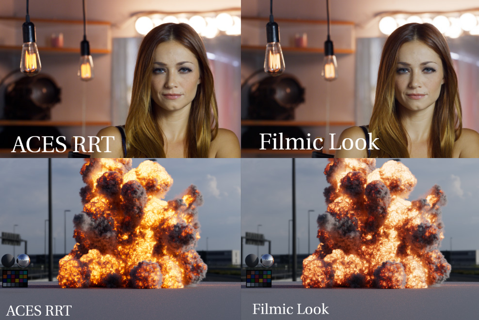

# Motivation

[ACES Next](https://community.acescentral.com/c/aces-development-acesnext/67) has identified several changes and improvements to the Output Transform that will be available at some furture date. Inspired by that work,  this config is to attempt to implement some of those changes as Look Transforms, to the extent that this is possible, as a stop-gap until ACES 2.0 is released.

# View Transforms
  
The config adds three Look Transforms to the view transforms included the ACES config included in Maya 2022:

- **Neutral Look**
   is intended as a neutral starting point for color grading and lookdev work. It reduces contrast (by a factor of 0.85 in log space) pulling the shadows and highlights slightly out of the toe and shoulder curves, to make more of the shot range visible. 
- **Filmic Look**
   is intended for shot work and has a similar filmic look to the standard ACES 1.0 RRT, with a little less contrast, resulting of less crushing of shadows. 
- **Show** is for the show specific look LUT decided on by the director. This could optionally be combined with the Filmic or Neutral Look if desired.

The *Filmic* and *Neutral* Look Transforms consist of three elements:
  - tonemapping contrast
  - [gamut compression](../docs/gamut.md)
  - highlight desaturation
  - chromaticity adjustments
  

The remaining view transforms are the same as the default Maya 2022 config.

- **ACES 1.0 SDR-video**
- **Un-tone-mapped** 
- **Raw** 
- **Log**
  

# Highlight Desaturation

Both the Filmic and Neutral looks handle warm light temperatures such as sunshine, fire, and tungsten light bulbs differently than the ACES RRT which renders these in an unnatural over-saturated way. 
   
   
   
This flourescent "yellow highlighter" look can be particularly unpleasant in clouds.
   
   
   
  
## Gamut Compression

Look transforms include an implementation of the <a href="https://github.com/ampas/aces-vwg-gamut-mapping-2020">ACES gamut compression algorithm</a> as a 3D LUT. Check out some <a href="https://github.com/sharktacos/OpenColorIO-configs/blob/main/docs/gamut.md">pretty pictures</a> showing the gamut compression implementation.

  
# Roles and rules 
**dif**, **BaseColor** and **hdr** color spaces act as aliases using OCIO rule name matching which assigns an input color space if its name appears in the image name. Therefore textures with "dif" (shirt_dif_v02.png) or "BaseColor" in their name will automatically be assigned the *Utility - sRGB - texture* color space. Likewise if "hdr" is in the file name the *scene-linear sRGB* color space will be assigned. All other textures (bump, normal, masks, displacement, etc.) will automatically be assigned the *Utility - Raw* color space (the default role).
 
  
## Color Spaces
**Pick - sRGBlin desat**
  
Defined as color picking role to pick colors in sRGB/Rec.709 primaries with slight desaturation (0.85 based on rec709 luma) resulting in colors having around 0.95 max saturation. Standard computer color pickers lead artists to pick extremely saturated neon colors. With the Rec2020 gamut of ACEScg this is exaserbated. The motivation is to have a color picker which encourages artists to pick painterly colors, meaning one has to lower the luminance to achieve deeply saturated colors.

**Input - Premiere Pro - ACEScg**
Input color space for Premiere Pro for EXR files in ACES-2065-1 AP0 color space. Premiere adds a BT.1886 2.4 gamma to EXR files, so this removes that to properly bring the file into scene-linear. Using OCIO you'll want to use this color space for the in and ACEScct for the out in order to grade in log.  

## EOTF
  

