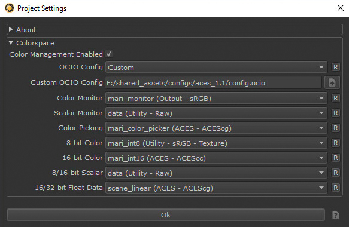
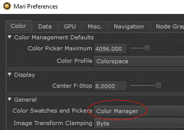
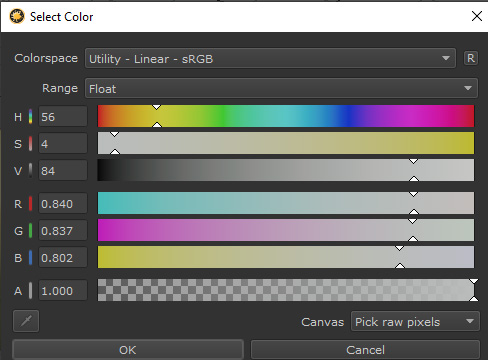

# Mari

In Mari our OCIO config is loaded in File>Settings

In the Mari prefs (edit > Preferenes, color tab) set *Color Swatches and Pickers* to “color picking” rather than "OCIO". This will allow for picking of raw colors (which we need to avoid having colors over 1 in our albedo textures), but viewing the color swatches adjusted to how they will appear in the display space.

Open the color picker by clicking the foreground color swatch and set *Canvas* to "Pick raw pixels". 

[Back to main](../StdX_ACES)

