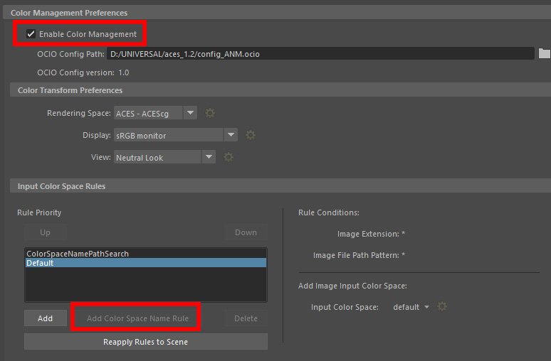

# Maya

*For Maya 2022 use the OCIOv2 config.* 

In Maya for Arnold the OCIO config is loaded in the Color Management section of the Maya Preferences. Note that we are using both the OCIO configuration and the color space rules. So make sure to click "add color space name rule" if it's not already active.

For a linear workflow with ACES  we need to define the following color spaces in Maya:

- *Color textures: **Color sRGB - Texture** (aliases: dif, BaseColor)*

input color space for color linearizing 8-16bit texture maps that impact the color of the render (diffuse color, sss color, specular color, etc.). 
	
- *Non-color textures: **Raw***

For all the other texture maps that do not affect the color of the render (bump maps, normal maps, displacement maps, roughness maps, masks). Utility–Raw can also be used for color texture maps saved as an EXR which have already been linearized.

- *HDR maps: **scene-linear Rec.709-sRGB** (aliases: hdr)*

Because ACES works in a wider gamut linear space, HDR maps that were made with sRGB primaries need to be converted from the old linear space to the wider gamut ACEScg linear space. 

That’s a lot of choices. To make this easier we use customized roles in our ACES config. Maya is thus set up to use Utility–Raw as the default input transform (since most texture maps are in this color space) and will automatically assign the *Utility– sRGB - Texture* color space to texture maps containing “dif” or "BaseColor" in the filename (for example Car_door_dif_v01.jpg as opposed to Car_door_bmp_v02.jpg). Likewise,  texture files containing “hdr” in the filename will automatically get the  *Utility – Linear – sRGB* color space. This works with a simple checkbox in Maya’s color management prefs to “use OCIO input color space rules”. So as long as you follow some simple naming conventions for your texture maps, the config will automagically assign the correct color space.

- * Color picking: **Pick Rec709-sRGB Desat** *

Defined as color picking role to pick colors in sRGB/Rec.709 primaries with slight desaturation (0.85 based on rec709 luma) resulting in colors having around 0.95 max saturation. Standard computer color pickers lead artists to pick extremely saturated neon colors. With the Rec2020 gamut of ACEScg this is exaserbated with colors on the edge of the AP1 gamut that are only found in lasers, and are not plausible values for the colors of reflective objects. The motivation is to have a color picker which encourages artists to pick painterly colors, meaning one has to lower the luminance to achieve deeply saturated colors.

[Back to main](../StdX_ACES)
