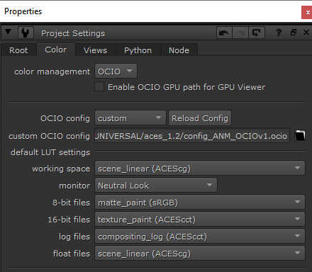
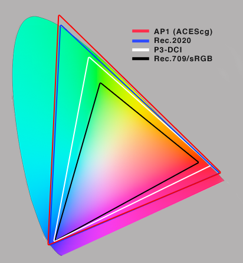
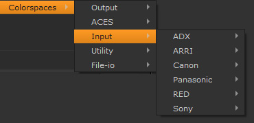

# Nuke

Nuke currently supports OCIOv1. To load the config Press “S” to access **Project Settings → Color**. Set *color managment* to "OCIO," select "custom" from the *OpenColorIO Config* dropdown and then enter the file path to the  ````StdX_ACES_OCIOv1.config```` file . 



## Input Transforms

In Nuke the input transform is set in the color space dropdown menu of a Read node. 

Let's discuss some of the difficulties with inputting camera footage in VFX in a traditional non-color managed workflow and how ACES greatly simplify and improve this. 

Knowing the right color space to choose in a traditional non-color managed workflow can be confusing. The files, typically DPX sequences or Prores clips, are often in the wrong color space. A client will for example say that the Prores movie is in Rec.709 when it is rather obviously in log (which you can tell because it appears washed out, which is characteristic of log footage). The reason for this is simple: They are not working color managed at all. They are simply working on log footage in the display space of their monitor. Going from this non-color managed workflow into a color managed workflow used by Nuke is confusing because you need to figure out midstream how to manage the color that no one has been managing. If there was a canonical log color space that DPX used this would be easy, but there is not. So knowing which particular flavor of log your DPX file is in is a mystery. Is it Cineon? Log-C? REDlog? Log3G10? If we knew the camera that was used this would be easier to determine, although many camera manufcturers have multiple log formats to choose from, but this information is often unknown. To make matters worse, it's not uncommon to have a double log space applied, say cineon on top of Log-C. It's really a wild west out there. 

Managing that chaos is the motivation for color *management*. The core aim of ACES is to unify the workflow so that there is consistency and predicability throughout every step of the film prodction pipeline. In ACES there are four color spaces to deal with.

- **ACES2065-1** (**AP0** for short) - scene-linear. This is the ACES *interchange* color space. So the footage from [VFX pulls](VFXpulls.md) from the client will always be in this color space, and VFX will deliver it back in this same interchange color space. 
- **ACEScg** - AP1 scene-linear. The color space for CG renders, and also the working space in Nuke, Maya, and other VFX software. This is a much larger gamut color space than Nuke's native linear color space which is sRGB/Rec709. In fact, ACEScg is slightly larger than Rec.2020 the standard for Ultra High Defintion Televisions (UHDTV) and a lot larger than P3-DCI the standard for film projectors. So lots of room to grow.



- **ACEScc** and **ACEScct** - AP1 log space. This is used by DI to grade in log. When viewing a client LUT in Nuke the LUT processing space needs to be set to match the space it was created in. This is done automagically in the OCIO config for the Shot Look view transform. Nevertheless, it's good practice to append the color space to the end of the file name for clarity. For example ````shot01_cct.cube````. 

See the [VFX Pulls](VFXpulls.md) doc for details on how client footage should be delivered to VFX in an ACES pipeline.

The config also contains the color spaces from all major film cameras if you need to work with camera raw files. This is not typical for VFX pulls though and more commonly ACES2065-1 is used as the interchange format.



## Display Transforms

Nuke traditionally has three display transforms: sRGB, Rec.709, and BT.1886. There is often confusion regarding these. Many people think of Rec.709 as an aesthetic preference, that is, they chose it because they "like the look of it." It's important to understand that this is not the intent of a display transform. [The Foundry explains,](https://support.foundry.com/hc/en-us/articles/115000229764-Q100319-How-to-use-colorspaces-in-Nuke-)

> “To use the Viewer space correctly, it should be set to match the colour space of the device/monitor you are viewing it on. For example if you are using an sRGB calibrated monitor, then you should use an sRGB monitor space, or for a DCI-P3 calibrated monitor, you should use a DCI-P3 space in order to display it correctly. If you then have these two correctly calibrated monitors side by side, then the image you perceive from each one should be the same.”

The aim here is that when the same image is viewed side by side on a computer monitor (sRGB) and a HDTV (Rec.709) they will look the same. Rec.709 is the specification for HDTV and sRGB is the specification for a standard computer monitor. So the display transform is asking “What are you displaying this on?” Simply put, we have

- Rec.709 = I’m displaying this on a TV
- sRGB = I’m displaying this on a computer

Another point of confusion is that when a client says to VFX “we are working in Rec.709" because they have broadcast monitors at the facility calibrated to Rec.709 this does not mean that a comper should set their display transform to Rec.709 to match. The opposite is the case, if you were to set your sRGB monitor to have a Rec.709 display transform in Nuke, this would mean the images viewed side by side *would not match*. Again, one chooses the display transform based on the calibration of the display they are using. Since we will be doing the majority of our VFX work on the sRGB monitors in the labs, our config defaults to having sRGB selected for the Display transform in both Nuke and Maya. One would only need to change this if, for example, viewing shots in 400a on an HDTV monitor (in which case it would be set to Rec.709).


## Input/Output pipeline

Based on the above understandings, let's step back and overview the input and output pipeline. Remember in Nuke the input color space is set in the Read node and the output color space is set in the Write node.

For reading renders into Nuke, since the EXR files are already in ACEScg the input (i.e the color space of the read node) would be  ACEScg.
	
````Input: ACEScg  >  Working: ACEScg >  Display: ACES sRGB````

VFX pulls will be in ACES2065-1 the ACES exchange color space and viewed on a computer monitor. 

````Input: ACES2065-1  >  Working: ACEScg  >  Display: ACES sRGB````

For VFX delivery of plates the ACES2065-1 exchange color space is again used (that is,  ACES2065-1 would be the color space on the Nuke write node). 

````Input: ACES2065-1 > Working: ACEScg  >  Display: ACES (sRGB) > Output: ACES2065-1````

As you can see, once the camera footage is input in and converted into ACES, one does not need to keep track of all the different color spaces because it’s always in the ACES exchange color space.

In a CG animation pipeline if you want to simply output a PNG sequence to make a Quicktime movie in Media Encoder that looks like what you see in Nuke then the display transform is baked into the media.  So if you are viewing *Filmic (sRGB)* and want to make a movie to be viewed on the web you would choose that in the color space for your write node for output.
	
````Working: ACEScg >  Display: Filmic (sRGB) > Output: Filmic (sRGB)````

Similarly, if in a VFX pipeline you are delivering a proxy movie for Editorial using the client LUT for viewing on broadcast reference monitor you would set your output to bake the view into the output. 

````Working: ACEScg >  Display: Shot Look (sRGB) > Output: Shot Look (Rec.1886/Rec.709 video)````

Note above that you bake the display transform (Shot Look) however since you are vieiwing this on a computer monitor (sRGB), but sending it to editorial who are viewing on broadcast reference monitors (Rec709) you output the Look to that target display device. It is good practive to append the color space to the file name for clarity when delivering proxy media (e.g. showID_seq_shot_v01_rec709.mxf).


## Gamut Compression and Nuke

For an intro into Gamut Compression and what it is and why you need it, Check out the [gamut compression](gamut.md) doc for details and pretty pics. 

[Back to main](../StdX_ACES)

