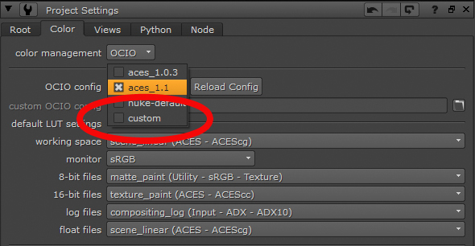

# Nuke

Press “S” to access the Project Settings → Color. Set *color managment* to "OCIO," select "custom" from the *OpenColorIO Config* dropdown and then enter the file path to the StdX_ANM.config file. 

