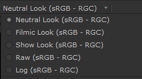
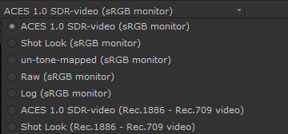
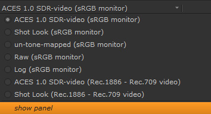
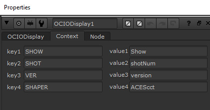
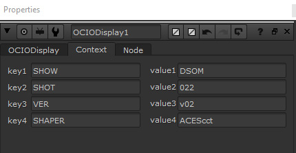

# Nuke

Nuke currently supports OCIOv1. To load the config Press “S” to access **Project Settings → Color**. Set *color managment* to "OCIO," select "custom" from the *OpenColorIO Config* dropdown and then enter the file path to the  ````StdX_ACES_OCIOv1.config```` file . 


## Input Transforms

In Nuke the input transform is set in the color space dropdown menu of a Read node. 

Let's discuss some of the difficulties with inputting camera footage in VFX in a traditional non-color managed workflow and how ACES greatly simplify and improve this. 

Knowing the right color space to choose in a traditional non-color managed workflow can be confusing. The files, typically DPX sequences or Prores clips, are often in the wrong color space. A client will for example say that the Prores movie is in Rec.709 when it is rather obviously in log (which you can tell because it appears washed out, which is characteristic of log footage). The reason for this is simple: They are not working color managed at all. They are simply working on log footage in the display space of their monitor. Going from this non-color managed workflow into a color managed workflow used by Nuke is confusing because you need to figure out midstream how to manage the color that no one has been managing. If there was a canonical log color space that DPX used this would be easy, but there is not. So knowing which particular flavor of log your DPX file is in is a mystery. Is it Cineon? Log-C? REDlog? Log3G10? If we knew the camera that was used this would be easier to determine, although many camera manufcturers have multiple log formats to choose from, but this information is often unknown. To make matters worse, it's not uncommon to have a double log space applied, say cineon on top of Log-C. It's really a wild west out there. 

Managing that chaos is the motivation for color *management*. The core aim of ACES is to unify the workflow so that there is consistency and predicability throughout every step of the film prodction pipeline. In ACES there are four color spaces to deal with.

- **ACES2065-1** (**AP0** for short) - scene-linear. This is the ACES *interchange* color space. So the footage from [VFX pulls](VFXpulls.md) from the client will always be in this color space, and VFX will deliver it back in this same interchange color space. 
- **ACEScg** - AP1 scene-linear. The color space for CG renders, and also the working space in Nuke, Maya, and other VFX software. This is a much larger gamut color space than Nuke's native linear color space which is sRGB/Rec709. In fact, ACEScg is slightly larger than Rec.2020 the standard for Ultra High Defintion Televisions (UHDTV) and a lot larger than P3-DCI the standard for film projectors. So lots of room to grow.


- **ACEScc** and **ACEScct** - AP1 log space. This is used by DI to grade in log. When viewing a client LUT in Nuke the LUT processing space needs to be set to match the space it was created in. This is done automagically in the OCIO config for the Shot Look view transform. Nevertheless, it's good practice to append the color space to the end of the file name for clarity. For example ````shot01_cct.cube````. 

See the [VFX Pulls](VFXpulls.md) doc for details on how client footage should be delivered to VFX in an ACES pipeline.

The config also contains the color spaces from all major film cameras if you need to work with camera raw files. This is not typical for VFX pulls though and more commonly ACES2065-1 is used as the interchange format.


## Display Transforms

Nuke traditionally has three display transforms: sRGB, Rec.709, and BT.1886. There is often confusion regarding these. Many people think of Rec.709 as an aesthetic preference, that is, they chose it because they "like the look of it." It's important to understand that this is not the intent of a display transform. [The Foundry explains,](https://support.foundry.com/hc/en-us/articles/115000229764-Q100319-How-to-use-colorspaces-in-Nuke-)

> “To use the Viewer space correctly, it should be set to match the colour space of the device/monitor you are viewing it on. For example if you are using an sRGB calibrated monitor, then you should use an sRGB monitor space, or for a DCI-P3 calibrated monitor, you should use a DCI-P3 space in order to display it correctly. If you then have these two correctly calibrated monitors side by side, then the image you perceive from each one should be the same.”

The aim here is that when the same image is viewed side by side on a computer monitor (sRGB) and a HDTV (Rec.709) they will look the same. Rec.709 is the specification for HDTV and sRGB is the specification for a standard computer monitor. So the display transform is asking “What are you displaying this on?” Simply put, we have

- Rec.709 = I’m displaying this on a TV
- sRGB = I’m displaying this on a computer

Another point of confusion is that when a client says to VFX “we are working in Rec.709" because they have broadcast monitors at the facility calibrated to Rec.709 this does not mean that a comper should set their display transform to Rec.709 to match. The opposite is the case, if you were to set your sRGB monitor to have a Rec.709 display transform in Nuke, this would mean the images viewed side by side *would not match*. Again, one chooses the display transform based on the calibration of the display they are using. Since we will be doing the majority of our VFX work on the sRGB monitors in the labs, our config defaults to having sRGB selected for the Display transform in both Nuke and Maya. One would only need to change this if, for example, viewing shots in 400a on an HDTV monitor (in which case it would be set to Rec.709).


## Input/Output pipeline

Based on the above understandings, let's step back and overview the input and output pipeline. Remember in Nuke the input color space is set in the Read node and the output color space is set in the Write node.

For reading renders into Nuke, since the EXR files are already in ACEScg the input (i.e the color space of the read node) would be  ACEScg.
	
````Input: ACEScg  >  Working: ACEScg >  Display: sRGB````

VFX pulls will be in ACES2065-1 the ACES exchange color space and viewed on a computer monitor. 

````Input: ACES2065-1  >  Working: ACEScg  >  Display: sRGB````

For VFX delivery of plates the ACES2065-1 exchange color space is again used (that is,  ACES2065-1 would be the color space on the Nuke write node). 

````Input: ACES2065-1 > Working: ACEScg  > Output: ACES2065-1````

As you can see, once the camera footage is input in and converted into ACES, one does not need to keep track of all the different color spaces because it’s always in the ACES exchange color space.

If you want to simply output a PNG sequence to make a Quicktime movie in Media Encoder (or output a Quicktime movie directly from Nuke) then the display transform is baked into the media (as set on the color space of the Nuke write node). This involves leaving the wide gamut working space of ACES, and encoding the image with the limited display space of the intended viewing device. The idea is that you want people to view things the same way you see them. So if you are viewing *Filmic (sRGB)* and what to make a movie to be viewed on the web you would choose that in the color space for your write node for output.
	
````Working: ACEScg >  Output: Filmic (sRGB)````

Similarly, if you are delivering a proxy movie for Editorial using the client LUT for viewing on broadcast reference monitor you would set your output to 

````Working: ACEScg >  Output: Shot LUT (Rec.1886/Rec.709 video)````

Note that, as discussed above, if you simply view this movie on an sRGB monitor in a movie player like Quicktime or VNC it will not appear correctly because it has the Rec.1886/Rec.709 display color space baked into it. Again it is therefore good practive to append the color space to the file name for clarity (e.g. showID_seq_shot_v01_rec709.mxf). File metadata notoriously gets lost.


## Gamut Compression and Nuke

[Reference gamut compression](gamut.md) (RGC) is applied differently for ANM and VFX. In the ANM config where we are dealing exclusivly with CG animation it is automatically applied in the view transforms, and also baked into the output when writing out to sRGB. In the VFX config where we are dealing with film footage it is instead applied with a node and used as "pixel healing" baked into the EXR files returned to the client. This is done with a Nuke node located in the ````software/Nuke```` folder of this config. 


Best practice is to be apply the RGC immediately after the Input Transform (i.e. directly after the Read node). There may be exception to this however, as noted in the [RGC Implementation Guide](https://paper.dropbox.com/doc/ACES-Gamut-Compression-User-Guide-8AodniaKveYsNgOwkuhTl)
> There may be situations (edge despill in keying has been noted) however where the unmodified pixel values give a preferable result. In these cases it may be necessary for the compositor to have access to both the original and gamut compressed image data in their node tree, choosing between them as necessary. For consistency, the RGC should still be applied at some other suitable point in the composite, such that the final renders delivered to DI still have the gamut compression applied as expected.

> Since normal practice in VFX is to return images with any pixel not touched by the compositing process unmodified from the original pulls, one might think that the RGC should be inverted for deliverables, as is done with CDL corrections, for example. However, it is better to think of the RGC more like a spill suppression, which is part of the composite, and would not be inverted out at the end. Inverting creates the possibility that elements added during compositing (CGI  originally created in ACEScg, for example) which have not had the RGC applied may produce extreme values on inversion. 


Check out the [gamut compression](gamut.md) doc for more details and pretty pics!


## ANM and VFX Configs

The ANM config ````config_ANM.ocio```` is designed for work on CG animation shorts and features. The VFX config ````config_VFX.ocio```` in contrast is designed for intgrating CG and VFX with live action film. Consequently each has different Display Transforms geared for its particular pipeline needs.

### ANM Config



The Display Transforms for the above ANM config are all in sRGB display for viewing on artist's monitors, and contain the Reference Gamut Compression (RGC) baked into the view to componsate for hue skews with highly saturated colors in CG (see the [gamut](gamut.md) page. The contain the [Neutral and Filmic](tonemap.md) looks, as well as a Show Look.

### VFX Config



The Display Transforms for the above VFX config contain both sRGB and Rec.709 display types depending on whether a shot is being viewed on an artist's monitor (sRGB) or on an HDTV display for dailies. As explained above, gamut compression is applied as a node in VFX and thus not included in the Display Transform. The views include standard an ACES 1.0 RRT in both sRGB and Rec.709, the shot look both sRGB and Rec.709 displays, as well as several diagnostic views (un-tone-mapped, Raw, Log). Un-tone-mapped is the equivalent to Nuke's native sRGB which is a simple sRGB Gamma function without tonemapping.  

### Shot Look

The shot Look Display Transform in the VFX config works with context variables. You will need to insert the following code into your Nuke menu.py file:

```py  
# OCIO Shot Look custom defaults: 
def _setOCIODisplayContext():
    node = nuke.thisNode()
    node.knob('key1').setValue("SHOW")
    node.knob('key2').setValue("SHOT")
    node.knob('key3').setValue("VER")
    node.knob('key4').setValue("SHAPER")
    
    node.knob('value1').setValue("Show")
    node.knob('value2').setValue("shotNum") 
    node.knob('value3').setValue("version")
    node.knob('value4').setValue("ACEScg")
    
nuke.addOnCreate(_setOCIODisplayContext, nodeClass="OCIODisplay")
```

Then in Nuke select the "view panel" menu from the View Transform menu



This will open up a properties window. Open the Context tab and you will see that it has been populated with template values. As a friendly hint for artists that this needs to be replaced with the actual shot values this template LUT is black and white.



Replace the value fields for your shot LUT. The shot_lut directory of the config contains all of the shot LUTS for the show. For example if you were working on the DSOM show on shot 22 and the client LUT was called ````DSOM_022_v02_ACEScct.cube```` you would write the following:



Alternatley, you can simply edit your menu.py file to input the values. In our example that would be

````py
    node.knob('value1').setValue("DSOM")
    node.knob('value2').setValue("022") 
    node.knob('value3').setValue("v02")
    node.knob('value4').setValue("ACEScg")
````

Nuke will open with these values, pointing to your shot look LUT.

In Maya you can similarly edit your Maya.env file and enter (again using the above example)
````
SHOW = DSOM
SHOT = 022
VER = v02
SHAPER = ACEScct
````
If you want to change the values in a Maya session you can use the following MEL code:
````py
putenv "SHOW" "DSOM";
putenv "SHOT" "022";
putenv "VER" "v02";
colorManagementPrefs -refresh;
````


[Back to main](../StdX_ACES)

