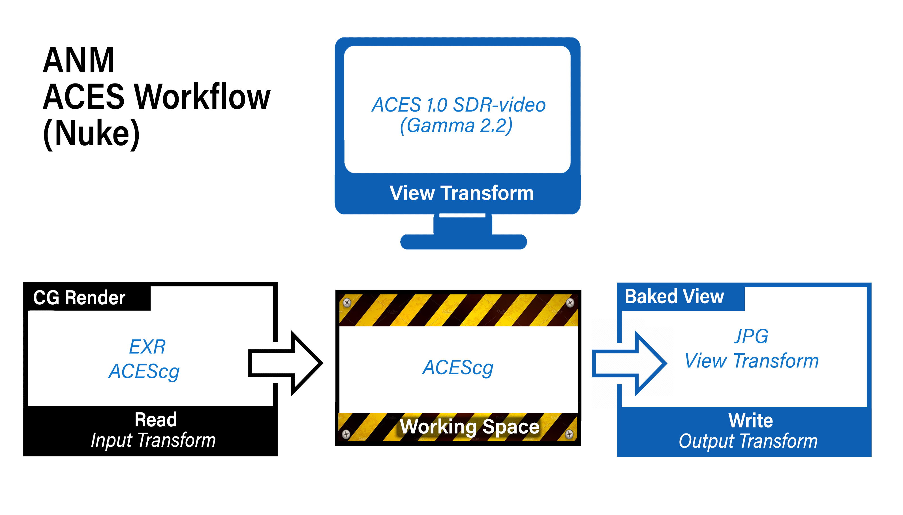
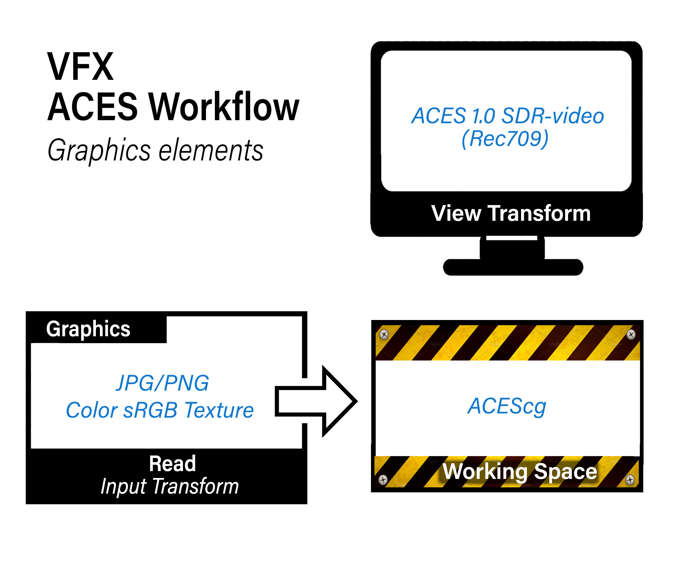
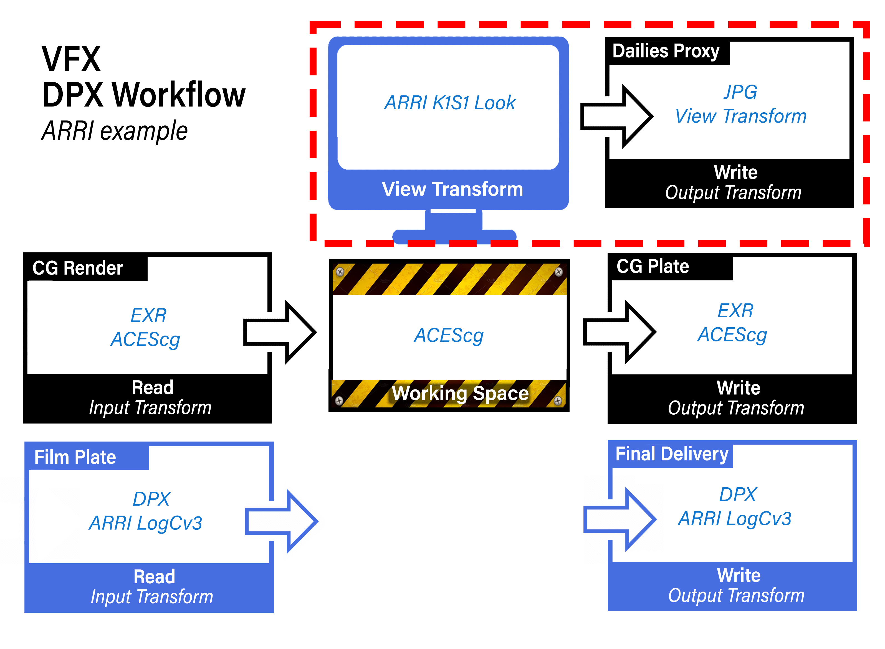
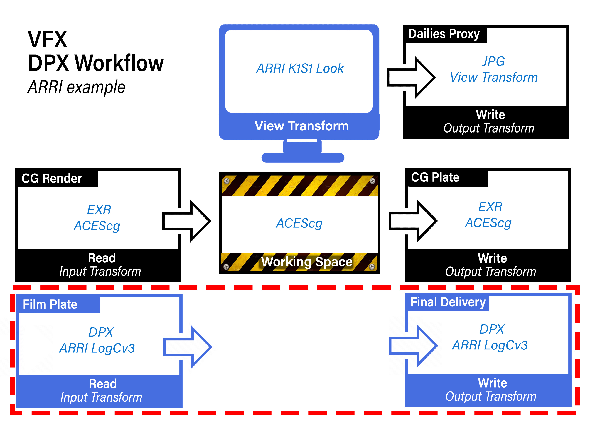
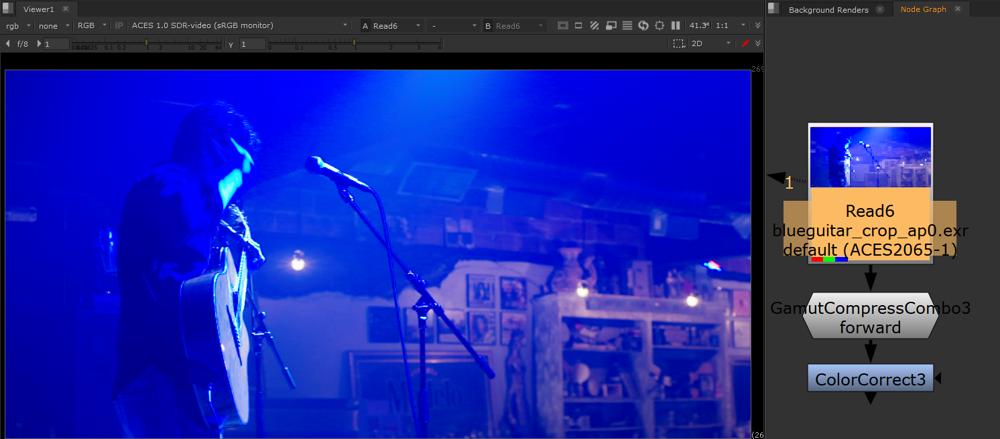

# Nuke

Nuke v13.1 now supports OCIOv2. To load the config Press “S” to access **Project Settings → Color**. Set *color management* to "OCIO," select "custom" from the *OpenColorIO Config* dropdown and then enter the file path to the  ````StdX_ACES_OCIOv1.config```` file . 


## OCIO Roles

Nuke's implementation of OCIO roles can be confusing and unintuitive. For this reason, you may wish to turn them off in the Preferences. Under the Color Management section uncheck "Allow OCIO Roles in color space knobs" and "prioritize OCIO Roles". Nuke needs to be restarted for this to take effect. This will result in a more organized color space menu in Read and Write nodes.

## Input Transforms

In ACES there are four color spaces to deal with:

- **ACES2065-1** (**AP0** for short) - scene-linear. This is the ACES *interchange* color space. So the footage from [VFX pulls](VFXpulls.md) from the client will always be in this color space, and VFX will deliver it back in this same interchange color space. 

- **ACEScg** - AP1 scene-linear. The color space for CG renders, and also the working space in Nuke, Maya, and other VFX software. Therefore CG renders are read in with this color space (read node input transform), and plates for CG are output with this color space (write node output transform).

- **ACEScc** and **ACEScct** - AP1 log space. This is used by DI to grade in log. When viewing a client LUT in Nuke the LUT processing space needs to be set to match the space it was created in. This is done automagically in the OCIO config for the Shot Look view transform. Nevertheless, it's good practice to append the color space to the end of the file name for clarity. For example ````shot01_cct.cube````. 

See the [VFX Pulls](VFXpulls.md) doc for details on how client footage should be delivered to VFX in an ACES pipeline.

## Input/Output pipeline

Based on the above understandings, let's look at the input and output  color pipeline in ACES. We'll start with a 

### ACES CG Animation pipeline

There are a number of different view transforms in the ANM config that produce different looks. The idea is to set the output transorm to match the view transform so your output will look the same as what you are viewing in Nuke. We output an image sequence, which we can then convert to a movie with Media Encoder. 



We are viewing on an sRGB monitor so the view transform is set to a gamma 2.2 display. If this were going to be broadcast on a TV then we'd want to output in Rec709 like below in an


### ACES VFX pipeline

This is more complex as it it involves mutiple inputs and outputs. First, notice that the Dailies Proxy output uses the same "baked view" approach as the ANM color i/o above. 


This is intended for proxy media for an offline edit. Again the image sequence would be converted to a movie in Media Encoder. Because this is proxy media (i.e. a place-holder for the final image which are EXR files) you can use a movie codec like H.264 in a MP4 wrapper which will produce a nice quality image with a small file size. Alternately, if the client prefers Prores, then a Prores 4:2:2 Proxy should be fine. What you want to avoid is a massively huge format like Prores 4444 which is intended for storing the full range data directly from a camera in log, not for viewing.

Next, notice that input CG as well as output CG is always in the ACEScg color space. This is also the working space for all VFX software (Nuke, Maya, Houdini, Substance Painter, etc.)

 

Finally, observe how the client film footage is returned in the same color space as it was recieved. This is a core principle in VFX where the film footage is unchanged, other than to add the VFX on top, as if it was shot that way.

 

In addition to these imnputs you may also have input images of graphics elements and matte paintings. For the graphics elements, where the idea is to incorporate the grapical elements into the plate as if it was shot that way (say a cornerpin monitor display in a space ship, or a poster on a wall) the approach would be the same as used for color texture maps in [Maya](Maya.md):

<div style="text-align: center;">
 
</div>

For [matte paintings](Photoshop.md) the input transform would depend on the color space that the image is in. Typlically for EXRs this would be ACEScg, and for log files ACEScct. Good practice is to tag the file name with the color space to remove the guesswork. For example, ```shot01_matte_v01_cct.dpx```

In summary then, it's critical to know the proper transforms to use for input, output and viewing. For ACES show most of these are constants:

For an ACES show
**Input**:
- CG renders: ACEScg
- Film footage: ACES2065-1
- Matte Paintings: ACEScct for log DPX, ACEScg for EXR
- Graphics: Color sRGB Texture

**Output**:
- Baked View (dailies proxy): Same as the view transform
- Final Delivery: Same as recieved film footage
- CG plates: ACEScg

What is variable, and needs to be in the show guide, is the view transform used, which as discussed corresponds to dailies output. For clarity here we have a Nuke gizmo called [Write Dailies Sequence](https://github.com/sharktacos/VFX-software-prefs/blob/main/docs/Nuke.md) that automatically creates a burn-in image with the shot name and output color space.


### Non-color managed show using DPX footage (in this example from an ARRI camera)

Our final example is where a client is not working color managed, but instead using the older DPX workflow. This would not be an ACES complient show, because the film footage coming in and going out is in DPX. However, we need to work in ACES in order to integrate the CG using physically based rendering. In this example our footage shot on an ARRI camera, so the view transform (as well as the dailies proxy output) uses the ARRI's classic DRT called K1S1, which the client can also use as a LUT (available on the ARRI website) for use in an offline editing program like Premiere. 



Observe how again the CG input and output is in ACEScg, and the film footage is returned in the same color space as it was recieved.



  


## Gamut Compression and Nuke

For an intro into Gamut Compression and what it is and why you need it, Check out the [gamut compression](gamut.md) doc for details and pretty pics. To use the Reference Gamut Compression node in Nuke copy the [Gizmo](../StdX_ACES/software/Nuke) located in the ```software/Nuke``` folder of the config into your *.nuke* folder (located in the home directory of your computer) and add the following to your menu.py file. 

````
toolbar = nuke.toolbar("Nodes")
toolbar.addCommand( "Color/OCIO/ACES Ref Gamut Compress", "nuke.createNode('ACES_ref_gamut_compress')")
````
This adds an item labeled "ACES Ref Gamut Compress" to the Color/OCIO/ menu which creates an instance of the *ACES Reference Gamut Compression* node.


Let's have a look at the Gamut Compression node in action in Nuke in the context of doing VFX work on film footage. We begin with some footage with colors that are out of gamut. 



Let's say we wanted to use a Color Correct to do some despill of all that blue light in the shot. We can see in the image below that this is looking good on the background room, but we are now seeing the out-of-gamut pixels more clearly on the performer. There is artifacting and posterization all over him.


Now let's look at how that same Color Correct looks when we first apply Gamut Compression, pictured below. The artifacting is gone. That's the "pixel healing" effect of Gamut Compression, and the reason it is applied as the first operation immediately after the input transform (i.e. right after the Read node). You want to begin working with healed pixels. Otherwise it's like cooking with spoiled food.


Best practice is to be apply the RGC immediately after the Input Transform (i.e. directly after the Read node). There may be exception to this however, as noted in the [RGC Implementation Guide](https://paper.dropbox.com/doc/ACES-Gamut-Compression-User-Guide-8AodniaKveYsNgOwkuhTl)

> There may be situations (edge despill in keying has been noted) however where the unmodified pixel values give a preferable result. In these cases it may be necessary for the compositor to have access to both the original and gamut compressed image data in their node tree, choosing between them as necessary. For consistency, the RGC should still be applied at some other suitable point in the composite, such that the final renders delivered to DI still have the gamut compression applied as expected.
>
> Since normal practice in VFX is to return images with any pixel not touched by the compositing process unmodified from the original pulls, one might think that the RGC should be inverted for deliverables, as is done with CDL corrections, for example. However, it is better to think of the RGC more like a spill suppression, which is part of the composite, and would not be inverted out at the end. Inverting creates the possibility that elements added during compositing (CGI  originally created in ACEScg, for example) which have not had the RGC applied may produce extreme values on inversion. 


[Back to main](../StdX_ACES)

