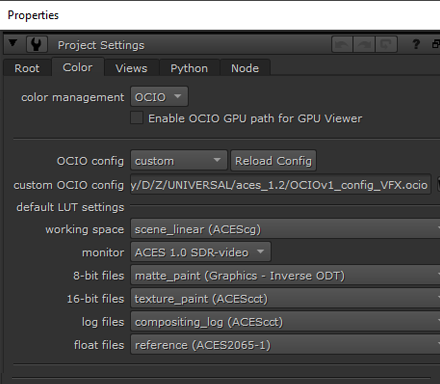

# Nuke

Nuke currently supports OCIOv1. To load the config Press “S” to access **Project Settings → Color**. Set *color managment* to "OCIO," select "custom" from the *OpenColorIO Config* dropdown and then enter the file path to the  ````StdX_ACES_OCIOv1.config```` file . 



## Input Transforms

In Nuke the input transform is set in the color space dropdown menu of a Read node. 

Let's discuss some of the difficulties with inputting camera footage in VFX in a traditional non-color managed workflow and how ACES greatly simplify and improve this. 

Knowing the right color space to choose in a traditional non-color managed workflow can be confusing. The files, typically DPX sequences or Prores clips, are often in the wrong color space. A client will for example say that the Prores movie is in Rec.709 when it is rather obviously in log (which you can tell because it appears washed out, which is characteristic of log footage. Of course which particular flavor of log is a mystery. Is it Cineon? Log-C? REDlog? Log3G10? If we knew the camera that was used this would be easier to determine, although many camera manufcturers have multiple log formats to choose from, but this information is often unknown. To make matters worse, it's not uncommon to have a double log space applied, say cineon on top of Log-C. It's really a wild west out there. 

Managing that chaos is the motivation for color *management*. The core aim of ACES to unify the workflow so that there is consistency and predicability throughout every step of the film prodction pipeline. In ACES there are four color spaces to deal with.

- **ACES2065-1** (**AP0** for short) - scene-linear. This is the ACES *exchange* color space. So the footage from [VFX pulls](VFXpulls.md) from the client will always be in this color space, and VFX will deliver it back in this same exchange color space. 
- **ACEScg** - scene-linear. The color space for CG renders, and also the working space in Nuke, Maya, and other VFX software.
- **ACEScc** and **ACEScct** - log space. This is used by DI to grade in log. When viewing a client LUT in Nuke the LUT processing space needs to be set to match the space it was created in. It's good practice therefore to append the color space to the end of the file name for clarity. For example ````shot01_cc.cube```` for a LUT. 

See the [VFX Pulls](VFXpulls.md) doc for details on how client footage should be delivered to VFX in an ACES pipeline.

## Display Transforms

Nuke traditionally has three display transforms: sRGB, Rec.709, and BT.1886. There is often confusion regarding these. Many people think of Rec.709 as an aesthetic preference, that is, they chose it because they "like the look of it." It's important to understand that this is not the intent of a display transform. The Foundry explains,

> “To use the Viewer space correctly, it should be set to match the colour space of the device/monitor you are viewing it on. For example if you are using an sRGB calibrated monitor, then you should use an sRGB monitor space, or for a DCI-P3 calibrated monitor, you should use a DCI-P3 space in order to display it correctly. If you then have these two correctly calibrated monitors side by side, then the image you perceive from each one should be the same.”

The aim here is that when the same image is viewed side by side on a computer monitor (sRGB) and a HDTV (Rec.709) they will look the same. Rec.709 is the specification for HDTV and sRGB is the specification for a standard computer monitor. So the display transform is asking “What are you displaying this on?” Simply put, we have

- Rec.709 = I’m displaying this on a TV
- sRGB = I’m displaying this on a computer

Another point of confusion is that when a client says to VFX “we are working in Rec.709" because they have broadcast monitors at the facility calibrated to Rec.709 this does not mean that a comper should set their display transform to Rec.709 to match. The opposite is the case, if you were to set your sRGB monitor to have a Rec.709 display transform in Nuke, this would mean the images viewed side by side *would not match*. Again, one chooses the display transform based on the calibration of the display they are using. Since we will be doing the majority of our VFX work on the sRGB monitors in the labs, our config defaults to having sRGB selected for the Display transform in both Nuke and Maya. One would only need to change this if, for example, viewing dailies in 400a on an HDTV monitor (in which case it would be set to Rec.709).

Below you can see the display device in parenthesis. Most are in sRGB as this is usually what you are viewing on. The equivalent to Nuke's native sRGB would be un-tone-mapped (sRGB). For details on what these view transforms do, see the [tone mapping](tonemap.md) doc. You'll find information on the gamut compression in the section below. Finally. in red you can see the display device *Rec.1886 / Rec.709 video* which is for a Rec.709 broadcast monitor with Rec.1886 gamma (2.4). You would select this if you are viewing on an HDTV (for example when viewing dailies in 400a). It's worth noting that when a client says they are working in Rec.709 they almost certainly mean gamma 2.4 (Rec.1886), which is what the config uses. Nuke's native Rec.709 has a non-standard gamma of approximately 1.95 which is much darker.


## Input/Output pipeline

Based on the above understandings, let's step back and overview the input and output pipeline. Remember in Nuke the input color space is set in the Read node and the output color space is set in the Write node.

VFX pulls will be in ACES2065-1 the ACES exchange color space and viewed on a computer monitor. 

````Input: ACES2065-1  >  Working: ACEScg  >  Display: sRGB````

For reading renders into Nuke, since the EXR files are already in ACEScg the input (i.e the color space of the read node) would be  ACEScg.
	
````Input: ACEScg  >  Working: ACEScg >  Display: sRGB````

For VFX delivery of plates the ACES2065-1 exchange color space is again used (that is,  ACES2065-1 would be the color space on the Nuke write node). 

````Input: ACES2065-1 > Working: ACEScg  > Output: ACES2065-1````

As you can see, once the footage is input in and converted into ACES, one does not need to keep track of all the different color spaces because it’s always in the ACES exchange color space.

If you want to simply output a PNG sequence to make a Quicktime movie in Media Encoder (or output a Quicktime movie directly from Nuke) then the display transform is baked into the media (as set on the color space of the Nuke write node). This involves leaving the wide gamut working space of ACES, and encoding the image with the limited display space of the intended viewing device. The idea is that you want people to view things the same way you see them. So if you are viewing *Filmic (sRGB)* and what to make a movie to be viewed on the web you would choose that in the color space for your write node for output.
	
````Working: ACEScg >  Output: Filmic (sRGB)````

Similarly, if you are delivering a proxy movie for Dailies using the client LUT for viewing on a broadcast HDTV monitor you would set your output to 

````Working: ACEScg >  Output: Shot LUT (Rec.1886/Rec.709 video)````


## Gamut Compression and Nuke

Nuke is the primary place where gamut compression is applied. To understand this it's important to differentiate between two concepts:
 1. Gamut correction applied to the *view transform* which does not alter the image in any way.
 1. Gamut correction baked into an image

For phases of production such as on set monitoring, dailies, editorial, etc. it can be beneficial to *see* footage with gamut compression in order to get an idea of the final look, just as it can be good to see footage through a LUT. However, the gamut compression should not be applied to the footage. For this purpose the config contains View Transforms with gamut compression. 


However, for VFX pulls a compositor will want to have unaltered footage. When that footage contains negative pixel values it can be really hard to do common compositing tasks like pull a key, denoise, or blur an image. This is where gamut compression comes in. Because the gamut compression algorithm only affects the pixels that are out of gamut, gamut compression in Nuke and VFX work can be thought of as "pixel healing" rather than color correction. 

Nuke is the ideal place to apply this gamut compression because the algorithm is designed to be applied in scene-linear (the working space of Nuke), and should be baked into all vfx returns. This is done with a Nuke node located in the ````software/Nuke```` folder of this config. This needs to be applied immediately after the Input Transform (i.e. directly after the Read node).


This Nuke node is the fully functioning gamut compression algorithm, as opposed to the 3D LUT approximation contained in the OCIO config, which again is only intended for intermediate viewing purposes. Indeed, if comp were to bake the gamut compression into the EXR plates it sends to CG there would be no need to use the gamut compress View Transform in Maya.

Check out the [gamut compression](gamut.md) doc for more details and pretty pics!


[Back to main](../StdX_ACES)

