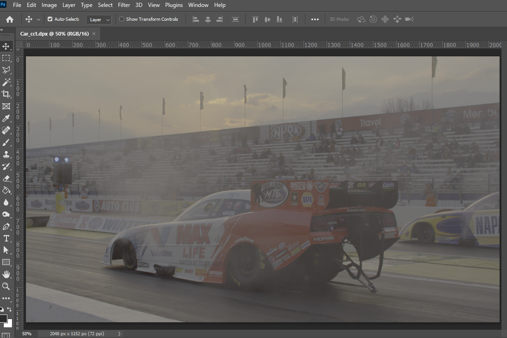
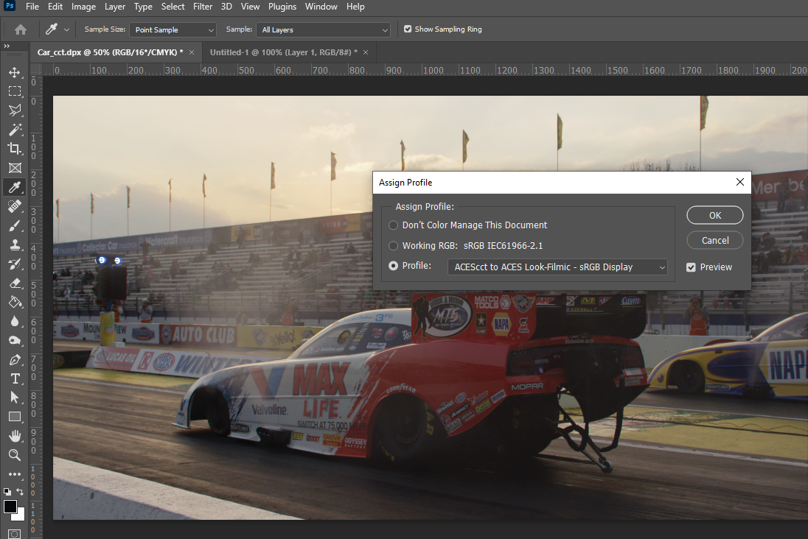
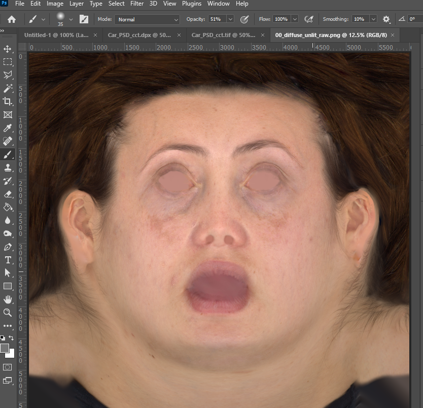
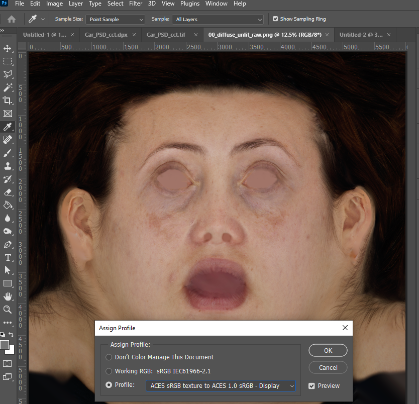
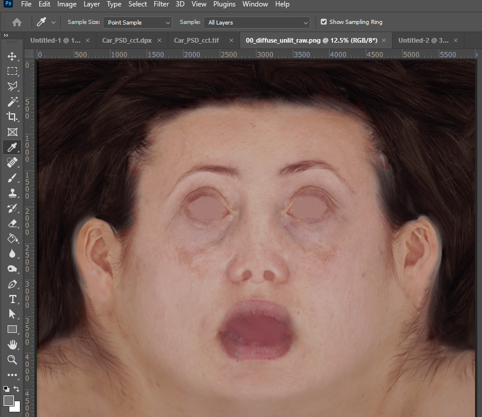
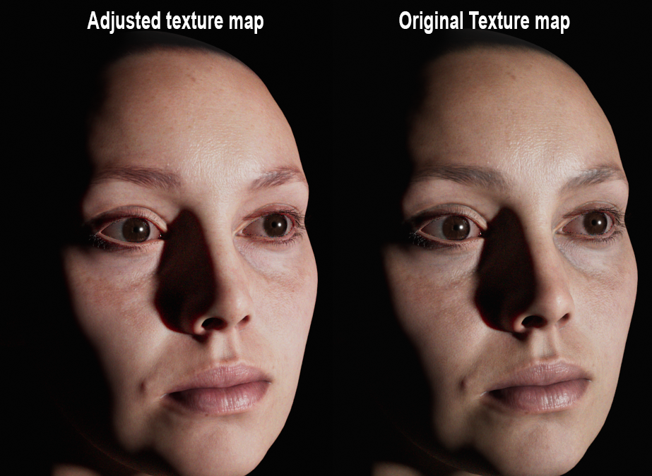

# Photoshop

There is a free [OCIO plugin for Photoshop](http://fnordware.blogspot.com/2017/02/opencolorio-for-photoshop.html) which lets you apply OCIO transforms as a filter, baking it into the file, which is a destructive workflow and thus undesirable. What you can do with the plugin however, is write out ICC profiles. This config contains ICC profiles for all if the Look Transforms for the various workflows, which are described below. These ICC profiles are located in the  ````software/Photoshop```` in the config. To install the icc profile on Windows, right-click the file and choose install profile. On a Mac copy the profiles into the ````/Users/[username]/Library/ColorSync/Profiles```` folder.

## EXR Files in Photoshop

Photoshop has a very limited toolset in 32 bit mode (meaning most of your faviorite tools in Photoshop wont be available). So if you're wanting to edit scene-linear EXR files, a better option is Affinity Photo, which is free.

## Matte Painting DPX log footage

Let's assume that we are beginning with a 10-bit Log DPX film plate in ACEScct color space.  Photoshop will read this in 16-bit integer mode displaying the log image in raw which will look washed out:




Next, we need to assign our film emulation profile to our Log file so it will display properly. Select the menu option **edit > assign profile** and in the window that opens, select the profile from the drop-down menu to convert from ACEScct to the desired display (in this example ````Look-Filmic - sRGB Display````). This displays the log image properly.





To toggle the profile on and off, first disable it with **view > proof setup > monitor RGB**. You can then use the **ctr-Y** hotkey (**view > proof colors**) to toggle the profile display on and off. You'll want to toggle between the two views frequently while painting, especially when painting darks.

Note that if you wish to paste an sRGB image such as a PNG or JPG from a digital camera or from the web into the matte painting, it will need to first be converted to ACEScct log space. The easiest way to do this is in Nuke.

The file can be saved in PSD format while working, and will embed the ICC profile information into the file. For delivery to comp, all layers should be flattened and saved as DPX. This gives a DPX roundtrip from Nuke to Photoshop and back. 

## Painting sRGB Texture Maps

Currently the ACES Output Transform (RRT) has a number of [hue shifts and skews](chroma.md), which will affect images going from sRGB space to ACEScg. If you need to paint a texture map in Photoshop, it's therefore good to see how it will appear through the display transform, just as you can in a 3D paint program like [Mari](Mari.md) or [Substance Painter](Substance.md). Here's the Digital Emily2 texture map in Photoshop. This is a PNG file converted from the scene-linear sRGB/Rec709 EXR file.



Now we apply the ICC profile to go from ````sRGB texture to ACES 1.0 sRGB Display````. The face gets a greenish-yellow hue shift that many have described as "ghoulish". (Note that this hue shift is fixed in the forthcoming ACESNext Output Transform!)



We can switch to the Neutral Look Transform ICC profile to reduce the crushed shadows areas. For the hue shifts we can do some Photoshop image adjustments (color balance, healing brush, masks, etc.) until we get the texture looking a little less zombie-like, like this maybe...



You can then save out the texture as a regular PNG or JPG. Just for fun here's that adjusted texture map rendered out.


