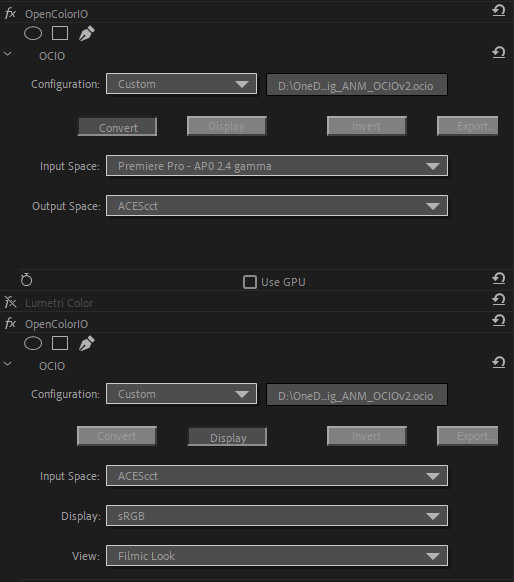

# Premiere Pro

## Overview

There are many possible ways to work in Premiere Pro. The most common is to work in Rec.709 with proxy video clips. These would later be swapped out with the high res footage in the [conform](VFXpulls.md) stage of production with an EDL/XML/AFF file. 

It is possible to debayer camera RAW footage in Premiere for some camera RAW types (ARRI and RED). This is a rather complex process that involves installing a plugin, downloading an OCIO config, and changing a lot of settings in Premiere. On top of that Premiere will be very slow. An alternative workflow is to export an XML file from Premiere and read this into Davinci Resolve and dabayer your footage there. This is simple to do, works with all camera types, and is fast. Plus Resolve is free.

## Debayering in Premiere


The free [OCIO plugin for After Effects](https://fnordware.blogspot.com/2012/05/opencolorio-for-after-effects.html) also works in Premiere Pro. You just need to place it in the common plugin folder, which on Windows is:<br>

| Platform	| Path
|-----------|---------------------------------------------------------------
| Windows	| C:\Program Files\Adobe\Common\Plug-ins\7.0\MediaCore
| Mac	      | /Library/Application Support/Adobe/Common/Plug-ins/7.0/MediaCore/ 


Next download [this OCIO config](https://github.com/sharktacos/OpenColorIO-configs/blob/main/StdX-ACES-OCIOv2.0/VFX_mini.ocio) which is configured specifically for converting camera RAW files to OpenEXR in Premiere. 

In Premiere open the Sequence Settings and turn on  **Max Bit Depth**. Otherwise Premiere will clip any image values over 1. 

The camera RAW file needs to be set to display in its camera log space. This is done in the Effect Controls and differs for each camera. For example an ARRI camera looks like this:


On the RAW file Effect Controls make sure the Output Transform Settings are set to match the Primary settings for Color Space and Gamma, and that the Output Tone Map and Highligh Roll-Off are both set to "none".  

Using the OCIOv2 config, you will make two OCIO FXs (located in ````Effects > Video Effects > Utility > OpenColorIO````), one to read in the files, and another to display them. So your FX layers would be:

   1. **OCIO input** (in: Camera color space, out: ACES2065-1)<br>
   For example for a RED camera the transform is in the ````Input/Camera/RED``` folder
   2.  **OCIO display** (in: ACES2065-1, out: Rec.709 BT1886 HDTV)
   The out transform should be set to match the display you are viewing on, so Rec.709 BT1886 HDTV would be for viewing on a reference broadcast monitor. If viewing on a computer monitor you would instead use Gamma 2.2.
   
To export a file in EXR disable the OCIO display above. This will put the file into ACES2065-1 space. Then export the media with the following settings:
   - Format: OpenEXR
   - Compression: PIZ
   - Bypass linear conversion: ON
   
   
 


[Back to main](../StdX_ACES)
