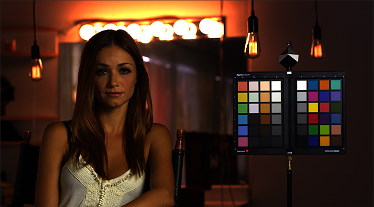

# Exporting OpenEXR from camera RAW with Premiere Pro

## Overview

For debayering camera RAW files into OpenEXR our recommended workflow is exporting an XML file from Premiere, importing this into Davinci Resolve, and dabayer your footage there. Broadly speaking Premiere is a great software for editing in Rec.709, but was not designed for scene-referred color management or debayering camera RAW footage. If you would like to go this route for a VFX pull, it is [outlined here](VFXpulls.html).

It is possible to debayer camera RAW footage in Premiere for some camera RAW types (ARRI and RED), and export OpenEXR files using OpenColorIO (OCIO). That alternate workflow is decribed below.

## Setup

  1. Download the free [OCIO plugin for After Effects](https://fnordware.blogspot.com/2012/05/opencolorio-for-after-effects.html) place it in the common plugin folder, which on Windows is:<br>

| Platform	| Path
|-----------|---------------------------------------------------------------
| Windows	| C:\Program Files\Adobe\Common\Plug-ins\7.0\MediaCore
| Mac	      | /Library/Application Support/Adobe/Common/Plug-ins/7.0/MediaCore/ 

Don't worry about the name, it works in both Premiere and After Effects.

  2. Download [this OCIO config](https://github.com/sharktacos/OpenColorIO-configs/blob/main/software/Premiere/VFX_mini.ocio) which is configured specifically for converting camera RAW files to OpenEXR in Premiere. 

  3. In Premiere open the Sequence Settings and turn on  **Max Bit Depth**. Otherwise Premiere will clip any image values over 1. 
  4. **Ungraded footage.** All color correction and grades should be *disabled* for a VFX pull.

## Camera log

Next the camera RAW file needs to be set to display in its native log space. This is done in the Effect Controls panel, and differs for each camera. For example for an ARRI camera you simply need to change to color space to LogC:


For a RED camera you need to first change the image pipeline from legacy to IPP2, and then set the Output Transforms Settings to match the Primary (RedWideGamutRGB color space, Log3G10 gamma)


This will display your footage in the log color space of your camera


## OpenColorIO (OCIO)

The OpenColorIO plugin is located in ````Effects > Video Effects > Utility > OpenColorIO````. 


Drag it onto the Effect Controls panel, under your camera RAW footage. Then click the Configuration drop-down menu, choose "custom" and load the [VFX_mini.ocio](https://github.com/sharktacos/OpenColorIO-configs/blob/main/software/Premiere/VFX_mini.ocio) file.


We work in an [ACES pipeline](VFXpulls.html) for VFX, but are also able to accomidate other workflows. ACES allows for delivery to digital cinema, HDR and widegamut displays. If your intended delivery is to broadcast HDTV (Rec.709/BT.1886) then the non-ACES workflow of scene-linear in the Rec.709-sRGB color gamut should be fine.

in Convert mode, set the **Input Space** to your camera type, and the **Output Space** to either *ACES2065-1* if you are working in ACES, or to *scene-linear Rec709-sRGB* if you are not. Below we have the settings for a RED camera going to scene-linear Rec709-sRGB.


This converts the image into scene-linear color space, meaning that the pixel values correspond to the photons on set.



## Exporting OpenEXR

Traditional 10-bit DPX files are not recommended, as they are not sufficient to contain all the information captured by modern digital cameras (For example RED camera RAW files are 16-bit and ARRI are 12-bit). In contrast, OpenEXR is 16-bit float with a dynamic range of 30+ exposure stops. That means it is able to preserve the full dynamic range of the camera RAW file at a reasonable file size. Using PIZ lossless compression an EXR file is actually smaller than a DPX.

Choose the ```File > Export > Media... ``` menu, and in the dialog choose OpenEXR with PIZ compression with "Bypass linear conversion" on. 


## VFX Pull Requirements

 - **Append color space** Be sure to append the file name with the output color space, "ap0" for ACES and "lin" for scene-linear Rec709-sRGB. For example 
AGM_104_065_010_PL01_v001_**ap0*.0001.exr for an ACES file and AGM_104_065_010_PL01_v001_**lin**.0001.exr for a non-ACES EXR.

- **Color Reference and LUTs.** VFX pulls should include 
  - *A reference frame for checking color against existing dailies.* <br>This should be an 8-bit JPG or PNG in sRGB color space. A screen grab works fine.
  - *A "shot LUT" to achieve dailies color, along with the working color space.* The LUT's working color space should be noted in the file name (For example ````shot01_rec709.cube````. VFX needs to know this in order to properly process the LUT in comp. 

## VFX Delivery.

VFX can deliver two types of files:
  - *Proxy media to editorial for inclusion in the offline edit.* <br>As in the Dailies process above, the ACES transform (as well as any client provided shot LUTs) are baked into the proxy media in the color space of the reference monitor used by editorial (typically Rec.709 with Rec.1886 gamma). Editorial should provide proxy media format requirements to VFX. 
  - *High resolution ungraded OpenEXR files with VFX added are sent to DI for the final color grade and finishing.* <br>The EXR files are returned to DI in the same interchange format they were received: ACES2065-1 AP0. This ensures that the master has the highest possible quality, which can accommodate any delivery medium or targeted display type. 

[Back to main](../StdX_ACES)
