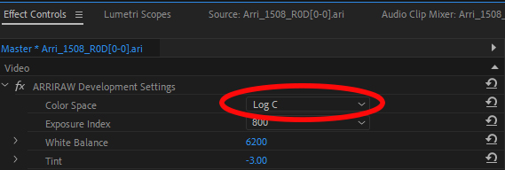
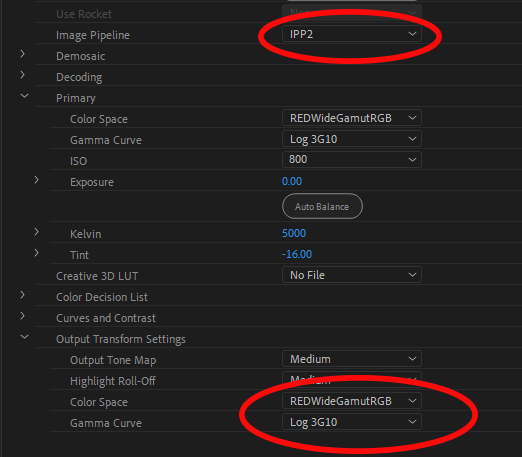
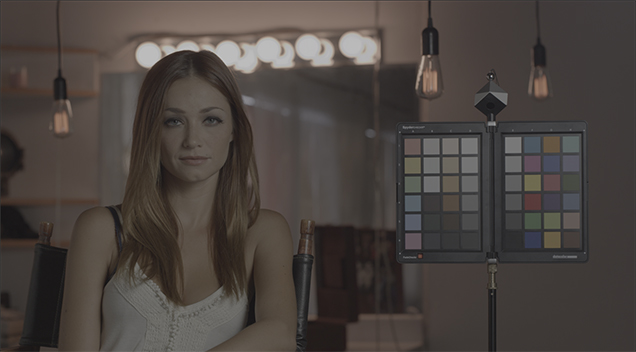
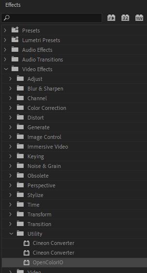
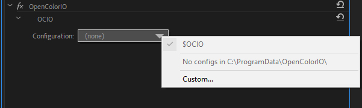
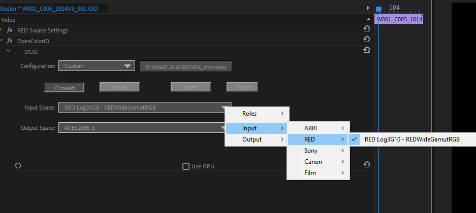
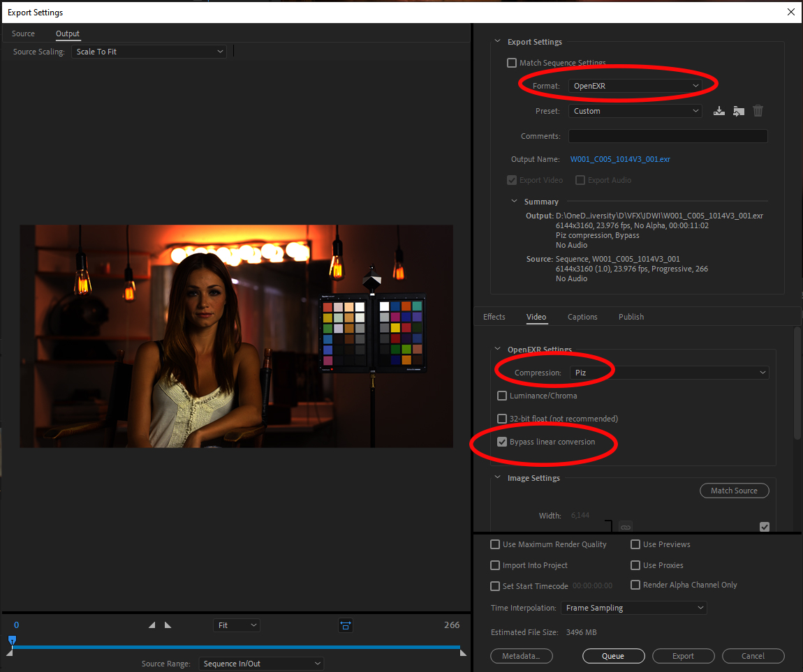

# Exporting OpenEXR from camera RAW with Premiere Pro

## Overview

Broadly speaking Premiere is a great software for editing, but is limited in it's ability to debayer camera RAW files. Premiere can *not* properly debayer the following:

- Black Magic (.BRAW)
- CinemaDNG

For these Resolve will need to be used, which can debayer all camera RAW formats. That said, Premiere can debayer camera RAW files from:

 - ARRI (.ari)
 - RED (.R3D)
 - Canon (.CRM)
 - MXF (a container format that supports many cameras including Sony, Panasonic, etc.)

Note that for MXF files, by default Premiere reads these in as Rec.709. You can however right-click the media and go to Source Settings where you can select the camera log space.
 
Using the OpenColorIO (OCIO) plugin it is then possible to export these to EXR. That workflow is decribed below.


## Setup

  1. Download the free [OCIO plugin for After Effects](https://fnordware.blogspot.com/2012/05/opencolorio-for-after-effects.html) place it in the common plugin folder, which on Windows is:<br>

| Platform	| Path
|-----------|---------------------------------------------------------------
| Windows	| C:\Program Files\Adobe\Common\Plug-ins\7.0\MediaCore
| Mac	      | /Library/Application Support/Adobe/Common/Plug-ins/7.0/MediaCore/ 

Don't worry about the name, it works in both Premiere and After Effects.

  2. Download the [VFX_mini.ocio](https://github.com/sharktacos/OpenColorIO-configs/blob/main/software/Premiere/VFX_mini.ocio) config, which is configured specifically for converting camera RAW files to OpenEXR in Premiere. 

  3. In Premiere open the Sequence Settings and turn on  **Max Bit Depth**. Otherwise Premiere will clip any image values over 1. 
  4. **Ungraded footage.** All color correction and grades should be *disabled* for a VFX pull.

## Camera log

Next the camera RAW file needs to be set to display in its native log space. This is done in the Effect Controls panel, and differs for each camera. For example for an ARRI camera you simply need to change to color space to LogC:



For a RED camera you need to first change the image pipeline from legacy to IPP2, and then set the Output Transforms Settings to match the Primary (RedWideGamutRGB color space, Log3G10 gamma)



This will display your footage in the log color space of your camera




## OpenColorIO (OCIO)

The OpenColorIO plugin is located in ````Effects > Video Effects > Utility > OpenColorIO````. 



Drag it onto the Effect Controls panel, under your camera RAW footage. Then click the Configuration drop-down menu, choose "custom" and load the [VFX_mini.ocio](https://github.com/sharktacos/OpenColorIO-configs/blob/main/software/Premiere/VFX_mini.ocio) file.



Next we need to convert from the log space of your camera into ACES scene-linear color space. in Convert mode, set the **Input Space** to your camera type. Below we have the settings for a RED camera.



This will convert the media from camera log into scene-linear, specifically the ACES interchange color space ACES2065-1 (AP0).


## Exporting OpenEXR

With our media in scene-linear we are ready to write to OpenEXR. Choose the ```File > Export > Media... ``` menu, and in the dialog choose the following options:

 - Format: OpenEXR
 - Compression: PIZ lossless compression 
 - Bypass linear conversion: ON




[Back to main](../StdX_ACES)
