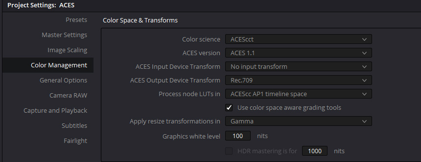
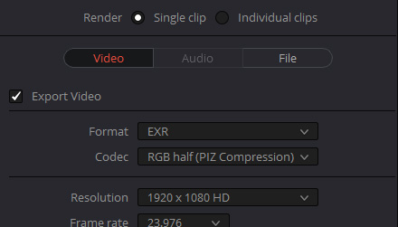

# Davinci Resolve

## scene-referred vs display-referred 

ACES works in a *scene-referred* workflow, meaning film footage is input using the mathematical transfer functions supplied by camera manufacturers which “reverse engineer” the encoding of each camera and bring it back into the linear light values of the physical real-world *scene* the camera was pointing at. 

Traditionally, colorists have instead worked in what is called a *display-referred* workflow, meaning the colorist needs to *refer* to the *display* and basically just eyeball footage from different cameras to get them to match, hoping the resulting film will look the same later on other monitors and projectors. This quote from the Davinci Resolve manual explains,

> “The default DaVinci YRGB color science setting, which is what Resolve has always used, relies on what is called “Display Referred” color management. This means that Resolve has no information about how the source media used in the Timeline is supposed to look; you can only judge color accuracy via the calibrated broadcast display you’re outputting to. Essentially, you are the color management, in conjunction with a trustworthy broadcast display that’s been calibrated to ensure accuracy.”

Because ACES uses a *scene-referred* workflow based on mathematical transfer functions, this means if you shoot footage of the same scene using different cameras, these can all be read into ACES using the scientific specifications of each particular camera, and all look the same side by side, the idea being that any camera pointed at the same scene would ostensibly generate the same image in scene-referred linear space. No tweaking or eyeballing required. The colorist can then focus on the artistic look of the film, beginning with a digital image that has been digitally “developed” according to the exact mathematical specifications of each particular camera manufacturer. In other words, the scene-referred workflow uses math and physics to get color to look the same consistently (scene-referred), rather than guesswork (display-referred). This consistency of color from start to finish of the film making process is the primary aim of ACES. It uses science in service of artistic vision.

## Using ACES

ACES is loaded in the Color Management section of the Project Settings.



To output a VFX pull you would temporarily set the display to linear by setting the *ACES Output Device Transform* in the project settings above to "No output transform" which will export the sequence in ACES2065-1 AP0 exchange color space. It's good practice to append this to the file name, for example ````MyFilm_shot22_ap0.0001.exr````. Then on the Delivery page export EXR files in 16-bit half float (which Davinci calls "RGB half"). 



Note that sequences in ACES are not output as DPX files, but as OpenEXR format. DPX is an older method which encodes the 0-1 image in log format allowing for storing a wide dynamic range (i.e. multiple camera exposures) in a small file size. However DPX is limited in the range it can hold, as opposed to an EXR which can go far beyond the 0-1 range and thus have a far larger dynamic range than a DPX file can. The ACES2065-1 archival/interchange color space contains the full gamut of what is visible to the human eye which is way more than an HDTV or sRGB monitor can display. If you are concerned about file sizes you can use Piz lossless compression. These EXR files will be smaller than a DPX file and even smaller than a PNG.

When you are done you can set the *ACES Output Device Transform* back, which brings us to the next topic...

## Viewing Looks in the *ACES Output Device Transform*

To use the *Filmic* and *Neutral* Look LUTS, the .cube files need to be placed into the Davinci Resolve LUT directory, which you can get to by clicking "Open LUT folder" in the Preferences, copying the files, and then clicking "update lists" to refresh. 


The two .cube Look LUT files are called:

````studio/LMT_filmic_AP1_shaper.cube```` <br>
````studio/LMT_neutral_AP1_shaper.cube````

A colorist may wish to use the Neutral Look for example as a starting place for grading instead of the default ACES Output Transform which many find to not be very neutral. See the [tone mapping](tonemap.md) doc for details and pretty pics.

## Gamut Compression

Gamut compression is done in Davinci Resolve Studio using a DCTL file which you will find in the ````software/Resolve/GamutCompress.dctl```` folder of the config. Place this into the Davinci Resolve LUT directory as described above. 

Gamut compression needs to be applied before anything else, immediately after the Input Transform (IDT) so that all grading operations are downstream of the compression. Gamut compression should be disabled when delivering a VFX pull so it is not baked into the EXR on export. 

See the [Nuke](Nuke.md) section on gamut compression for more details on this workflow, and the [Gamut Compression](gamut.md) doc for an overview with example pics. 

## Timeline vs Clip

Gamut compression can be applied to an individual clip or blanket applied to all footage since, unlike the former “Blue Light LMT” the algorithm only affects the necessary pixels of the image leaving the rest untouched.

Similarly, a Look Transform (LMT) conceptually should be applied across an entire scene or show, before the Output Transform. This can be done in Resolve by applying the LUT to the timeline instead of to an individual clip. To do this, in the Color module Node Editor set the drop-down to timeline. The first node would be the gamut compress, with a serial node for the Look Transform, for example using the Neutral Look as a starting point for grading.


To apply these, just click on the node and choose your LUT from the contextual menu. The LUT will then affect all the clips in the timeline, and can be toggled on or off as desired. For example when passing a clip to VFX the Look should be disabled so it is not baked into the EXR on export. 

The “process node LUTs in” in the ACES Color management Settings should be set to AP1 when using these .cube LUTs with the shaper built in (Log2 48 nits shaper ACEScc). 


[Back to main](../StdX_ACES)
