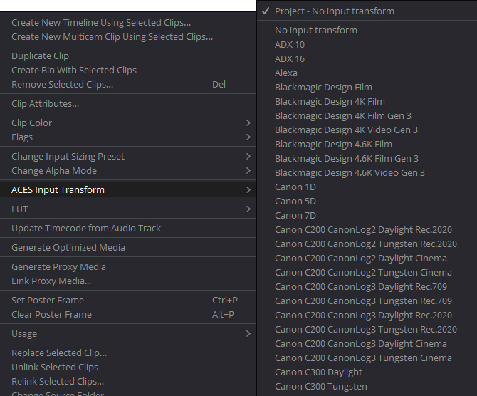

# DaVinci Resolve

## scene-referred vs display-referred 

Traditionally colorists work in what is called a *display-referred* workflow, meaning the colorist needs to *refer* to the *display* and basically just eyeball footage to manually get it to look good. If one were for example reading in footage from a RED camera, they would read in the raw camera file in IPP2 using Log3G10 REDwideGamutRGB and see the washed out image below. The colorist would begin with this washed out image in log space, and grade it manually until it looked nice.


ACES instead works in a *scene-referred* workflow, meaning film footage is input using the mathematical transform provided by the camera manufacturer to read in the raw footage. Here's that same RED footage in ACES. This is the starting point that the colorist then begins with, allowing them to focus on the artistic look of the film, beginning with a digital image that has been digitally “developed” according to the exact mathematical specifications of each particular camera manufacturer. 


In a non-color managed workflow one says they "are working in Rec.709" because they are working in the *display-referred* space of their display device, which is a broadcast monitor. In a color managed workflow like ACES one instead has *Input > Working > Output* spaces. A RAW camera file is recognized by its file format extension (for example .ari for ARRI) and will be debayered by Resolve. However if the original camera footage was saved in a format such as ProRes the camera type will need to be selected in the ACES input color space. This is done by right-clicking on the clip and choosing the camera color space. Note that unlike a LUT which is limited to a 0-1 range this is a mathematical transform which can accommodate high dynamic range images.



The Output is set to match the color space of the device/monitor you are viewing it on. For example if you are using a broadcast HDTV monitor then you would set it to Rec.709. If you are instead viewing on a standard computer monitor you would set it to sRGB. In other words, you set the color space to match what your display device is calibrated to. Rec.709 is the specification for HDTV and sRGB is the specification for a standard computer monitor. If you then have these two correctly calibrated monitors side by side, then the image you perceive from each one should be the same.

The working space in ACES is log, most commonly in ACEScct. Below you can see the settings in the Preferences for ACES color management. ACEScct is the working color space set in the "color science" drop down which determines the processing space. Therefore when it says "process LUTs in AP1 ACEScc" in the image below this actually means it will process in AP1 ACEScct, based on the color science setting. The ACES Input Transform is set to "no input transform" so it can be chosen for each clip as described above. The ACES Output Transform is set for viewing on a Rec.709 broadcast monitor.


## Creating LUTs for on-set monitoring

Resolve can generate a LUT that can be used, either in-camera or with an external LUT box, to preview footage on-set with a standard Rec.709 reference monitor. This is done using the ACES Transform OFX plugin in resolve. 

The first step to do this is to set Color Management to *DaVinci YRGB* in the Project Settings. Then create the following serial nodes:

- *Input Transform*: Apply an OFX ACES Transform to the first serial node and set its input to your camera, and the output to ACEScct. 
- *(optional) Look Transform*: This is where you would apply whatever custom grade is desired to the middle node. 
- *Output Transform*: Apply an OFX ACES Transform to the final serial node and set its input to ACEScct, and the output to Rec.709 for viewing on.


Then simply export the 3D LUT with the “Generate 3D LUT (CUBE)” command. This will create a full range .cube LUT, also called *extended range* (EE). This [chart](http://www.antlerpost.com/downloads/LUT_ranges.pdf) lists compatibility of various cameras and LUT boxes with *extended range* (EE) and legal range (LL) LUTs. for the few cameras that require legal range, you can add the [provided DCTLs](../StdX_ACES/software/Resolve/) ````StdX_ACES/software/Resolve/Range_smpte_to_full.dctl```` at the beginning of the above node chain and  ````StdX_ACES/software/Resolve/Range_full_to_smpte.dctl```` at the end to bring the LUT into SMPTE legal video range. If you are using an ARRI, as in the above example, you can use [free software from ARRI](https://www.arri.com/en/learn-help/learn-help-camera-system/tools/arri-look-creator) to convert this to ARRI look format.

If you don't want to "roll your own" LUTs, cinematographer Geoff Boyle has a [set of free LUTs](https://community.acescentral.com/t/luts-that-emulate-the-aces-workflow/1334/21) you can download for just about every film camera out there.

## Conform

Editorial is working with proxy media made from baking the ACES Output Transform into the clip for viewing in a non-color managed workflow such as Adobe Premiere. The conform is where those proxy files are substituted for the high res Open-EXR files in ACES AP0 interchange color space (ACES2065-1). This swap is done with an EDL/AAF/XML file provided by editorial. 


Generally XML and AAF have replaced EDL. XML is used by Premiere, and AAF by AVID. Assuming we are working with Premiere and Resolve then, the conform would involve exporting an XML of the proxy edit in Premiere (```file > export > final Cut Pro XML```) and importing this into Resolve (```file > import timeline > import AAF,EDL,XML```). The proxy media is then linked to the full res camera RAW files in Resolve. See the Resolve manual for details on this. A good place to start is the [The Beginner’s Guide to Conforming with DaVinci Resolve](https://blog.frame.io/2019/03/29/conforming-with-resolve/?__cf_chl_jschl_tk__=pmd_UNFRGgnL4qFI66TSmGJ_YszygW4jy2EaeIb0GSYfGKg-1633042554-0-gqNtZGzNAfujcnBszQdR).

This can then be output as Open-EXR files in ACES AP0 interchange color space (ACES2065-1) with PIZ lossless compression. Unlike a 10-bit DPX, this ACES interchange format is able to hold all of the quality and dynamic range of the original camera RAW files. Resolve Netflix Studios has a great [step-by-step guide for Resolve](https://partnerhelp.netflixstudios.com/hc/en-us/articles/360002088888-Color-Managed-Workflow-in-Resolve-ACES-) that will walk you through the process in detail.  


## VFX Pulls and Per-Shot LUTs

Like the conform, VFX pulls should be debayered from the original RAW camera files and exported as 16-bit EXR in the ACES AP0 interchange format (ACES2065-1) with PIZ compression. All color correction and grades should be *disabled* for a VFX pull. An easy way to do this is to turn on "Enable Flat Pass" in the Resolve Delivery advanced options (again, see the above step-by-step guide). The basic idea is that VFX returns the ungraded plate to DI, with the VFX added, so that DI gets the full quality film plate back *as if it were filmed that way*. DI can then seamlessly insert it back into the conform and color grade everything together.

- **Color Reference and LUTs.** VFX pulls should include 
  - *A reference frame for checking color against existing dailies.* <br>This should be an 8-bit JPG or PNG in sRGB color space. A screen grab works fine.
  - *A "shot LUT" to achieve dailies color, along with the working color space.* <br>In Resolve the "generate LUT" command can be used to export all enabled grades, both in the timeline and the clip, so it will combine the Look Transform with your shot grades, including any CDL, all into a single *Shot LUT* for VFX to use. The LUT's working color space should be noted in the file name (For example ````shot01_ACEScct.cube````. This will be ACEScct or ACEScc based on the Project Settings in Resolve. VFX needs to know this in order to properly process the LUT in comp. 


## Setting up Reference Gamut Compression for Resolve

Gamut compression is done in DaVinci Resolve Studio using a DCTL file which you will find in the ````software/Resolve/GamutCompress.dctl```` folder of the config. Place this into the DaVinci Resolve LUT directory, which you can get to by clicking "Open LUT folder" in the Preferences, copying the files, and then clicking "update lists" to refresh. 


The “process node LUTs in” in the ACES Color management Settings should be set to AP1 when using the DCTL. This will be the same as the Color Science setting  (ACEScct or ACEScc). 


## Applying Gamut Compression

See the [Gamut Compression](gamut.md) page for an overview of the "what" and "why" of gamut compression with example pics. For phases of production such as on-set monitoring, dailies, editorial, etc. it can be beneficial to *see* footage with gamut compression in order to get an idea of the final look, just as it can be good to see footage through a LUT. This can be done on proxy media. However, **gamut compression should only be applied to the full-fidelity EXR footage either in VFX (and therefore not in a VFX pull or in the conform) or in DI (for non-VFX shots).** 

Gamut compression is designed to be applied before anything else, immediately after the Input Transform (IDT) so that all grading operations are downstream of the compression. Unlike the former “Blue Light LMT” the algorithm only affects the necessary pixels of the image leaving the rest untouched. Consequently, while gamut compression can be applied to an individual clip, it can also be blanket-applied to all footage. 

This can be accomplished with groups in Resolve. Select all of the clips and create a group by right-clicking on an individual clip and selecting *Add into new group.*  In the Color module Node Editor you will then have added options in the drop-down for *Group Pre-clip* and  *Group Post-clip* in addition to *clip* and *timeline*.


The gamut compress DCTL is applied in the *Group Pre-clip* which is accessed by right-clicking on the node and choosing it from the LUT menu. This will blanket apply gamut compression before all the clip grades.

# Digital Intermediate, Mastering, and Delivery

Digital Intermediate (DI) is the process where the entire motion-picture is color-corrected (often called "grading"), and the visual look of the film is finalized. It's crucial that DI is done in an environment that exactly mirrors the viewing conditions of the final exhibition (e.g. in a theater viewed with a film projector). This is known as a color grading suite.

<p align="center">
<br>
 <sup>The ARRI color grading theater (photo © Arri CC BY-SA).</sup>
</p>

DI is the final step where the files from conform, as well as VFX shots, are read into an ACES capable color corrector (Resolve, Baselight, etc.), and viewed through the appropriate ACES Output Transform for the targeted display. For example, the Output Transform would be set to DCI-P3 for viewing on a film projector. In the final step, known as "mastering" this device-specific Output Transform, together with the final color grade, is baked into the media for delivery. Additionally, an archival master is created using the ACES interchange and archival format ACES2065-1.

Typically one particular viewing environment is identified as the “gold standard,” and the majority of the artistic time is spent correcting the images to look perfect on that display device. Once the main color grade is complete, additional masters are handled as "trim passes" atop the main output. A trim pass involves relatively minor adjustments, made atop the reference master, needed to make the film look great in the different viewing environment. 

<p align="center">
<br>
</p>

Traditionally theatrical (digital) projection was considered the "gold" reference, and trim passes were made for other other display devices (television, web, and so on). With the recent advent of HDR displays, there’s debate as to how best to use this emerging technology. Does one use HDR as the reference, and create SDR trim passes on top of that, or visa-versa? There are [many factors to consider](https://community.acescentral.com/t/odt-without-changing-the-grade-and-round-trip-from-premier/2258/2). 

In the end, film is an art aided by science, and while using the ACES Output Transform for the particular display type provides a solid starting point, it is incumbent on the developed eye of the artist to adapt or “trim” the grade, optimizing it for the particular characteristics of each display device. In other words, ACES doesn't replace the need for the artist, rather it enables artists to focus on nuance.


[Back to main](../StdX_ACES)
