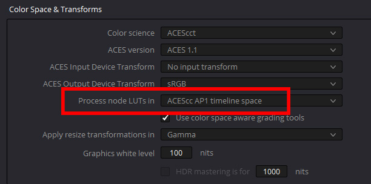

# Davinci Resolve

## Installation

ACES is loaded in the Color Management section of the Project Settings.


To use the *Filmic* and *Neutral* Look LUTS, located in the "studio" folder of the config, need to be placed into the Davinci Resolve LUT directory which you can get to by clicking "Open LUT folder" in the Preferences, copying the files, and then clicking "update lists" to refesh. 


The two .cube Look LUT files are called:

````studio/LMT_filmic_AP1_shaper```` <br>
````studio/LMT_neutral_AP1_shaper````

Gamut compression is done in Davinci Resolve Studio using a DCTL file which you will find in the ````software/Resolve/GamutCompress.dctl```` folder of the config. Place this into the Davinci Resolve LUT directory as described above. 


## Use

Gamut compression needs to be applied before anything else, immediately after the Input Transform (IDT) so that all grading operations are downstream of the compression.
It can be applied to an individual clip or blanket applied to all footage since, unlike the former “Blue Light LMT” the algorithm only affect the necessary pixels of the image leaving the rest untouched.

Similarly, a Look Transform (LMT) conceptually should be applied across an entire scene or show, before the Output Transform. This can be done in Resolve by applying the LUT to the timeline instead of to an individual clip. To do this, in the Color module Node Editor set the drop-down to timeline. The first node would be gamut compress, with a seriel node for the Look Transform.


Then just click on the node and choose your LUT from the contextual menu. The LUT will then affect all the clips in the timeline, and can be toggled on or off as desired. For example when passing a clip to VFX the Look should be disabled so it is not baked into the EXR on export. 

The “process node LUTs in” in the ACES Color management Settings should be set to AP1 when using these .cube LUTs with the shaper built in (Log2 48 nits shaper ACEScc). 



[Back to main](../StdX_ACES)
