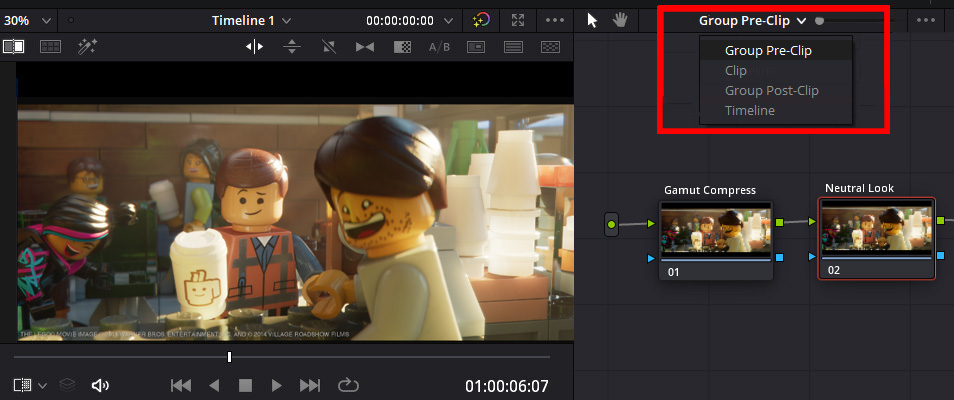

# Davinci Resolve

ACES is loaded in the Color Management section of the Project Settings.

To use the *Filmic* and *Neutral* Look LUTS, located in the "studio" folder of the config, need to be placed in the into the Davinci Resolve LUT directory which you can get to by clicking "Open LUT folder" in the Preferences, copying the files, and then clicking "update lists" to refesh. The two .cube LUT files are called:

[studio/LMT_filmic_AP1_shaper.cube](../StdX_ACES/studio/LMT_filmic_AP1_shaper_v27.cube)

[studio/LMT_neutral_AP1_shaper.cube](../StdX_ACES/studio/LMT_neutral_AP1_shaper_v27.cube)

Conceptually a Look Transform (LMT) should be applied across an entire scene or show, downstream of the per shot grades, but before the Output Transform. This can be done in Resolve by applying the LUT to the timeline instead of to an individual clip. To do this, in the Color module Node Editor set the drop-down to timeline.

Then just click on the node and choose your LUT from the contextual menu. The LUT will then affect all the clips in the timeline, and can be toggled on or off as desired. For example when passing a clip to VFX the Look should be disabled so it is not baked into the EXR on export. 

The “process node LUTs in” in the ACES Color management Settings should be set to AP1 when using these .cube LUTs with the shaper built in (Log2 48 nits shaper ACEScc). 

