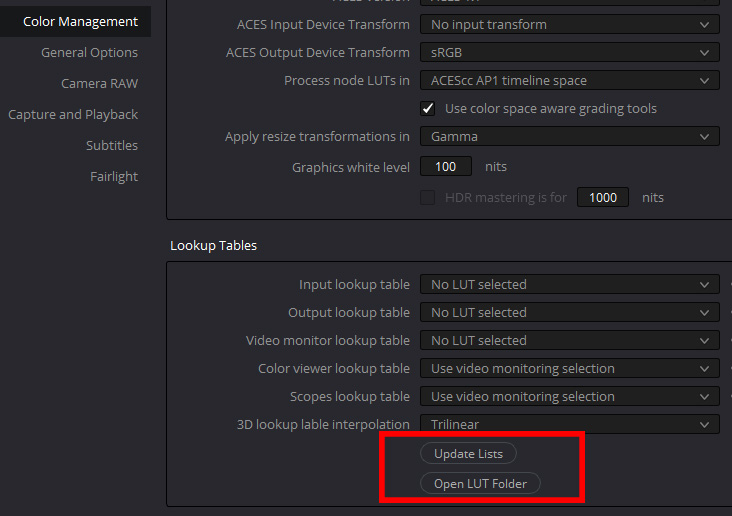

# Davinci Resolve

## Using ACES

ACES is loaded in the Color Management section of the Project Settings.


To output a VFX pull you would temporarily set the display to linear by setting the *ACES Output Device Transform* in the project settings above to "No output transform" which will export the sequence in ACES2065-1 AP0 exchange color space. It's good practice to append this to the file name, for example ````MyFilm_shot22_ap0.0001.exr````. Then on the Delivery page export EXR files in 16-bit half float (which Davinci calls "RGB half"). 


Note that sequences in ACES are not output as DPX files, but as OpenEXR format. DPX is an older method which encodes the 0-1 image in log format allowing for storing a wide dynamic range (i.e. multiple camera exposures) in a small file size. However DPX is limited in the range it can hold, as opposed to an EXR which can go far beyond the 0-1 range and thus have a far larger dynamic range than a DPX file can. The ACES2065-1 archival/interchange color space contains the full gamut of what is visible to the human eye which is way more than an HDTV or sRGB monitor can display. If you are concerned about file sizes you can use Piz lossless compression. These EXR files will be smaller than a DPX file and even smaller than a PNG.

When you are done you can set the *ACES Output Device Transform* back, which brings us to the next topic...

## Viewing Looks in the *ACES Output Device Transform*

To use the *Filmic* and *Neutral* Look LUTS, the .cube files need to be placed into the Davinci Resolve LUT directory, which you can get to by clicking "Open LUT folder" in the Preferences, copying the files, and then clicking "update lists" to refresh. 



The two .cube Look LUT files are called:

````studio/LMT_filmic_AP1_shaper.cube```` <br>
````studio/LMT_neutral_AP1_shaper.cube````

A colorist may wish to use the Neutral Look for example as a starting place for grading instead of the default ACES Output Transform which many find to not be very neutral. See the [tone mapping](tonemap.md) doc for details and pretty pics.

## Gamut Compression

Gamut compression is done in Davinci Resolve Studio using a DCTL file which you will find in the ````software/Resolve/GamutCompress.dctl```` folder of the config. Place this into the Davinci Resolve LUT directory as described above. 

Gamut compression needs to be applied before anything else, immediately after the Input Transform (IDT) so that all grading operations are downstream of the compression.

It can be applied to an individual clip or blanket applied to all footage since, unlike the former “Blue Light LMT” the algorithm only affects the necessary pixels of the image leaving the rest untouched.

Similarly, a Look Transform (LMT) conceptually should be applied across an entire scene or show, before the Output Transform. This can be done in Resolve by applying the LUT to the timeline instead of to an individual clip. To do this, in the Color module Node Editor set the drop-down to timeline. The first node would be the gamut compress, with a seriel node for the Look Transform, for example using the Neutral Look as a starting point for grading.


To apply these, just click on the node and choose your LUT from the contextual menu. The LUT will then affect all the clips in the timeline, and can be toggled on or off as desired. For example when passing a clip to VFX the Look should be disabled so it is not baked into the EXR on export. For 

The “process node LUTs in” in the ACES Color management Settings should be set to AP1 when using these .cube LUTs with the shaper built in (Log2 48 nits shaper ACEScc). 


[Back to main](../StdX_ACES)
