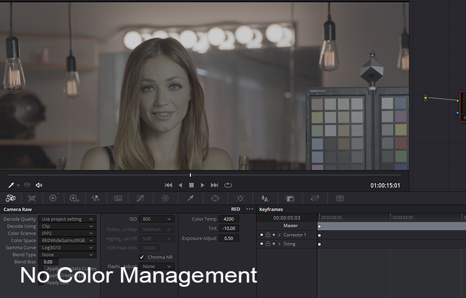
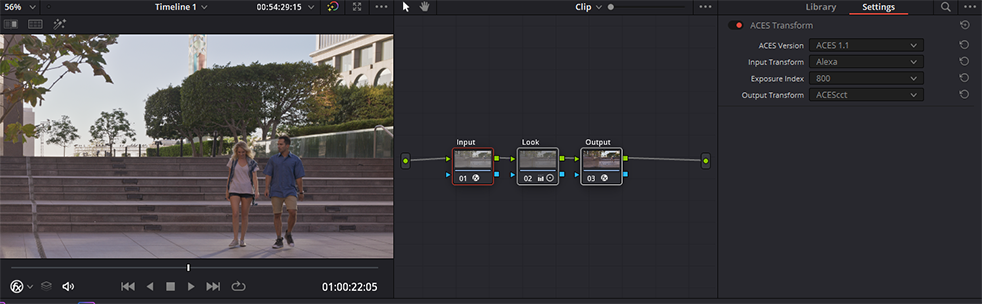

# Davinci Resolve


## scene-referred vs display-referred 

Traditionally colorists work in what is called a *display-referred* workflow, meaning the colorist needs to *refer* to the *display* and basically just eyeball footage to manually get it to look good. If one were for example reading in footage from a RED camera, they would read in the raw camera file in IPP2 using Log3G10 REDwideGamutRGB and see the washed out image below. The colorist would begin with this washed out image in log space, and grade it manually until it looked nice.



ACES instead works in a *scene-referred* workflow, meaning film footage is input using the mathematical transform provided by the camera maufacturer to read in the raw footage. Here's that same RED footage in ACES. This is the starting point that the colorist then begins with, allowing them to focus on the artistic look of the film, beginning with a digital image that has been digitally “developed” according to the exact mathematical specifications of each particular camera manufacturer. 


However, while everyone is happy with these ACES Input Transforms, a lot of colorists are not as happy with the ACES Output Transform which they find has too much of a "look" on it. They would prefer a more *neutral* starting point to begin their grading work from. That's the motivation for the [Look Transforms](tonemap.md) of this config. Here's a side by side comparison of the ACES Output Transform and the **Neutral Look** transform. You can read more details about these Look Transforms [here](tonemap.md).


## Viewing Looks in the *ACES Output Device Transform*

To use the *Filmic* and *Neutral* Look LUTS, the .cube files need to be placed into the Davinci Resolve LUT directory, which you can get to by clicking "Open LUT folder" in the Preferences, copying the files, and then clicking "update lists" to refresh. 


The two .cube Look LUT files are called:

````studio/LMT_filmic_AP1_shaper.cube```` <br>
````studio/LMT_neutral_AP1_shaper.cube````

A colorist may wish to use the Neutral Look for example as a starting place for grading instead of the default ACES Output Transform which many find to not be very neutral. See the [tone mapping](tonemap.md) doc for details and pretty pics.

## Gamut Compression

Gamut compression is done in Davinci Resolve Studio using a DCTL file which you will find in the ````software/Resolve/GamutCompress.dctl```` folder of the config. Place this into the Davinci Resolve LUT directory as described above. 

Gamut compression needs to be applied before anything else, immediately after the Input Transform (IDT) so that all grading operations are downstream of the compression. Gamut compression should be disabled when delivering a VFX pull so it is not baked into the EXR on export. 

See the [Nuke](Nuke.md) section on gamut compression for more details on this workflow, and the [Gamut Compression](gamut.md) doc for an overview with example pics. 

## Timeline vs Clip

Gamut compression can be applied to an individual clip or blanket applied to all footage since, unlike the former “Blue Light LMT” the algorithm only affects the necessary pixels of the image leaving the rest untouched.

Similarly, a Look Transform (LMT) conceptually should be applied across an entire scene or show, before the Output Transform. This can be done in Resolve by applying the LUT to the timeline instead of to an individual clip. To do this, in the Color module Node Editor set the drop-down to timeline. The first node would be the gamut compress, with a serial node for the Look Transform, for example using the Neutral Look as a starting point for grading.


To apply these, just click on the node and choose your LUT from the contextual menu. The LUT will then affect all the clips in the timeline, and can be toggled on or off as desired. For example when passing a clip to VFX the Look should be disabled so it is not baked into the EXR on export. 

The “process node LUTs in” in the ACES Color management Settings should be set to AP1 when using these .cube LUTs with the shaper built in. This will be the same as the Color Science setting  (ACEScct or ACEScc). 


## Creating LUTs for on-set monitoring

Resolve can generate a LUT that can be used, either in-camera or with an external LUT box, to preview footage on-set with a standard Rec.709 reference monitor. This is done using the ACES Transform OFX plugin in resolve. 

The first step to do this is to set Color Management to *Davinci YRGB* in the Project Settings. Then create the following seriel nodes:

- *Input Transform*: Apply an OFX ACES Transform to the first seriel node and set its input to your camera, and the output to ACEScct. 
- *(optional) Look Transform*: This is where you would apply whatever custom grade is desired to the middle node. 
- *Output Transform*: Apply an OFX ACES Transform to the final seriel node and set its input to ACEScct, and the output to Rec.709 for viewing on.



Then simply export the 3D LUT with the “Generate 3D LUT (CUBE)” command. This will create a full range .cube LUT, also called *extended range* (EE). This [chart](http://www.antlerpost.com/downloads/LUT_ranges.pdf) lists compatibilty of various cameras ans LUT boxes with *extended range* (EE) and legal range (LL) LUTs. If you are using an ARRI, as in the above example, you can use [free software from ARRI](https://www.arri.com/en/learn-help/learn-help-camera-system/tools/arri-look-creator) to convert this to ARRI look format.

If you don't want to "roll your own" LUTs, cinematographer Geoff Boyle has a [set of free LUTs](https://community.acescentral.com/t/luts-that-emulate-the-aces-workflow/1334/21) you can download for just about every film camera out there.


[Back to main](../StdX_ACES)
