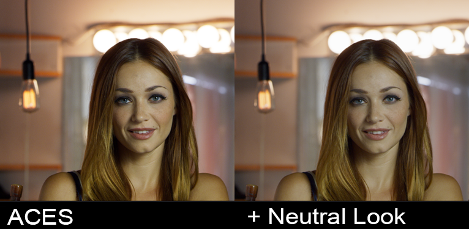

# Davinci Resolve

## Creating LUTs for on-set monitoring

Resolve can generate a LUT that can be used, either in-camera or with an external LUT box, to preview footage on-set with a standard Rec.709 reference monitor. This is done using the ACES Transform OFX plugin in resolve. 

The first step to do this is to set Color Management to *Davinci YRGB* in the Project Settings. Then create the following seriel nodes:

- *Input Transform*: Apply an OFX ACES Transform to the first seriel node and set its input to your camera, and the output to ACEScct. 
- *(optional) Look Transform*: This is where you would apply whatever custom grade is desired to the middle node. 
- *Output Transform*: Apply an OFX ACES Transform to the final seriel node and set its input to ACEScct, and the output to Rec.709 for viewing on.


Then simply export the 3D LUT with the “Generate 3D LUT (CUBE)” command. This will create a full range .cube LUT, also called *extended range* (EE). This [chart](http://www.antlerpost.com/downloads/LUT_ranges.pdf) lists compatibilty of various cameras and LUT boxes with *extended range* (EE) and legal range (LL) LUTs. If you are using an ARRI, as in the above example, you can use [free software from ARRI](https://www.arri.com/en/learn-help/learn-help-camera-system/tools/arri-look-creator) to convert this to ARRI look format.

If you don't want to "roll your own" LUTs, cinematographer Geoff Boyle has a [set of free LUTs](https://community.acescentral.com/t/luts-that-emulate-the-aces-workflow/1334/21) you can download for just about every film camera out there.

## scene-referred vs display-referred 

Traditionally colorists work in what is called a *display-referred* workflow, meaning the colorist needs to *refer* to the *display* and basically just eyeball footage to manually get it to look good. If one were for example reading in footage from a RED camera, they would read in the raw camera file in IPP2 using Log3G10 REDwideGamutRGB and see the washed out image below. The colorist would begin with this washed out image in log space, and grade it manually until it looked nice.


ACES instead works in a *scene-referred* workflow, meaning film footage is input using the mathematical transform provided by the camera maufacturer to read in the raw footage. Here's that same RED footage in ACES. This is the starting point that the colorist then begins with, allowing them to focus on the artistic look of the film, beginning with a digital image that has been digitally “developed” according to the exact mathematical specifications of each particular camera manufacturer. 


However, while everyone is happy with these ACES Input Transforms, a lot of colorists are not as happy with the ACES Output Transform which they find has too much of a "look" on it. They would prefer a more *neutral* starting point to begin their grading work from. That's the motivation for the [Look Transforms](tonemap.md) of this config. Here's a side by side comparison of the ACES Output Transform and the **Neutral Look** transform. You can read more details about these Look Transforms [here](tonemap.md).




## Setting up the Gamut Compress and Look Transforms for Resolve

To use the *Filmic* and *Neutral* Look LUTS, the .cube files need to be placed into the Davinci Resolve LUT directory, which you can get to by clicking "Open LUT folder" in the Preferences, copying the files, and then clicking "update lists" to refresh. 


The two .cube Look LUT files are called:

````studio/LMT_filmic_AP1_shaper.cube```` <br>
````studio/LMT_neutral_AP1_shaper.cube````

A colorist may wish to use the Neutral Look for example as a starting place for grading instead of the default ACES Output Transform which many find to not be very neutral. See the [tone mapping](tonemap.md) doc for details and pretty pics.

Gamut compression is done in Davinci Resolve Studio using a DCTL file which you will find in the ````software/Resolve/GamutCompress.dctl```` folder of the config. Place this into the Davinci Resolve LUT directory as described above. 

The “process node LUTs in” in the ACES Color management Settings should be set to AP1 when using these .cube LUTs with the shaper built in as well as for the DCTL. This will be the same as the Color Science setting  (ACEScct or ACEScc). 


## Applying Gamut Compression

See the [Gamut Compression](gamut.md) page for an overview of the "what" and "why" of gamut compression with example pics. For phases of production such as on-set monitoring, dailies, editorial, etc. it can be beneficial to *see* footage with gamut compression in order to get an idea of the final look, just as it can be good to see footage through a LUT. This can be done on proxxy media. However, the gamut compression should only be applied to the full-fidelity EXR footage either in VFX (and therefore not in a VFX pull or in the conform) or in DI (for non-VFX shots). 

Gamut compression is designed to be applied before anything else, immediately after the Input Transform (IDT) so that all grading operations are downstream of the compression. Unlike the former “Blue Light LMT” the algorithm only affects the necessary pixels of the image leaving the rest untouched. Consequently, while gamut compression can be applied to an individual clip, it can also be blanket-applied to all footage. 

This can be accomplished with groups in Resolve. Select all of the clips and create a group by right-clicking on an individual clip and selecting *Add into new group.*  In the Color module Node Editor you will then have added options in the drop-down for *Group Pre-clip* and  *Group Post-clip* in addition to *clip* and *timeline*.


The gamut compress DCTL is applied in the *Group Pre-clip* which is accessed by right-clicking on the node and choosing it from the LUT menu. This will blanket apply gamut compression before all the clip grades.

## Applying Look Transforms

On the other hand, a Look Transform (LMT) conceptually should be applied across an entire scene or show, *after* the per shot grades but before the Output Transform. For example using the Neutral Look as a starting point for grading.

The Look Transform is therefore applied in the *Group Post-clip* which is again accessed by right-clicking on the node and choosing it from the LUT menu. This will blanket apply the Look Transform after all the clip grades.

## Putting it all together (and taking it off)

Both  *Group Pre-clip* and  *Group Post-clip*  can be toggled on or off as desired. For example, as discussed above when passing a clip to VFX the Look should be disabled (as should all grades) so it is not baked into the EXR on export. Similarly, gamut compression should be disabled for VFX pulls. 


[Back to main](../StdX_ACES)
