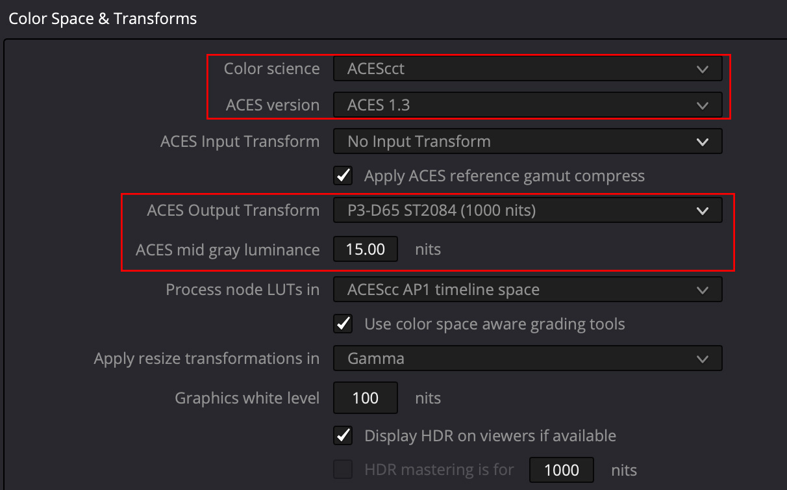
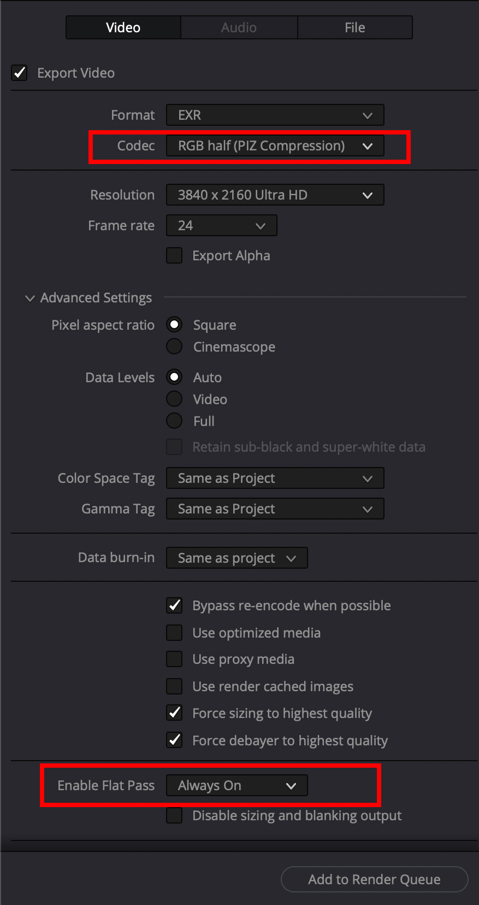

# VFX Pulls in Resolve

For more information about the ACES implementation in Davinci Resolve, please go to the ‘Color Management using ACES’ chapter in the “The Data Levels, Color Management, and ACES” section of the latest DaVinci Resolve Manual.

The following is from the [Netflix Partner Help Center](https://partnerhelp.netflixstudios.com/hc/en-us/articles/360002088888-Color-Managed-Workflow-in-Resolve-ACES-)

## Project Settings

Once you create a new project, go to the Project Settings > Color Management panel. The first thing you will want to change is the Color Science settings to **ACEScct**. If you don’t have a specific reason to use ACEScc, it is recommended to use ACEScct. 

Generally, we recommend using the latest ACES version.

Set your ACES Output Device Transform to match the calibration and capacities of your video display:

 - For SDR, this will be **Rec. 709**, which corresponds to a monitor calibrated to Rec. 709 / BT.1886 with 100 cd/m2 peak luminance.
    

 - For HDR, this will be P3-D65 ST.2084 (PQ) with the corresponding nit level your monitor is capable of. Today, most commonly, this will be P3-D65 ST2084 (1000 nits). 

 - Make sure the ACES Mid Gray Luminance setting stays at 15.00 throughout the whole grading and finishing process.

 - Process Node LUTs will only apply in the event that you are loading LMTs as LUTs to the project. The setting will vary depending on how those LMTs were generated. For more context around LMTs, please follow [this thread](https://acescentral.com/t/lmts-part-1-what-are-they-and-what-can-they-do-for-me/790).

An important note is that when the ACES Output Device Transform is set to **None**, Resolve will output ACES images a.k.a. ACES 2065-1 or ACES Linear (AP0).

## Bringing in Clips

By default, for RAW clips, Resolve will automatically debayer images into ACES and you should see a normal looking image. 

For non-RAW formats (such as DPX, ProRes, XAVC, etc), Resolve may not automatically detect the color space, so you will have to manually select your ACES Input Device Transform (IDT).

You can do this by right-clicking on a shot or group of shots in the Media Pool, as shown in the screenshot below. 

*Example: you shot XAVC on the Sony F55 using the SLog3-SGamut3.CINE color space, and bring these clips into the Media Pool. Resolve is not able to recognize this based on the metadata, so you must manually select “Sony SLog3 SGamut3CINE” from the ACES Input Device Transform dropdown list.*

You may also set your Project to *default* to a specific ACES Input Device Transform. This may be handy if the majority of your clips will be in a common color space and cannot be auto-detected. 

*TIP: Sorting your Media Pool by “Format” or “Video Codec” columns can help batch-assign IDTs to groups of clips highlighted at one time. See screenshot below for an example.*

## Rendering

When you are ready to render your deliverables, open up the Deliver page.
 
**IMF Master, Video Display Master (VDM) or Quicktime references**

When rendering images in display color spaces, such as those required for IMF Master deliverables, a VDM source for IMF creation, or Quicktime references, make sure your ACES Output Transform is enabled and matches the intended display type.
 
**VFX Pulls**

Turn off the ACES Output Transform in order to output ACES AP0/Linear data as shown below. This put the clip in ACES2065-1 used for interchange if images between facilities or softwares in an ACES pipeline, such as VFX plates.

To disable the grade for your VFX render, the **Enable Flat Pass** option on the **Deliver** page can be used. See screenshot from the DaVinci Resolve Manual below.

Ensure you have the following render settings:

 - **Render:** 	Single Clip
 - **File Type:** 	EXR
 - **Codec:** 	RGB half, PIZ lossless compression (note: this is 16-bit half float)
 - **Render Resolution:** 	Equal to the scene’s Working Format
 - **ACES Output Device Transform(in Project Settings):** 	No Output Transform
 - **Enable Flat Pass:** 	Always On

*Tip: The setting ‘Force debayer to highest quality’  will automatically select what Resolve considers to be the highest debayering quality for each RAW file on the timeline. This may differ from your own findings. Please feel free to select your preferred debayering algorithm instead, and untick this option if you prefer.*

*Tip: Resolution may vary depending on the project’s framing, but should be at UHD resolution (3840 x 2160) or higher.*

