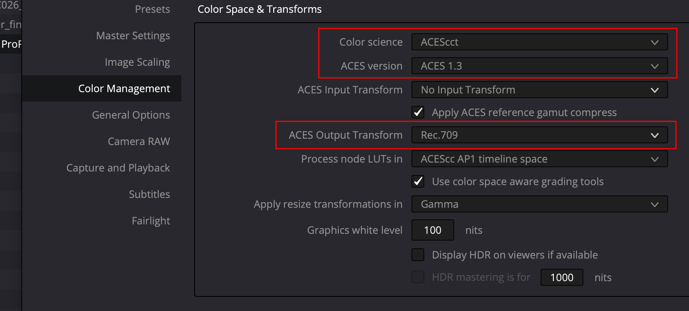

# VFX Pulls in Resolve

For more information about the ACES implementation in Davinci Resolve, please go to the ‘Color Management using ACES’ chapter in the “The Data Levels, Color Management, and ACES” section of the latest DaVinci Resolve Manual.

The following is from the [Netflix Partner Help Center](https://partnerhelp.netflixstudios.com/hc/en-us/articles/360002088888-Color-Managed-Workflow-in-Resolve-ACES-). If you like video instruction, you may also want to check out the following videos made by Netflix in partner ship with Blackmagic:

[ACES Set Up in DaVinci Resolve](https://www.youtube.com/watch?v=u9Rvm5xiuhk&list=PLsJrJgQkAdTnNB5sbmkRLZaZkcd63W8Nb&index=4)
[ACES Deliveries in DaVinci Resolve](https://www.youtube.com/watch?v=2-H3jgXXTiQ&list=PLsJrJgQkAdTnNB5sbmkRLZaZkcd63W8Nb&index=5)

## Project Settings

Once you create a new project, go to the Project Settings > Color Management panel. The first thing you will want to change is the Color Science settings to **ACEScct**. If you don’t have a specific reason to use ACEScc, it is recommended to use ACEScct. 

Generally, we recommend using the latest ACES version.

Set your ACES Output Device Transform to match the calibration and capacities of your video display:

 - For SDR, this will be **Rec. 709**, which corresponds to a monitor calibrated to Rec. 709 / BT.1886 with 100 cd/m2 peak luminance.
    

 - For HDR, this will be P3-D65 ST.2084 (PQ) with the corresponding nit level your monitor is capable of. Today, most commonly, this will be P3-D65 ST2084 (1000 nits). 

Notes: 

 - *Make sure the ACES Mid Gray Luminance setting stays at 15.00 throughout the whole grading and finishing process.*

 - *Process Node LUTs will only apply in the event that you are loading LMTs as LUTs to the project. The setting will vary depending on how those LMTs were generated. Note that "Process node luts in: ACEScc:AP1 timeline space" is a bit of a misnomer. With this setting Resolve will process luts in the AP1 timeline space that set in the coresponding "Color Science" section above (set here to ACEScct).*

 - *An important note is that when the ACES Output Device Transform is set to **None**, Resolve will output ACES images a.k.a. ACES 2065-1 or ACES Linear (AP0).*

## Bringing in Clips

By default, for RAW clips, Resolve will automatically debayer images into ACES and you should see a normal looking image. 

For non-RAW formats (such as MXF, DPX, ProRes, XAVC, etc), Resolve may not automatically detect the color space, and read the footage in with the native camera log color space. An indication of this is if your image looks washed out, which is typical of log footage. Here we see an example of ARRI footage saved as ProRes 4444. It's pretty easy to recognize that the image is overly bright and washed out:

In such cases you will need to manually select your ACES Input Device Transform (IDT). You can do this by right-clicking on a shot or group of shots in the Media Pool, and setting the ACES input transform to the appropriate camera log color space. In this example ARRI LogC. 

You may also set your Project to *default* to a specific ACES Input Device Transform. This may be handy if the majority of your clips will be in a common color space and cannot be auto-detected. 

*TIP: Sorting your Media Pool by “Format” or “Video Codec” columns can help batch-assign IDTs to groups of clips highlighted at one time. See screenshot below for an example.*

## Rendering

When you are ready to render your deliverables, open up the Deliver page.
 
**IMF Master, Video Display Master (VDM) or Quicktime references**

When rendering images in display color spaces, such as those required for IMF Master deliverables, a VDM source for IMF creation, or Quicktime references, make sure your ACES Output Transform is enabled and matches the intended display type. For example if sending clips to editorial for offline editing of proxy media viewed on a broadcast reference monitor, the Output Transform would be set to "Rec709" (HDTV). If sending clips to VFX as reference the Output Transform would likewise be set to Rec709.
 
**VFX Pulls**

 - **Set color space to ACES2065 (AP0)** This done in Resolve by disabling the ACES Output Transform (setting it to "No Output Transorm") as shown below.
 

This puts the clip in ACES2065-1 used for interchange of images between facilities or softwares in an ACES pipeline, such as VFX plates. This will make the image appear dark, as we can see with our example ARRI footage:

This is expected, as you are viewing the image in scene-linear ACES2065-1 without the output transform. Scene-linear means that the pixel values have a 1:1 linear relationahip to the values of the light photons in the real world scene. Those light values are not what our eye sees, but rather for data storage of the physical values of light captured on the scene.

 - **Disable all grades** To disable the grade for your VFX render, the **Enable Flat Pass** option on the **Deliver** page can be used. See screenshot from the DaVinci Resolve Manual below. The basic idea is that VFX returns the ungraded plate to DI, with the VFX added, so that DI gets the full quality film plate back *as if it were filmed that way*. DI can then seamlessly insert it back into the conform and color grade everything together. 

 - **Disable ACES gamut compression** Frame pulls for VFX should have the ACES Reference Gamut Compression (RGC) *DISABLED* in Resolve. This can be done in the Color Management Settings. The RGC will be added by VFX in the returned plates.

Ensure you have the following render settings:

 - **Render:** 	Single Clip
 - **File Type:** 	EXR
 - **Codec:** 	RGB half, PIZ lossless compression (note: this is 16-bit half float)
 - **Render Resolution:** 	Ultra HD 4k (3840 x 2160) is the maximum resolution we can accomidate at this time.
 - **ACES Output Device Transform (in Project Settings):** 	No Output Transform (ACES2065-1)
 - **Apply ACES Referece Gamut Compress (in Project Settings):** OFF
 - **Enable Flat Pass:** 	Always On

*Tip: The setting ‘Force debayer to highest quality’  will automatically select what Resolve considers to be the highest debayering quality for each RAW file on the timeline. This may differ from your own findings. Please feel free to select your preferred debayering algorithm instead, and untick this option if you prefer.*

**Reference Quicktimes**

For the reference Quicktime movie everything that was turned off for the VFX pull above should be turned back on. The Output Transform should be set back to Rec709, the grades (if any) should be enabled. In other words, the Quicktime is a reference of how the image should look in your final film, including any grades done on the shot. So if the Quicktime looks really dark, like the ACES2065-1 scene-linear export above, or washed out like the log images above, then something went wrong. Looks good is good.

An MP4 works great for these files as it keeps the file size down. Also the resolution can be set to a max of 1080 HD for the reference Quicktime. These reference Quicktimes should be a visual exact match to the proxy media you are sending to offline editorial, the only difference being is that they are smaller (proxy media for offline edit would be full resolution and typically ProRes).

**Shot LUTs**

If you do grade the shot (for example normalizing the exposure for continuity in a sequence), this should be exported as a LUT so VFX can achieve dailies color. In Resolve the "generate LUT" command can be used to export all enabled color grades, both in the timeline and the clip, including any CDLs, all into a single Shot LUT for VFX to use. The LUT's working color space, i.e. the color space it was created in, should be noted in the file name, (for example shot01_ACEScct.cube for Resolve). VFX needs to know this in order to properly process the LUT in comp. This is determined by the "color science" field in the Color Mangerment section of the Settings which, as discussed above, would typically be set to ACEScct.

[Back to VFX Pulls](VFXpulls.md)
