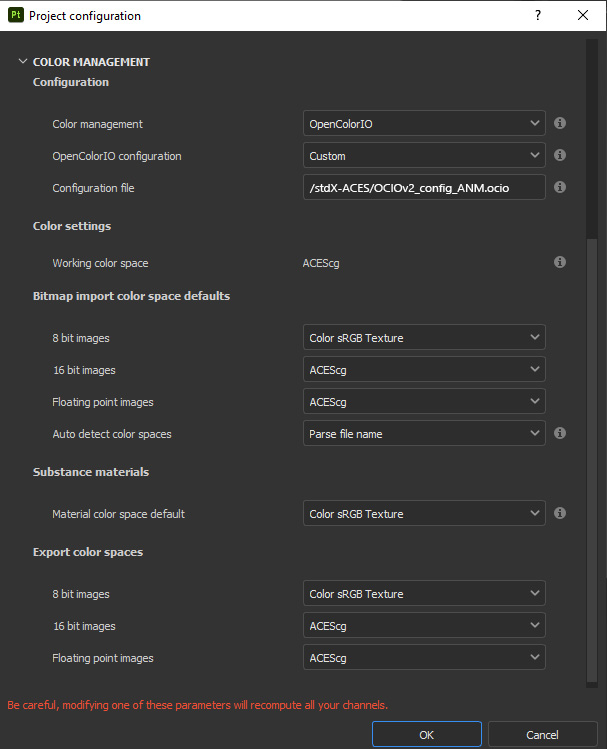
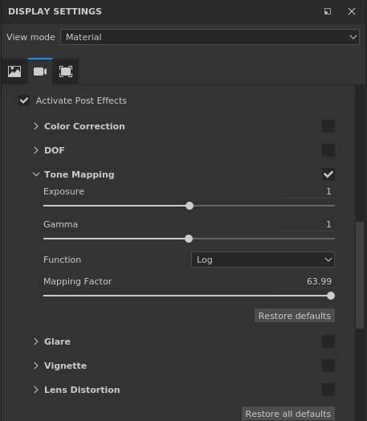
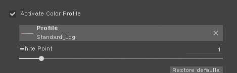
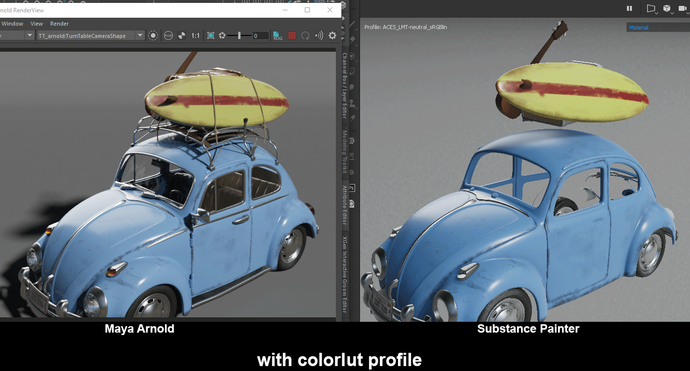

# Substance Painter

As of v7.4 Substance Painter supports OCIO. In the initial release OCIO roles are not supported so the file types need to be set manually when creating a new project ( file > new ), or in the Project Configuration. Below the proper settings are pictured. 

## Earlier versions

Substance Painter prior to v7.4 does not work with OCIO, so for older versions we need to use a workaround using these EXR files as LUTs, which will allow us to view our asset through the  Filmic and Neutral Look transforms.

[StdX_ACES/software/SubstancePainter](https://github.com/sharktacos/OpenColorIO-configs/tree/main/StdX_ACES/software/SubstancePainter)

These files need to be copied into the Substance Painter shelf folder. 

| Platform	| Version	      | Path
|-----------|---------------|---------------------------------------------------------------
| Windows	  | 7.2 or newer	| C:\Users\username\Documents\Adobe\Adobe Substance 3D Painter\assets\colorluts\
|           |  Legacy	      | C:\Users\username\Documents\Allegorithmic\Substance Painter\shelf\colorluts\
| Mac	      | 7.2 or newer	| /Users/username/Documents/Adobe/Adobe Substance 3D Painter/assets/colorluts/
|           | Legacy	      |/Users/username/Documents/Allegorithmic/Substance Painter/shelf/colorluts/

In the Display Settings, enable Activate Post Effects and Tone Mapping. Set *function* to Log and slide the *mapping factor* to the max (63.99). This will tonemap scene-linear into a 0-1 range so speculars do not clip in the view.

Check *activate color profile* and choose the colorlut profile you just put there.

Here's a side-by-side of Maya (Arnold) and Substance Painter showing a before and after of how the two programs compare without the colorlut profile, and with it. Note that the Substance Environment Exposure is raised to 1 for the colorlut profile image which seems to get a better match than with the default exposure of 0 (YMMV).

Note these view transforms assume you are in sRGB scene-linear working space in Substance Painter, and that the HDR environment maps are all in sRGB scene-linear (which is the default). When sampling colors, make sure to pick them from the Base Color not the material material. You may also find that you get a better match between Substance Painter and Maya when the Substance Environment Exposure is raised to 1 (YMMV).

[Back to main](../StdX_ACES)
