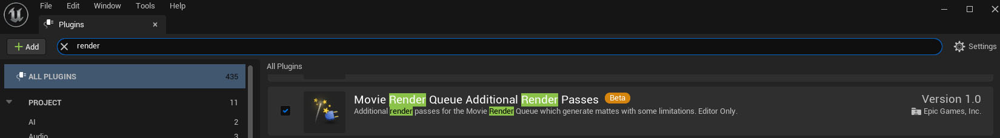
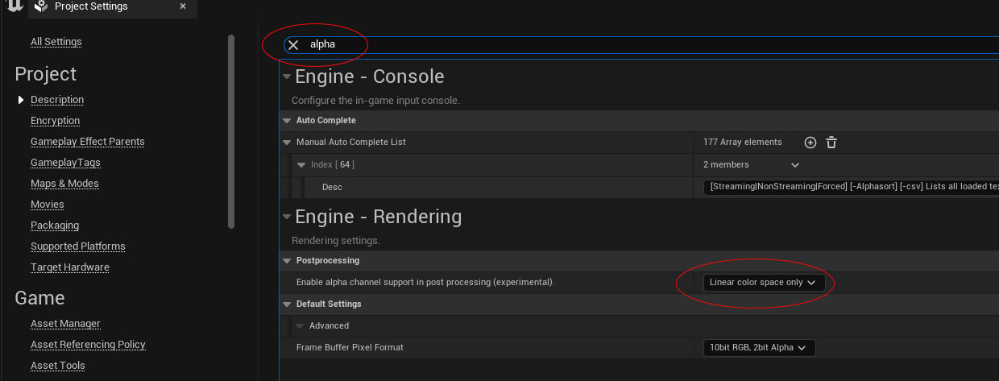
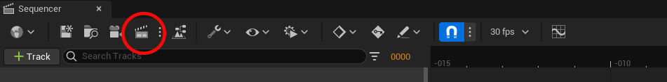
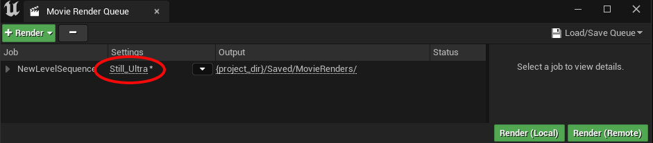
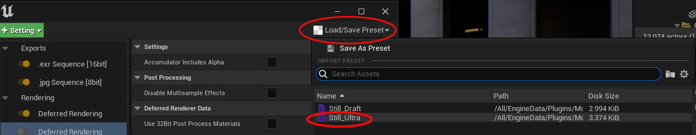
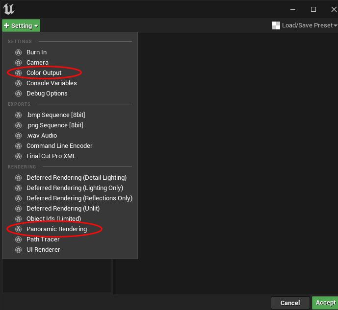
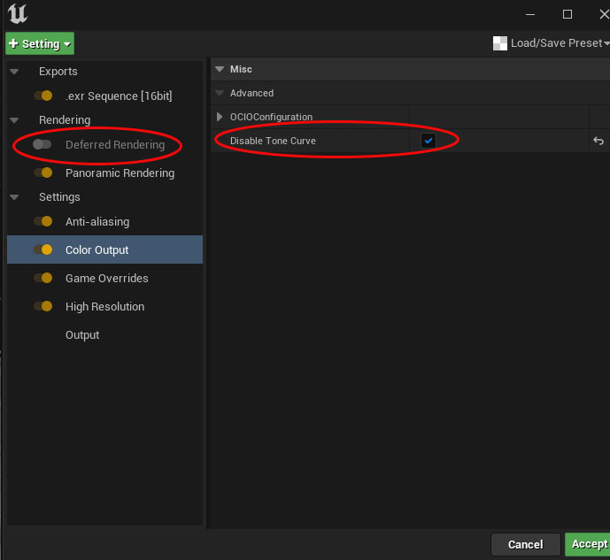
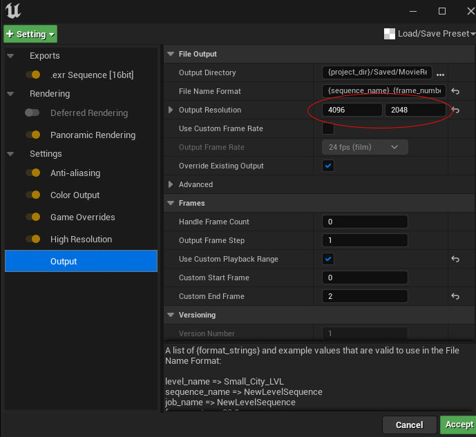
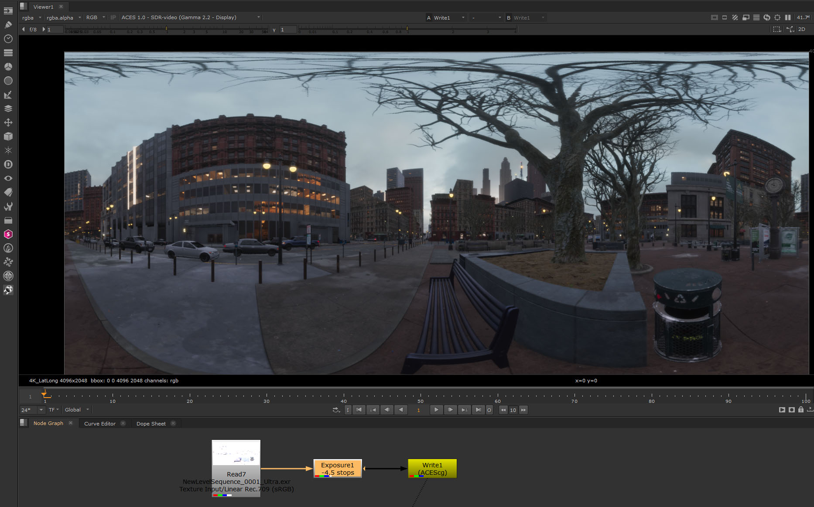
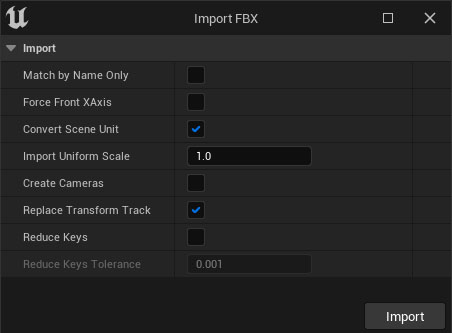

# Unreal Engine

Unreal Engine (UE) applies an ACES sRGB display transform by default ````ACES 1.0 SDR (sRGB - Display)```` with an added 1.45 gain added in. Consequently you don't really need to load OCIO in UE. What you need to do is have a way to view renders from UE in other apps like Nuke. For this we have custom input transforms in the config. More on that below.

The larger issue is how to incorporate UE with the rest of a VFX pipeline. For this we take the LED wall approach, and translate this into a purely digital environment. This begins with recognizing that what UE does best is render massive enviornments photrealistically in realtime. In other words, it makes a great 3D matte painting program i.e. it's great for generating background enviornments. 

What UE does not do as well is render hero elements, whether that's animated characters or FX like explosions. Therefore, we use Maya to render the hero elements and UE to render the environment. The part where we parallel the LED wall approach is in using the UE environment to *light* our hero elements. We do this through image based lighting (IBL). The first step here is to generate a 360 Panorama from Unreal.

## Rendering a 360 Panorama from Unreal

1. Open ```edit > plugins``` and load the "Movie Render Queue Additional Render Passes" plugin (search for "render" to find it).


<br><br>

2. Open ```edit > project settings``` and set *Enable alpha channel support for post processing* to "Linear coloer space only" (search for "alpha" to find it). 


<br><br>

3. Restart Unreal for both of these to take effect.

4. If you don't have one already, create an Image Squencer and camera. Place the camera where you want the 360 panorama to be. Usually far away from anything to avoid paralax. 

5. In the *Sequencer* click the movie icon to open the *Movie Render Queue*. 


<br><br>

6. In the *Movie Render Queue* click the sequence to open the *Settings*. 


<br><br>

7. In the *Settings* click *Load/Save Presets* and select "Stills Ultra" preset which will give you high quality render settings.


<br><br>

8. Click the ```+Setting``` button and add in "Color Output" and "Panoramic Rendering"


<br><br>

9. Disable *Deferred Rendering* (this is for a regular camera render which we don't want), and select *Color Output* check "disable tone curve" (this is so  we get HDR values for our render, rather than the tone mapper clipping everything to a 0-1 range).


<br><br>

10. In the *Output* set the resolution to 2:1 aspect ratio, which we need for a latlong image.


<br><br>

12. Click the green ```Accept``` button followed by the green ```Render (local)``` button. During the rendering process, the editor might appear to be frozen or unresponsive for a few seconds up to a few minutes. This is due to the demanding rendering requirements of the Panoramic render. When the editor becomes responsive again, you will be able to find the screenshots in the following location.

```Unreal Projects\[Project Name]\Saved\MovieRenders\NewLevelSequence_0001_Ultra.exr```

## Nuke

In Nuke, read in thew file with a ```linear Rec.709 (sRGB)``` input transform. As UE's postprocess volume exposure adjustments are not applied to panoramic renders, you will need to make these in Nuke. In this example from the Matrix City Sample an exposure node of -5 stops has been applied. You can then write out the file in ```ACEScg``` output transform. 


<br><br>


## Importing & Exporting Eeometry and Cameras in UE and Maya

expot ground and buildings, import cam

Exporting in Unreal is done by right-clicking on the item in the *Sequencer* and choosing "export" from the menu. To export a geo you can select it in the viewport, which will highlight it in the Outliner, and you can then drag it into the Sequencer. 

To import a camera you need to have a camera (i.e. a cinematic camera actor) in the sequencer to import it into. In the options window use the following settngs.


<br><br>

imported geo will appear in the *Content Browser* and can then be draged into the view port. 


## Comping UE

1. Render the background environment in Unreal
2. Generate an IBL from that enviornment
3. Render CG hero elements in Maya, using the IBL
4. Comp the Unreal environment with the Maya CG in Nuke using the [Bridge](https://learn.foundry.com/nuke/content/comp_environment/unrealreader/unreal-intro.html)


## Materials

try master material instance

is "expose to library" in every project?
how to make starter assets, reuse materials

import object with textures

"share to a common library "

workflow:
import textures into folder in UE
import geo. comes in as separate elements. 
- Can I assign shader instances for each from master?
then connect textures to instances 

"create new instanced materials" in "FBX import options" not working.

alt: "do not create material," 
1. make instance from master and rename, 
2. drag material onto geo, 
3. connect textures to shader. (like in Maya)

maybe shotgrid integration for UE?
or does Maya live link? no cuz it links existing.
   

default to have sRGB off? 
change multiple textures at once? = asset actions>bulk edit
create master material using material properties, 
modify MegaScan to add in roughness and get rid of channel packing, use Ai names.

if combine mesh option is on can you get elements for materials?

Import with quixel bridge?
https://dev.epicgames.com/community/learning/courses/eER/unreal-engine-technical-guide-to-linear-content-creation-production/GxWX/unreal-engine-look-development

Fix Sp2M to work with albedo naming 

Review Slay master materials and compare with MegaScans and to aiStandard.
https://www.unrealengine.com/marketplace/en-US/learn/slay-animation-sample

Include default textures for MM? How to export this?
Use ORM (just don't hook up O).
