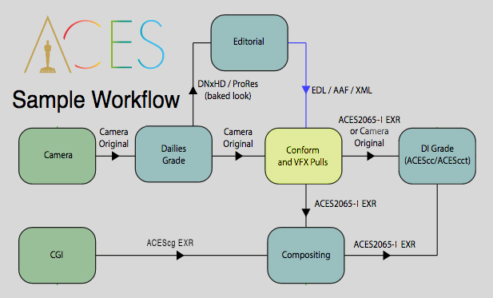
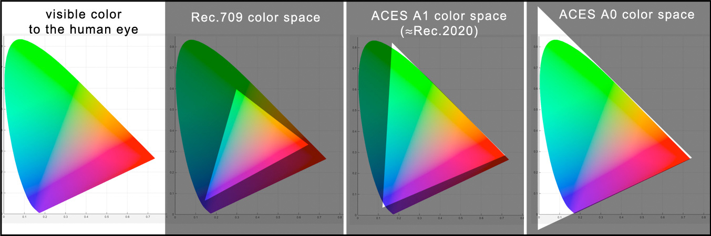

# ACES for Indie Filmmakers

The advantage of the ACES color managed workflow is that it ensures that you see the same image throughout every stage of the filmmaking process, from on-set monitoring, to dailies and editorial, to VFX and DI. Everything just looks right everywhere along the pipeline. Plus it is at the highest quality so nothing is lost. And the whole thing is organized and managed to avoid mistakes and chaos. Using ACES from start to finish ensures continuity of artistic vision. As cinematographer Erik Messerschmidt says, 

> "As a DP it's very important to me that the choices I make on set with the director perpetuate through the pipeline; from editorial, VFX, all the way to DI. ACES guarantees everyone is looking at a consistent representation of those choices."

However, even if you have already started without ACES, it's not a problem to introduce ACES at a later stage in the pipeline.

## On-set Monitoring

Modern  digital  cinema  cameras raw or log modes have a known mathematical relationship to  the  light  in  the  photographed  scene. ACES uses these exact transfer functions supplied by each camera manufacturer to bring it into the ACES color space. This is called an Input Transform. There are options from ACES product partners like [Pomfort LiveGrade Pro](https://pomfort.com/store/livegradepro/subscription/) for ACES on-set monitoring which enable filmmakers to view camera footage through an ACES Input Transform and for a DIT (Digital Image Technician) to use the same tools as DI to create custom looks for on-set. 

There are however also options for low budget productions. You can create LUTs for your camera using the free version of Resolve and use these LUTs, either in-camera or in an external LUT box, for on-set viewing on a standard Rec.709 reference monitor. This ensures that what you see on-set is accurately carried all the way through production and post. See the [Resolve](Resolve.md) doc for details.

## Dailies & Editorial
 
Dailies is where the camera RAW files, which will be used for the conform, are used to generate color-baked dailies and editorial media. One therefore needs a software that can properly debayer RAW camera files in a color managed ACES workflow. There are many software programs that can do this. For the indie filmmaker, a clear choice is [DaVinci Resolve](Resolve.md) due to the low price point. The RAW camera files are read into Resolve using ACES color management, graded (including applying on-set color decisions via ASC CDLs) and then exported out with an ACES Rec.709 Output Transform as h.264 clips for Dailies viewing, and as ProRes or DNxHD clips for editorial.

Since editorial is working "offline" with proxy video clips with the look baked-in, you can use whatever editing software you like. In other words, editorial is not working in ACES, but rather is working with proxy files that have the look of ACES baked into them. There is therefore no problem with software compatibility with ACES, and editors can work as they are accustomed with clips that look great, seeing in the edit suite the film as the director wants it to look. 

 
## Conform & VFX Pulls
 
Similar to the *conform*, a *VFX pull* is where these proxy files are swapped out for high resolution files used for delivery to DI and finaling. In the ACES workflow these are AP0 OpenEXR files. 
 
The following guidance is compiled from the Netflix Studio's [VFX Best Practices](https://partnerhelp.netflixstudios.com/hc/en-us/articles/360000611467-VFX-Best-Practices) document.

- **Debayering to OpenEXR.** In an ACES pipeline VFX pulls should be debayered from the original RAW camera files and exported as 16-bit EXR in the ACES AP0 exchange format (ACES2065-1). Again, there are many choices for color correction software. Let's assume we are using Resolve. Netflix Studios has a great [step-by-step guide for Resolve](https://partnerhelp.netflixstudios.com/hc/en-us/articles/360002088888-Color-Managed-Workflow-in-Resolve-ACES-) that will walk you through the process in detail.  

- **Why not DPX?** Traditional 10-bit DPX files are not recommended, as they are [not sufficient](https://acescentral.com/uploads/default/original/1X/25ec1472d70b169ceabb215beacdd501d1a27fac.pdf) to contain all the information captured by modern digital cameras (For example RED camera RAW files are 16-bit). In contrast, [OpenEXR](https://www.openexr.com/) is 16-bit float with a dynamic range of 30+ exposure stops, and a wide gamut color space (ACES2065-1) that contains the full gamut of what is visible to the human eye (see graphic below). If you are concerned about file sizes with EXR you can use PIZ lossless compression. The resulting EXR files will be *smaller* than a DPX file!

- **Ungraded footage.** All color correction and grades should be *disabled* for a VFX pull. An easy way to do this is to turn on "Enable Flat Pass" in the Resolve Delivery advanced options (again, see the above step-by-step guide). The basic idea is that VFX returns the ungraded plate to DI, with the VFX on it, *as if it were filmed that way*, and DI can then color grade it, just as they would everything else.

- **Color Reference and LUTs.** VFX pulls should include a reference frame for checking color against existing dailies as well as a color ‘recipe’ to achieve dailies color (i.e. CDL + LUT, working color space). This LUT can be made in Resolve (the LUT's working/processing space will be ACEScct or ACEScc based on the Project Settings), and will include all enabled grades, both in the timeline and the clips, so it will combine the Look Transform with your shot grade into a single LUT. This can be exported as a *Shot LUT* for VFX to use.

- **VFX Delivery.** VFX can deliver two types of files:
  - *Proxy media to editorial for inclusion in the offline edit.* As in the Dailies process above, the ACES transform is baked into the proxy media in the color space of the reference monitor used by editorial (typically Rec.709 with Rec.1886 gamma). Editorial should provide proxy media format requirements to VFX. 
  - *High resolution ungraded OpenEXR files to DI for final color grade and finishing.* The EXR files are returned in the same exchange format they were received: ACES2065-1 AP0. This ensures that the master has the highest possible quality, which can accommodate any delivery medium or targeted display type, now and into the future. 

## Archival & Delivery

After final color grading, the last stage in the filmmaking process is where the graded master is output to the targeted display types for distribution (theatrical film projector, broadcast television, etc.) and the [non-graded master](https://partnerhelp.netflixstudios.com/hc/en-us/articles/360049545294-Non-Graded-Archival-Master-NAM-Specifications-Best-Practices) is archived for future distribution. The details of this are beyond the scope of this article, but the basics are outlined in sample ACES workflow below.
 
 

[Back to main](../StdX_ACES)
