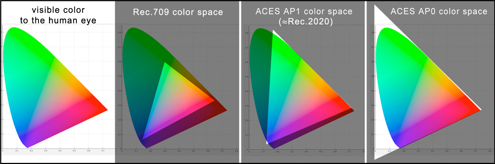

# Conform and VFX Pulls

The conform is where the display-referred proxy files used by offline editorial are swapped out in the final edit for the original scene-referred camera native RAW files. A common workflow here would be for editorial to export an EDL/XML/AAF of the edit to be read into a color grading software such as Baselight or Davinci Resolve. [This video](https://www.youtube.com/watch?v=u9Rvm5xiuhk&list=PLsJrJgQkAdTnNB5sbmkRLZaZkcd63W8Nb&index=4) offers a nice walk through of the conform process in Resolve. For more details refer to the Part 7 "Import and Conform Projects" in the latest version of the [Resolve Reference Manual](https://pomfort.com/store/livegradepro/subscription/). Here we will focus specifcally on VFX part of the workflow below, known as a *VFX pull*.

<p align="center">

</p>

# Why we use ACES

ACES (short for Academy Color Encoding System) was developed as an industry standard for color management used in every stage of the filmmaking process. It is based on solid color science and a wealth of production experience, and has been widely adopted in major film and VFX studios. Marvel for instance uses ACES for all of their films. However, ACES is not just for major tentpole productions and VFX blockbusters. Because ACES is free and open source indy productions can benefit from it too. As educators, part of our mission is to share this knowledge with you! [This video]((https://www.youtube.com/watch?v=vdmFjFoE2YA&list=PLsJrJgQkAdTnNB5sbmkRLZaZkcd63W8Nb&index=8), created by Netflix Studios, offers a great overview of the advantages of an ACES color managed workflow for filmmakers. 

Specifically for VFX work, the reason we use an ACES pipeline is that it ensures your film footage stays at the highest dynamic range and color fidelity, and that the whole image pipeline is standarized and managed to avoid mistakes and chaos, allowing you as artist and filmmaker to be in control of your own artistic vision. Let take a look at this in a bit of detail. In the process described below, using the precise mathematical transforms from ACES, you will be converting your camera native RAW files into to the ACES interchange format known as ACES2065-1 (AP0). As shown in the graphic below, these files have a wide gamut color space that contains every color visible to the human eye, with a dynamic range of 30+ exposure stops. That far exceeds the dynamic range and color fidelity of any camera RAW file, at a file size that is smaller than a DPX.

<p align="center">

</p>

Okay, enough theory, let's get to it.

# <a name="require"></a>VFX Pull requirements

**Debayering to OpenEXR.** VFX pulls should be debayered from the original RAW camera files and exported as 16-bit EXR in the ACES AP0 interchange format (ACES2065-1) with PIZ lossless compression, with all grades disabled. This should be done is a software that supports an ACES color managed workflow and can properly debayer the camera RAW files. A great choice for the filmmaker on a budget is Davinci Resolve. It is free for SDR up to UHD resolution, and the paid version is just $300, and with the ACES workflow you can be confident that you will be keeping your film at the highest possible quality. The guide below will step you through the process:

 - [VFX Pulls with Resolve](ResolvePull.md)

**Color Reference and LUTs.** VFX pulls should include 
  - *A reference frame for checking color against existing dailies.* <br>This should be an 8-bit JPG or PNG in sRGB color space. A screen grab works fine.
  - *A "shot LUT" to achieve dailies color, along with the working color space.* <br>In Resolve the "generate LUT" command can be used to export all enabled grades, both in the timeline and the clip, including any CDLs, all into a single *Shot LUT* for VFX to use. The LUT's working color space, i.e. the color space it ws created in, should be noted in the file name (For example ````shot01_ACEScct.cube```` for Resolve). VFX needs to know this in order to properly process the LUT in comp.

# <a name="vfx-deliver"></a>VFX Delivery

VFX can deliver two types of files:
  - *Proxy media to editorial for inclusion in the offline edit.* <br>As in the Dailies process above, the ACES transform (as well as any client provided shot LUTs) are baked into the proxy media in the color space of the reference monitor used by editorial (typically Rec.709 with Rec.1886 gamma). Editorial should provide proxy media format requirements to VFX. 
  - *High resolution ungraded OpenEXR files with VFX added are sent to DI for the final color grade and finishing.* <br>The EXR files are returned to DI in the same interchange format they were received: ACES2065-1 AP0. This ensures that the master has the highest possible quality, which can accommodate any delivery medium or targeted display type. 


[Back to main](../StdX_ACES)
