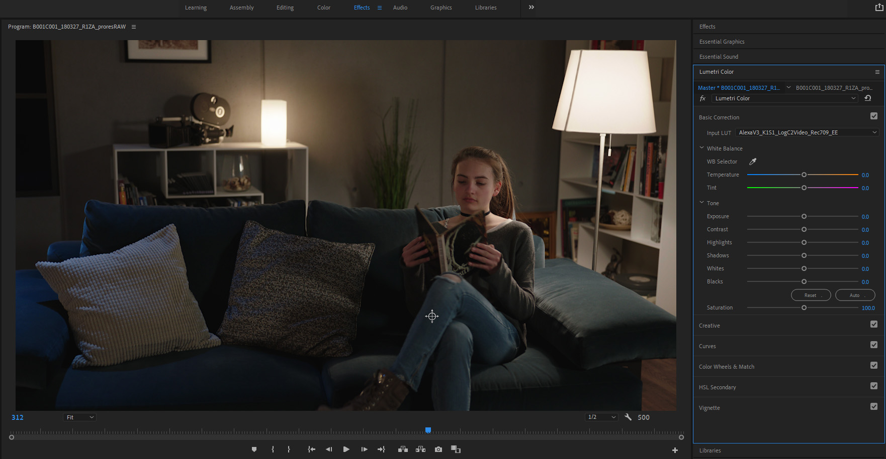

# VFX Pulls and ACES Color Management

Cameras are able to capture high dynamic range images, containing a huge gamut of colors and multiple stops of exposure. This is known as *scene-referred* data because it captures the light values of the physical scene the camera was pointing at. However, displays are not as capable as cameras in terms of dynamic range and color. So in order to look correct on a display, some of the image data must be thrown away in order to fit or limit the data to the range of the particular display, whether that's a computer monitor, a TV, an HDR display, or a movie projector. This is known as *display-referred* or *display-encoded* data where the data is limited to fit onto the particular display. Our preferred format for these scene-referred files is ACES, the Academy Color Encoding System. If you are unfamiliar with ACES, [this video](https://www.youtube.com/watch?v=vdmFjFoE2YA&list=PLsJrJgQkAdTnNB5sbmkRLZaZkcd63W8Nb&index=8), created by Netflix Studios, offers a great overview of the advantages of an ACES color managed workflow for filmmakers. 

For a VFX pull, the camera RAW files need to be debayerd and saved out in a format that preserves the full quality and dynamic range of the original camera RAW files in scene-referred space. The basic idea is that VFX returns the ungraded plate to DI, with the VFX added, returning the full quality film plate back *as if it were filmed that way*. This ensures that the master contains all the original camera data so it can accommodate any delivery medium or targeted display type. 

Our preferred format for these scene-referred files is ACES, the Academy Color Encoding System. Specifically for VFX work, the two main reasons we use ACES are quality and control. First, ACES ensures that your film footage stays at the absolute highest dynamic range and color fidelity. As shown in the graphic below, the ACES interchange format, known as ACES2065-1 (AP0) has a wide gamut color space that contains every color visible to the human eye, meaning it can accommodate any delivery medium or targeted display type, now and into the future. 

<p align="center">

</p>

Additionally, these files are 16-bit float with a dynamic range of over 30 exposure stops. As a point of comparison, the most of any digital cinema camera RAW file is 15 stops. So ACES files far exceed the dynamic range of any camera RAW file, at a file size that is smaller than a DPX! The second benefit is consistency and control. Unlike DPX files, which can have any number of log color spaces with no way of knowing which one you have, because the ACES image format represents an industry (SMPTE) standard, the whole image pipeline is controlled and managed, taking out the guesswork and avoiding mistakes and chaos when passing images between facilities.

# <a name="require"></a>VFX Pull Requirements

**Debayering to OpenEXR.** VFX pulls should be debayered from the original RAW camera files and exported in the ACES file interchange format (ACES2065-1) with PIZ lossless compression. 

 - Format: OpenEXR 16-bit half float
 - Compression: PIZ lossless compression
 - Color Space: ACES2065-1 (AP0)
 - All color grades disabled 
 - ACES Gamut Compression disabled

This should be done in a software that supports an ACES color managed workflow and can properly debayer the camera RAW files. A great choice for the filmmaker on a budget is DaVinci Resolve. The free version has a resolution limit of Ultra HD (3840 x 2160), but the full software is just $300 dollars for a permanent license, which is a steal for people being able to afford a subscription for Adobe, and certainly less than paying a DI facility to perform a VFX pull!

The guide below will walk you through the process:
 - [VFX Pulls with Resolve](ResolvePull.md)

**Color Reference and LUTs.** VFX pulls should include:
  - *A reference frame for checking color against existing dailies.* <br>This should be an 8-bit JPG or PNG in sRGB color space. A screengrab works fine.
  - *A "shot LUT" to achieve dailies color, along with the working color space.* <br>In Resolve the "generate LUT" command can be used to export all enabled color grades, both in the timeline and the clip, including any CDLs, all into a single *Shot LUT* for VFX to use. The LUT's working color space, i.e. the color space it was created in, should be noted in the file name, (for example ````shot01_ACEScct.cube```` for Resolve). VFX needs to know this in order to properly process the LUT in comp.

# <a name="vfx-deliver"></a>VFX Delivery

VFX can deliver two types of files:
  - *High resolution ungraded OpenEXR files with VFX added are sent to DI for the final color grade and finishing.* <br>The EXR files are returned to DI in the same interchange format they were received: ACES2065-1 AP0. 
  - *Proxy media to editorial for inclusion in the offline edit.* <br> The ACES transform (as well as any client provided shot LUTs) are baked into the proxy media in the color space of the reference monitor used by editorial (typically Rec.709 with Rec.1886 gamma). Editorial should provide proxy media format requirements to VFX. There are a number of options here:

## Proxy Output Transforms
  - *ACES 1.0 SDR (Rec709)* This is the standard ACES Output Transform for a Rec709 display.
  - *Low Contrast Look* The ACES look with lowered contrast of 0.85 using an ASC-CDL transform.
  - *ARRI ALF-2 Look (Rec709)* An emulation of the ARRI ALF-2 Look. This is applied as an LMT so that the show remains ACES compliant.
  - *ARRI K1S1 Look (Rec709)* An emulation of the ARRI classic K1S1 Look. This is applied as an LMT so that the show remains ACES compliant.
  - *ARRI RED IPP2 Look (Rec709)* An emulation of the RED IPP2 Look. This is applied as an LMT so that the show remains ACES compliant.

All of the above Looks are avaialble as CLF and DCTL files for use in an ACES workflow in programs such as Davinci Resolve for finalling and DI. That is, they are ACES Look Transforms that allow the show to remain ACES complient, and still have the desired DRT that colorists and filmmakers love to grade with, such as the ARRI K1S1.


# Offline Edit

Many editing programs (for example Premiere Pro) lack the ability to properly process and display these scene-referred files. This is the case both for the final EXR files from VFX as well as for the source Camera native log files. For example, this is what footage from an ARRI camera looks like in Premiere. Note the washed-out look. This is because Premiere is incorrectly displaying the image in its camera native log color space.


Images encoded in log are not meant to be viewed that way, rather log is a method to effiently store the full dynamic range of the image as discussed above, similar to a photo negative. In the same way as one is not intended to view a negative, one should not view a log file (nor should one view a scene-linear EXR). Rather these scene-referred files need to be viewed with the appropriate DRT for the target display device. For example, below you can see the way the image looks with the ARRI classic K1S1 DRT for Rec709 applied to it.



For this reason, a preferred workflow for Premiere is an offline edit. This involves the shots from set dailies being written out from a program like Davinci Resolve as display-encoded proxy media with the look baked into them, and for these to be sent to (offline) editorial. Typically this would be Prores or DNxHD files in Rec709 color space, which is the standard for broadcast HDTV. Editorial works with these proxy files, allowing everyone to view the files as they were intended to look in editorial, which of course is important for editorial as the color affects the emotional mood of the film. Friends don't let friends view their camera footage in log! Later in the conform these proxy files are swapped out for the camera RAW files as well as the EXR files from VFX for finalling. This workflow is shown in the diagram below. The advantage of this workflow is that it preserves the image integrity of the master, while allowing filmmakers to view their movie as they intend for it to look thorughout every stage of the filmmaking process. 

<p align="center">

</p>

If you are not using this offline edit workflow or otherwise need help in how best to integrate ACES into your existing image pipeline, we are happy to discuss options with you. One posibility, for cases where the camera RAW files are being read directly into Premiere and viewed in log, is to provide a LUT to view your camera log footage through the the ACES Output Transform chosen for the VFX proxy media. Note that this is again intended as an alternate way to view the media in the (offline) edit preserving artistic intent, and not as a substitute for proper color grading for finalling and archive. 


[Back to main](../StdX_ACES)
