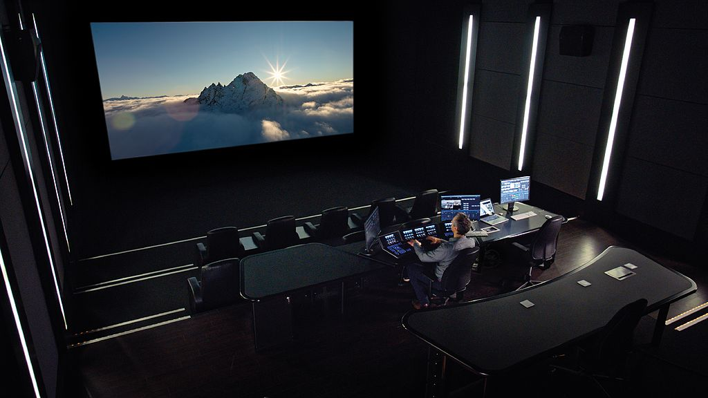
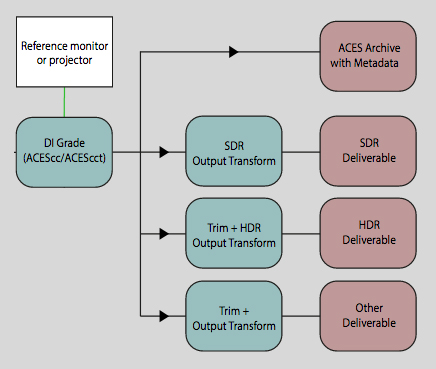

<p align="center">

</p>


## Contents:
- [ACES for Indie Filmmakers](#why)
- [On-Set Monitoring](#on-set)
- [Dailies & Editorial](#dailies)
- [Conform & VFX Pulls](#pulls)
  - [VFX Pull requirements](#require)
  - [VFX Delivery](#vfx-deliver)
- [Digital Intermediate, Mastering, and Delivery](#di)


# <a name="why"></a>ACES for Indie Filmmakers

ACES (short for Academy Color Encoding System) was developed as an industry standard for color management used in every stage of the filmmaking process. It is based on solid color science and a wealth of production experience, and has been widely adopted in major film and VFX studios. Marvel for instance uses ACES for all of their films. However, ACES is not just for major tentpole productions and VFX blockbusters. Its open and independent nature means independent filmmakers can benefit from it too.

The advantage of the ACES color managed workflow is that it ensures that you see the same image throughout every stage of the filmmaking process, from on-set monitoring, to dailies and editorial, to VFX and DI. Everything just looks right everywhere along the pipeline. As cinematographer Erik Messerschmidt says, 

> "As a DP it's very important to me that the choices I make on set with the director perpetuate through the pipeline; from editorial, VFX, all the way to DI. ACES guarantees everyone is looking at a consistent representation of those choices."

Secondly, ACES ensures that the film footage stays at the highest quality, so nothing is lost along the way. Plus the whole pipeline is organized and managed to avoid mistakes and chaos. Using ACES from start to finish ensures continuity of artistic vision. 

Each section below will step you through the following diagram. Note that because of the way this workflow is designed, even if you have already started without ACES, it's not necessarily a problem to introduce ACES at a later stage (the latest being for conform and VFX pulls). The sooner color is managed, the better it will be for everyone.

<p align="center">

</p>


# <a name="on-set"></a>On-set Monitoring

Modern digital cinema cameras raw or log modes have a known mathematical relationship to the light in the photographed scene, which ACES uses to bring it into the ACES color space. This is called an Input Transform. There are options from ACES product partners like [Pomfort LiveGrade Pro](https://pomfort.com/store/livegradepro/subscription/) for ACES on-set monitoring which enables filmmakers to view a live preview of the camera signal in the ACES color pipeline, and for a DIT (Digital Image Technician) to use the same tools as DI to create custom looks for on-set. 

There are however also options for low budget productions. You can create LUTs for your camera using the free version of Resolve and use these LUTs, either in-camera or in an external LUT box, for on-set viewing on a standard Rec.709 reference monitor. This ensures that what you see on-set is accurately carried all the way through production and post. This is done using the ACES Transform OFX plugin in resolve. The first step to do this is to set Color Management to *DaVinci YRGB* in the Project Settings. Then create the following serial nodes:

- *Input Transform*: Apply an OFX ACES Transform to the first serial node and set its input to your camera, and the output to ACEScct. 
- *(optional) Look Transform*: This is where you would apply whatever custom grade is desired to the middle node. 
- *Output Transform*: Apply an OFX ACES Transform to the final seriel node and set its input to ACEScct, and the output to Rec.709 for viewing on.


Then simply export the 3D LUT with the “Generate 3D LUT (CUBE)” command. This will create a full range .cube LUT, also called *extended range* (EE). This [chart](http://www.antlerpost.com/downloads/LUT_ranges.pdf) lists compatibility of various cameras and LUT boxes with *extended range* (EE) and legal range (LL) LUTs. If you are using an ARRI, as in the above example, you can use [free software from ARRI](https://www.arri.com/en/learn-help/learn-help-camera-system/tools/arri-look-creator) to convert this to ARRI look format.

If you don't want to "roll your own" LUTs, cinematographer Geoff Boyle has a [set of free LUTs](https://community.acescentral.com/t/luts-that-emulate-the-aces-workflow/1334/21) you can download for just about every film camera out there.


# <a name="dailies"></a>Dailies & Editorial
 
Dailies is where the camera RAW files, which will be used for the conform, are used to generate color-baked dailies and editorial media. The DIT therefore needs a software that can properly debayer RAW camera files in a color managed ACES workflow. There are many software programs that can do this. For the indie filmmaker, a clear choice is DaVinci Resolve due to the low price point. 

In a non-color managed workflow one begins with a washed out image in log space, and grades it manually until it looks nice. For example the footage below is from a RED camera RAW file in IPP2 using Log3G10 REDwideGamutRGB. This is known as a *display-referred* workflow.


A color manged workflow like ACES takes the guesswork out of it, and digitally “develops” the RAW camera data according to the exact mathematical specifications of each particular camera manufacturer. Below is the same RED RAW footage (also IPP2 using Log3G10 REDwideGamutRGB) viewed in ACES. This is known as a *scene-referred* workflow because it uses the actual values from the *scene* (i.e. the pixel values are proportional to photons in the real world).


From this solid starting point, any desired color corrections can be added, including applying on-set color decisions via ASC CDLs. This is then exported out as h.264 clips for Dailies viewing, and as ProRes or DNxHD clips for editorial. The Output Transform should be set to match the targeted display device. So if editorial will be looking at broadcast reference monitors (HDTV) the Output Transform would be set to Rec.709 

Note that Rec.709 is the specification for HDTV, and sRGB is the specification for a standard computer monitor. So the above Rec.709 Output Transform baked into these movies assumes that editorial is viewing on a broadcast reference monitor. If a standard computer monitor is instead being used by editorial, the clips would need to be output in sRGB color space. Likewise, when viewing in an ACES color managed software (such as Resolve for Dailies) the Output Transform needs to be set to correspond to the display device you are viewing. Setting the Output Transform to the correct EOTF for the display device is a critical part of color management, ensuring that what you see is what you get (WYSIWYG).

Since editorial is working "offline" with proxy video clips with the ACES look baked-in, editors can work as they are accustomed in their tool of choice without concern for it being compatible with ACES. An important thing to understand about this proxy workflow is that it lets editorial focus on editing, fire-walling it off from color correction as well as from concerns with preserving the original camera files dynamic range, which editing software lack the tools to properly handle.
 
# <a name="pulls"></a>Conform & VFX Pulls
 
The conform is where the proxy files are swapped out in the final edit for the original debayered camera RAW files. For example, working in Resolve with ACES, the DIT uses an EDL/AAF/XML file provided by editorial to swap in the original debayered camera RAW files. This again needs to be done in a software that can properly debayer RAW camera files in a color managed ACES workflow, such as DaVinci Resolve. In a traditional workflow these files are then passed to DI, either as Camera RAW files on rare occasion or more typically as integer log DPX files. The ACES workflow replaces this with its official interchange and archival format: 16-bit OpenEXR in ACES2065-1 color space. The advantage is that the ACES interchange format is able to hold all of the quality and dynamic range of the original camera RAW files whereas DPX cannot.

Traditional 10-bit DPX files are not recommended, as they are [not sufficient](https://acescentral.com/uploads/default/original/1X/25ec1472d70b169ceabb215beacdd501d1a27fac.pdf) to contain all the information captured by modern digital cameras (For example RED camera RAW files are 16-bit). In contrast, [OpenEXR](https://www.openexr.com/) is 16-bit float with a dynamic range of 30+ exposure stops, and a wide gamut color space (ACES2065-1) that contains the full color gamut visible to the human eye (see graphic below). In short: Using 10-bit DPX involves a degradation of quality from the original camera footage, while EXR *more than* covers the full quality and range of any camera RAW file. It has become [common industry practive](https://partnerhelp.netflixstudios.com/hc/en-us/articles/360000611467-VFX-Best-Practices) to use PIZ or ZIP *lossless* compression on these ACES OpenEXR files. This results in file sizes that are *smaller* than DPX files! 

<p align="center">

</p>

A *VFX pull* involves "pulling" select film plates from the conform and sending them to VFX so they can add their magic to them. This is likewise exported with the ACES  "interchange" image format.  Let's take a look at that process in detail:

### <a name="require"></a>VFX Pull requirements:

- **Debayering to OpenEXR.** VFX pulls should be debayered from the original RAW camera files and exported as 16-bit EXR in the ACES AP0 interchange format (ACES2065-1) with PIZ compression. Netflix Studios has a great [step-by-step guide for Resolve](https://partnerhelp.netflixstudios.com/hc/en-us/articles/360002088888-Color-Managed-Workflow-in-Resolve-ACES-) that will walk you through the process in detail.  

- **Ungraded footage.** All color correction and grades should be *disabled* for a VFX pull. An easy way to do this is to turn on "Enable Flat Pass" in the Resolve Delivery advanced options (again, see the above step-by-step guide). The basic idea is that VFX returns the ungraded plate to DI, with the VFX added, so that DI gets the full quality film plate back *as if it were filmed that way*. DI can then seamlessly insert it back into the conform and color grade everything together.

- **Color Reference and LUTs.** VFX pulls should include 
  - *A reference frame for checking color against existing dailies.* <br>This should be an 8-bit JPG or PNG in sRGB color space. A screen grab works fine.
  - *A "shot LUT" to achieve dailies color, along with the working color space.* <br>In Resolve the "generate LUT" command can be used to export all enabled grades, both in the timeline and the clip, so it will combine the Look Transform with your shot grades, including any CDL, all into a single *Shot LUT* for VFX to use. The LUT's working color space should be noted in the file name (For example ````shot01_ACEScct.cube````. This will be ACEScct or ACEScc based on the Project Settings in Resolve. VFX needs to know this in order to properly process the LUT in comp. 

### <a name="vfx-deliver"></a>VFX Delivery.

VFX can deliver two types of files:
  - *Proxy media to editorial for inclusion in the offline edit.* <br>As in the Dailies process above, the ACES transform is baked into the proxy media in the color space of the reference monitor used by editorial (typically Rec.709 with Rec.1886 gamma). Editorial should provide proxy media format requirements to VFX. 
  - *High resolution ungraded OpenEXR files are sent to DI for the final color grade and finishing.* <br>The EXR files are returned to DI in the same interchange format they were received: ACES2065-1 AP0. This ensures that the master has the highest possible quality, which can accommodate any delivery medium or targeted display type, now and into the future. 


# <a name="di"></a>Digital Intermediate, Mastering, and Delivery

Digital Intermediate (DI) is the process where the entire motion-picture is color-corrected (often called "grading"), and the visual look of the film is finalized. It's crucial that DI is done in an environment that exactly mirrors the viewing conditions of the final exhibition (e.g. in a theater viewed with a film projector). This is known as a color grading suite.

<p align="center">
<br>
 <sup>The ARRI color grading theater (photo © Arri CC BY-SA).</sup>
</p>

In our ACES workflow above, DI is the final step where the files from conform, as well as VFX shots, are read into an ACES capable color corrector (Resolve, Baselight, etc.), and viewed through the appropriate ACES Output Transform for the targeted display. For example, the Output Transform would be set to DCI-P3 for viewing on a film projector. In the final step, known as "mastering" this device-specific Output Transform, together with the final color grade, is baked into the media for delivery. Additionally, an archival master is created using the ACES interchange and archival format ACES2065-1.

Typically one particular viewing environment is identified as the “gold standard,” and the majority of the artistic time is spent correcting the images to look perfect on that display device. Once the main color grade is complete, additional masters are handled as "trim passes" atop the main output. A trim pass involves relatively minor adjustments, made atop the reference master, needed to make the film look great in the different viewing environment. 

<p align="center">
<br>
</p>

Traditionally theatrical (digital) projection was considered the "gold" reference, and trim passes were made for other other display devices (television, web, and so on). With the recent advent of HDR displays, there’s debate as to how best to use this emerging technology. Does one use HDR as the reference, and create SDR trim passes on top of that, or visa-versa? There are [many factors to consider](https://community.acescentral.com/t/odt-without-changing-the-grade-and-round-trip-from-premier/2258/2). 

In the end, film is an art aided by science, and while using the ACES Output Transform for the particular display type provides a solid starting point, it is incumbent on the developed eye of the artist to adapt or “trim” the grade, optimizing it for the particular characteristics of each display device. In other words, ACES doesn't replace the need for the artist, rather it enables artists to focus on nuance.


[Back to main](../StdX_ACES)
