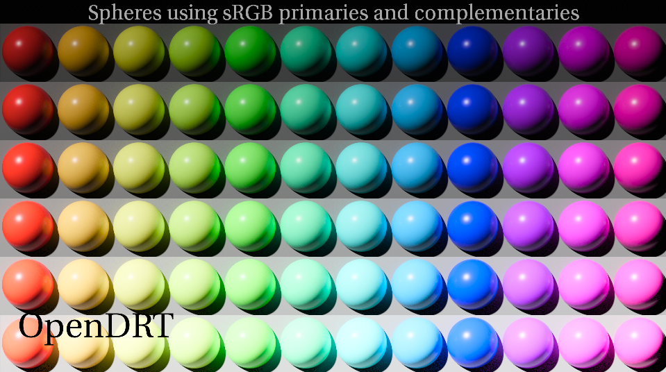
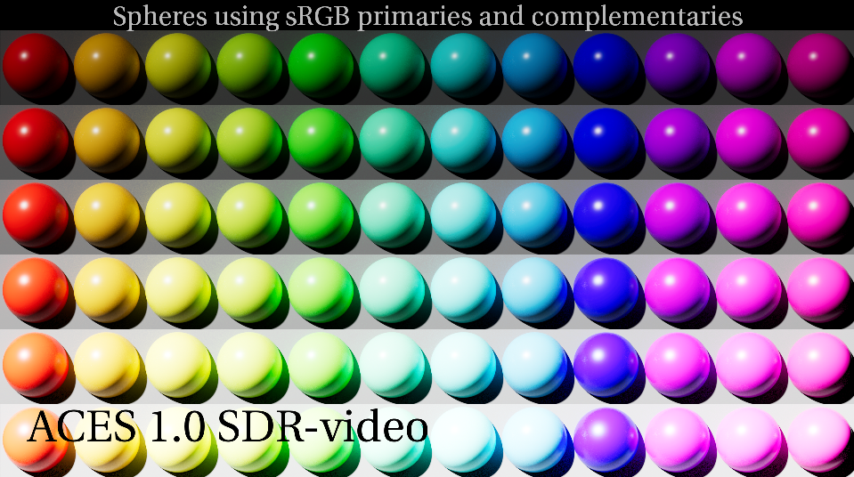
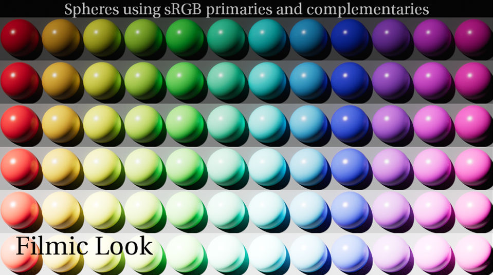

# Chroma Adjustments

The current ACES Output Transform has a number of hue shifts and skews. This is largely due to the per-channel approach of the RRT, and the current proposal for the ACES 2.0 output Transform, called [OpenDRT](https://github.com/jedypod/open-display-transform), will fix this using a chromaticity preserving approach. Because these changes are made from the ground up, it is obviously not possible to implement with a Look Transform that simply modifies the existing RRT. Nevertheless, a few tweaks have been made affecting chromaticities, in particular for blues which sit at the edge of the AP1 color space, to get a little closer than the current behavior.

Below is a test image made by [Chris Brejon](https://chrisbrejon.com/cg-cinematography/chapter-1-5-academy-color-encoding-system-aces/) showing sRGB primaries and complimentary colors, increasing each row by one exposure stop. Viewed through OpenDRT it looks perfect.

However viewed through the ACES 1.0 Output Transform below there are a number of issues. The red column as exposure increases is skewing into orange, the blue column is more extreme, skewing into magenta. We can also see that as the exposure increases all the colors are shifting from 12 into six colors. This is known as the [notorious six](https://community.acescentral.com/t/about-issues-and-terminology/3501/8).

Viewed through the Filmic Look Transform, while not perfect, we see significant improvment. The "notorious six" is still there, but the red and blue columns are dramtically improved. 

This visual improvment is a welcome by-product of the [gamma compression](gamut.md) and the [highlight desaturation](highlight.md). 

