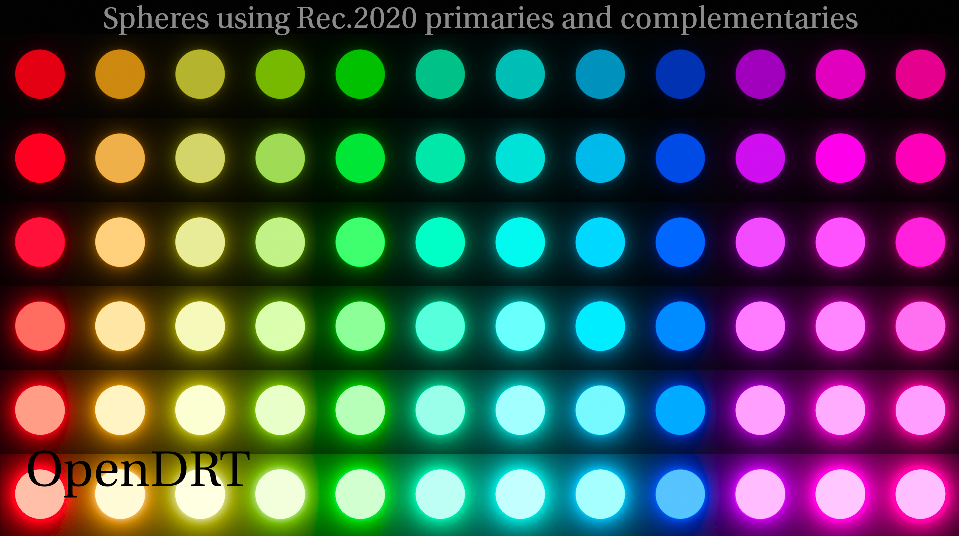
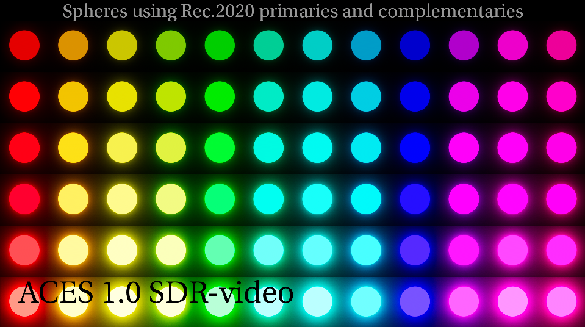
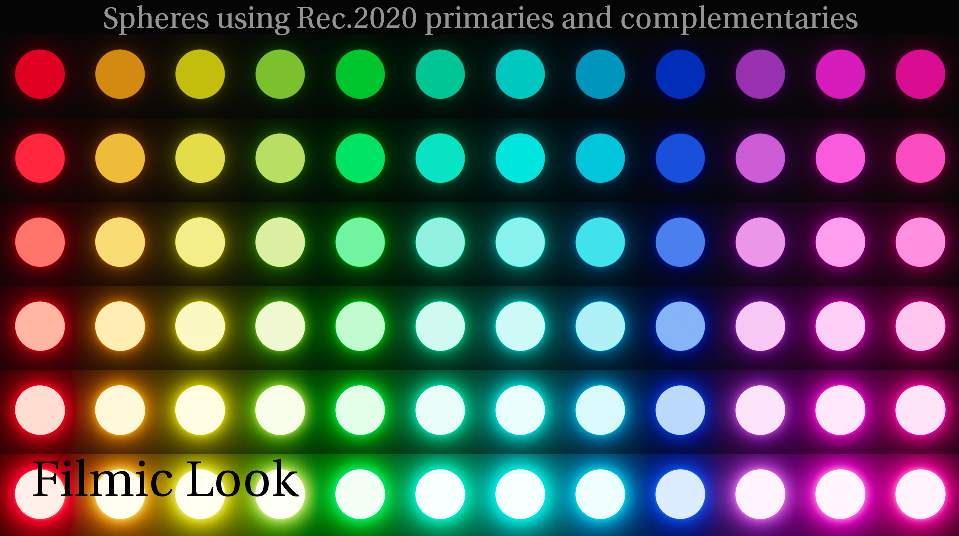

# Chroma Adjustments

The current ACES Output Transform has a number of hue shifts and skews. This is largely due to the per-channel approach of the RRT, and the current proposal for the ACES 2.0 output Transform, called [OpenDRT](https://github.com/jedypod/open-display-transform), will fix this using a chromaticity preserving approach. Because these changes are made from the ground up, it is obviously not possible to implement with a Look Transform that simply modifies the existing RRT. Nevertheless, a few tweaks have been made affecting chromaticities, in particular for blues which sit at the edge of the AP1 color space, to get a little closer than the current behavior.

Below is a test image made by [Chris Brejon](https://chrisbrejon.com/cg-cinematography/chapter-1-5-academy-color-encoding-system-aces/) showing Rec2020 primaries and complimentary colors of glowing circles, increasing each row by one exposure stop. Viewed through OpenDRT it looks perfect.

However viewed through the ACES 1.0 Output Transform there are a number of issues. The bottom row of blue has turned magenta, and by the third row we can see that as the exposure increases all the colors are shifting from 12 into six colors. This is known as the [notorious six](https://community.acescentral.com/t/about-issues-and-terminology/3501/8).

Here's it is viewed through the Filmic Look Transform. The blue is not turning magenta, but the "notorious six" is still there.

Now let's look at another test image of rendered spheres, this time with sRGB primaries and complimentary colors, increasing each row by one exposure stop. Again viewed through OpenDRT it looks perfect. 

And viewed through the ACES 1.0 Output Transform it looks... not quite so perfect. The red column as exposure increases is skewing into orange, the blue column is more extreme, skewing into magenta.

Viewed through the Filmic Look Transform, while not perfect, we see significant improvment. If you look hard you can still see that the blue is skewing into magenta, but much less dramtically.

This was done in the Look Transforms by adjusting the chroma of the primary and secondary colors, basically eyeballing it. 

**Notorious Six Chroma adustment**
- yellow: -0.05
- red: 0
- magenta: -0.15
- blue: -0.15
- cyan: 0
- green: -0.1

Not a particulary scientific methodology, but hopefully better than nothing as we wait for ACES 2.0!  
