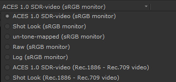
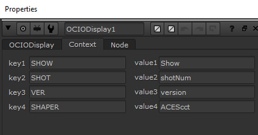

# ANM and VFX Configs

The ANM config ````config_ANM.ocio```` is designed for work on CG animation shorts and features. The VFX config ````config_VFX.ocio```` in contrast is designed for intgrating CG and VFX with live action film. Consequently each has different Display Transforms geared for its particular pipeline needs.

## ANM Config

- *OCIOv1_config_ANM.ocio.ocio*
   is designed for a CG animation pipeline 
 - *OCIOv1_config_ANM.ocio.ocio*
   is the same, but using OCIOv2 for Maya 2022


The Display Transforms for the above ANM config are all in sRGB display for viewing on artist's monitors, and contain the Reference Gamut Compression (RGC) baked into the view to componsate for hue skews with highly saturated colors in CG (see the [gamut](gamut.md) page. They contain two modifications of the standard ACES view transform using Look Transforms. 

**Neutral Look** is intended as a neutral starting point for lookdev work. 

**Filmic Look** is intended for shot work and has a similar filmic look to the standard ACES 1.0 RRT, with slightly reduced contrast. You can read details about both of these in [tone mapping](tonemap.md) page.  Additionally, The *Filmic* and *Neutral* Look Transforms provide [highlight desaturation](docs/highlight.md) of blackbody color temperatures, and [reduced hue shifts](docs/chroma.md) compared to the default ACES 1.0 Output Transform. Finally, the new [Gamut Compression](docs/gamut.md) is baked into the view to address hue shifts in CG renders with ACES. Note that Reference Gamut Compression is not baked into the view in a VFX pipeline.

**Show Look** is for the show specific look LUT decided on by the director for the ANM config. This Look is combined with the Filmic Look.

The remaining view transforms are the same as the default Maya 2022 config and are used for diagnostic purposes.

- **Un-tone-mapped** 
- **Raw** 
- **Log**


## VFX Config

For an overview of how the VFX pipeline fits into the whole filmmaking process, see [ACES for Indie Filmmakers](docs/VFXpulls.md)

- *OCIOv1_config_VFX.ocio.ocio*
   is designed for a VFX pipeline integtrating CG and VFX into live action film.
 - *OCIOv1_config_VFX.ocio.ocio*
   is the same, but using OCIOv2 for Maya 2022
   


The Display Transforms for the above VFX config contain both sRGB and Rec.709 display types depending on whether a shot is being viewed on an artist's monitor (sRGB) or on an HDTV display for dailies. In a VFX pipeline [gamut compression](gamut.md) is applied as a node in VFX and thus not included in the Display Transform. The views include the standard **ACES 1.0 RRT** in both sRGB and Rec.709, the **Shot Look** (see below) both for sRGB and Rec.709 displays, as well as several diagnostic views (**un-tone-mapped, Raw, Log**). **Un-tone-mapped** is the equivalent to Nuke's native sRGB which is a simple sRGB Gamma function without [tone mapping](tonemap.md).  

**Shot Look** This view transform uses contextual variables to apply the shot-specific look LUT provided by the client to the view. The variables are defined in the config and can be set by the artist.

````
environment:
  LUT_PATH: ../2_Shots/SM_020_018/01_Client_Original_Footage/5_LUT/
  LUT_NAME: clientLUT_ACEScct.cube
````


## Shot Look

The shot Look Display Transform in the VFX config works with context variables set in the config. 

You will need to insert the following code into your Nuke menu.py file:

```py  
# OCIO Shot Look custom defaults: 
def _setOCIODisplayContext():
    node = nuke.thisNode()
    node.knob('key1').setValue("SHOW")
    node.knob('key2').setValue("SHOT")
    node.knob('key3').setValue("VER")
    node.knob('key4').setValue("SHAPER")
    
    node.knob('value1').setValue("Show")
    node.knob('value2').setValue("shotNum") 
    node.knob('value3').setValue("version")
    node.knob('value4').setValue("ACEScct")
    
nuke.addOnCreate(_setOCIODisplayContext, nodeClass="OCIODisplay")
```

Then in Nuke select the "view panel" menu from the View Transform menu


This will open up a properties window. Open the Context tab and you will see that it has been populated with template values. As a friendly hint for artists that this needs to be replaced with the actual shot values this template LUT is black and white.



Replace the value fields for your shot LUT. The shot_lut directory of the config contains all of the shot LUTS for the show. For example if you were working on the DSOM show on shot 22 and the client LUT was called ````DSOM_022_v02_ACEScct.cube```` you would write the following:


Alternatley, you can simply edit your menu.py file to input the values. In our example that would be

````py
    node.knob('value1').setValue("DSOM")
    node.knob('value2').setValue("022") 
    node.knob('value3').setValue("v02")
    node.knob('value4').setValue("ACEScct")
````

Nuke will open with these values, pointing to your shot look LUT.

In Maya you can similarly edit your Maya.env file and enter the following (again using the above example):
````
SHOW = DSOM
SHOT = 022
VER = v02
SHAPER = ACEScct
````
If you want to change the values in a Maya session you can use the following MEL code:
````py
putenv "SHOW" "DSOM";
putenv "SHOT" "022";
putenv "VER" "v02";
putenv "VER" "ACEScct";
colorManagementPrefs -refresh;
````
