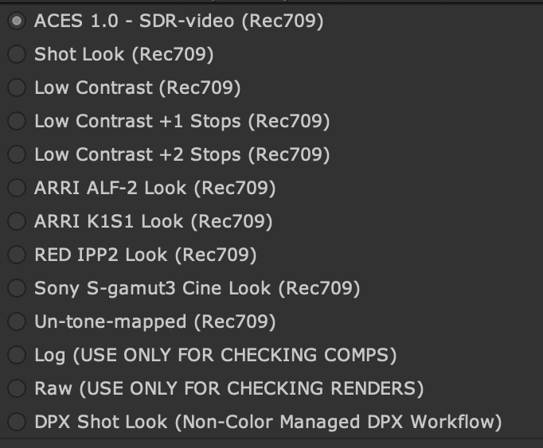

# ANM and VFX Configs

The ANM config ````ANM_config.ocio```` is designed for work on CG animation shorts and features. The VFX config ````VFX_config.ocio```` in contrast is designed for integrating CG and VFX with live action film. Consequently each has different Display Transforms geared for its particular pipeline needs.

# ANM Config


### View Transforms

All View Transforms in the ANM config contain the ACES [Referrence Gamut Compression (RGC)](gamut.md) applied. Note that this is not the case for the VFX config below, where the RGC is applied as a comp node in Nuke.

- **ACES 1.0 SDR - RGC** <br> The standard ACES [tone mapping](tonemap.md) with added RGC (see above). 
- **Show Look - RGC** <br> Look transform for the show specific look LUT decided on by the director for the ANM config. See "Defining Shot & Show LUT contextual variables" below for setup.
- **RED IPP2 Look** <br> The RED IPP2 display rendering transform implemented as an LMT. Additionally includes the RGC (see above), as well as exposure to match the levels of the ACES transform. The reason for using this transform is because it does a nicer job reproducing colors. Observe the differences in the following exposure sweeps of sRGB/Rec709 primaries. Note in particular how with ACES 1.0 RRT, the red skews into orange, and the blue skews into magenta with increased exposure, whereas the RED IPP2 does a much better job maintaining the hues in comparison.

<div style="text-align: center;">
 
</div>


### Display Transforms
In OCIO, a View Transform is paired with a Display Transform corresponding to the display it is being viewed on. As you can see in the image above, in Nuke these are all in a single drop-down menu with the display listed in parenthesis after the view. In Maya, the View and Display are separate drop-downs.

- **Gamma 2.0** <br> For viewing on artist's computer monitors. This uses the pure gamma 2.2, rather than the piece-wise sRGB EOTF. If an image is encoded for a 2.2 display, but shown on a piece-wise sRGB display in can appear a bit low contrast. Conversely if an image is encoded for a piece-wise sRGB display, but shown on a pure gamma 2.2 display the shadows will appear crushed. Since there is no way to control the calibration of a viewers computer monitor, best practice is for artists  to work in pure gamma 2.2.
- **Apple Display P3** <br> Display transform for the MacBookPro M1 XDR display in the wider P3 gamut used for film with a pure 2.2 gamma. This display transform also contains options for HDR display.

The remaining view transforms are the same as the default Maya 2022 config and are used for diagnostic purposes.

- **Raw** 
- **Log**


# VFX Config
   


As noted above, in a VFX pipeline [gamut compression](Nuke.md#gamut-compression-and-nuke) is applied as a node in VFX and thus not included in the Display Transform. 

### View Transforms

Standard ACES Output Transform:
- **ACES 1.0 SDR-video** <br> The standard ACES RRT [tone mapping](tonemap.md)

ACES with ASC-CDL (American Society of Cinematographers Color Decision List) modifications:
- **Low Contrast** <br> An ASC CDL transform lowering contrast by 85% to give a more neutral look often preferred as a starting point for grading. Because this is an ASC CDL transform, this can easily be given to a client an applied in other color correction programs.
- **Low Contrast +1 stop** <br> Low Contrast Look Transform with +1 exposure stop.
- **Low Contrast +2 stops** <br> Low Contrast Look Transform with +2 exposure stops.

Client supplied looks:
- **Shot Look** <br> This view transform uses contextual variables to apply the shot-specific look LUT provided by the client to the view. The variables are defined in the config and can be set by the artist. See "Defining Shot & Show LUT contextual variables" below for details.
- **DPX Shot Look** for displaying client LUTS from a display-referred non-color managed pipeline. See "Defining Shot & Show LUT contextual variables" below for details.

Camera vendor DRT as ACES Looks:
- **ARRI ALF-2 Look** <br> An ACES compliant LMT emulating the look of the ARRI camera RRT of the same name.
- **ARRI K1S1 Look** <br> An ACES compliant LMT emulating the look of the classic ARRI camera RRT of the same name.
- **RED IPP2 Look** <br> An ACES compliant LMT emulating the look of the RED camera RRT of the same name.
- **Sony S-gamut3 Cine Look** <br> An ACES compliant LMT emulating the look of the Sony camera RRT of the same name.

These are for clients who want to have an ACES compliant show, but with the look of popular camera vendor DRTs (display rendering transform) such as ARRI's classic K1S1.

### Display Transforms

In OCIO, a View Transform is paired with a Display Transform corresponding to the display it is being viewed on. As you can see in the image above, in Nuke these are all in a single drop-down menu with the display listed in parenthesis after the view. In Maya, the View and Display are seperate drop-downs.

- **Gamma 2.0** <br> For viewing on artist's computer monitors. This uses the pure gamma 2.2, rather than the piece-wise sRGB EOTF. If an image is encoded for a 2.2 display, but shown on a piece-wise sRGB display in can appear a bit low contrast. Conversely if an image is encoded for a piece-wsie sRGB display, but shown on a pure gamma 2.2 display the shadows will appear crushed. Since there is no way to control the calibration of a viewers computer monitor, best practice is for artists  to work in pure gamma 2.2.
- **Rec.709 - BT.1886 HDTV** <br> For viewing in editorial on a Rec.709 (Gamma 2.4) reference monitor or on a HDTV display for dailies. 
- **Apple Display P3** <br> Display transform for the MacBookPro M1 XDR display in the wider P3 gamut used for film with a pure 2.2 gamma. This display transform also contains options for HDR display.

There are again transforms for diagnostic purposes.
- **Log** For checking comps. This uses the camera log space defined in the contextual variable, described below.
- **Raw** For checking renders


# Defining Shot & Show LUT contextual variables

Both the **Show Look** from the ANM config and the **Shot Look** and **DPX Shot Look** view transforms from the VFX config use contextual variables to apply the shot-specific look LUT provided by the client to the view. The variables are defined in the config and can be set by the artist. **Shot Look** is intended for LUTs in an ACES pipeline (the client is delivering EXR files in ACES2065-1 color space) and **DPX Shot Look** is for LUTs in a non-color managed display-referred pipeline (the client is delivering DPX in the log space of the original camera raw).

The config has the following section at the top.

````
# ---------------- Per Shot Grade Variables ------------------------- #
environment:
#--------------
# example path: ../shots/SM_020_018/01_Client_Original_Footage/5_LUT/
#--------------
  LUT_PATH: path_to/shot_lut/
  LUT_NAME: clientShotLUTname_ACEScct.cube
#--------------
# Camera aliases are: ARRI, RED, CLog2, CLog3, 
# Sony, SonyCine, SonyVenice, SonyVeniceCine, ADX10
#--------------
  CAMERA: ARRI
  SHAPER: ACEScct
# ------------------------------------------------------------------- # 
````
Because the config file uses OCIOv2 it is self-contained and does not require external LUTs, instead using built-in mathematical transforms. Therefore each artist can simply copy the ```VFX_config.ocio``` file into their local directory for the show they are working on, and edit the file setting the above variables to correspond to the location (*LUT_PATH*) and name (*LUT_NAME*) of the LUT for the shot they are working on. Additionally if the client is delivering a LUT for display-referred DPX footage, the color space of the original camera should be entered into the **CAMERA** variable to set the log space for the **Shot Look DPX** display transform. 

In the StudioX VFX directory structure, the OCIO config directory is parallel to the shots directory:

- **Show/**
  - <b>shots/</b>SM_020_018/01_Client_Original_Footage/5_LUT/clientShotLUTname_ACEScct.cube
  - <b>ocio/</b>VFX_config.ocio

Therefore to go up a directory simply use ```../``` at the front of the file path. Like so:

````
  LUT_PATH: ../shots/SM_020_018/01_Client_Original_Footage/5_LUT/ 
````
The *SHAPER* variable refers to the working color space the LUT was created in (this is referred to as a "shaper" LUT). This will be either ACEScct or (less commonly) ACEScc, based on the Project Settings in DaVinci Resolve. VFX needs to know this in order to properly process the LUT in comp. It is good practice to have the client append the shaper space to the file name for clarity. See the [VFX Pulls](VFXpulls.md) guide for details on requirements for VFX pulls. 

Below is the first part of a two part video series covering how to use the VFX config both for when the client is working in ACES and also when then are still using the display-referred workflow, and how to integrate that into a color managed ACES pipeline for VFX.

<iframe src="https://player.vimeo.com/video/670932268?h=22be11d525" width="640" height="360" frameborder="0" allow="autoplay; fullscreen; picture-in-picture" allowfullscreen></iframe>
