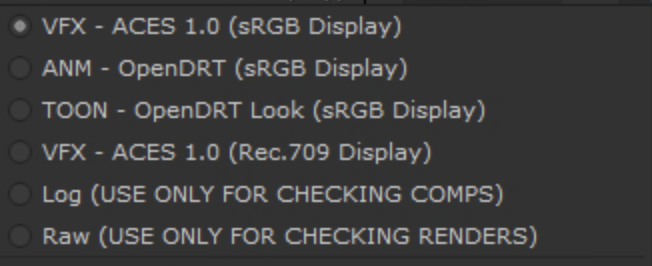
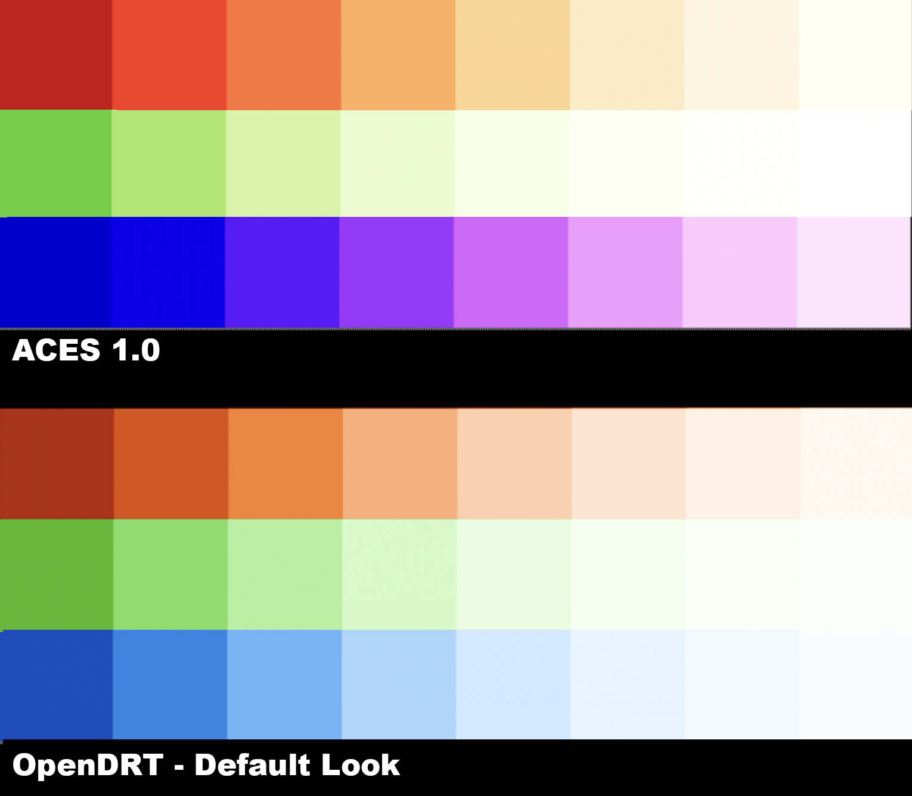

# ANM and VFX Global config

The global config ````StdX_global_config.ocio```` is designed for work on both CG animation shorts and features, as well as on a VFX designed for integrating CG and VFX with live action film. 


# View and Display Transforms 



In OCIO, a View Transform is paired with a Display Transform corresponding to the display it is being viewed on. As you can see in the image above, in Nuke these are all in a single drop-down menu with the display listed in parenthesis after the view. In Maya, the View and Display are separate drop-downs.

- **ACES 1.0 SDR (sRGB Display)** <br> The standard ACES [tone mapping](tonemap.md) *view*, paired with a Gamma 2.2 sRGB *display*. <br>Intended for viewing on artist's computer monitors. This uses the pure gamma 2.2, rather than the piece-wise sRGB EOTF. If an image is encoded for a 2.2 display, but shown on a piece-wise sRGB display in can appear a bit low contrast. Conversely if an image is encoded for a piece-wise sRGB display, but shown on a pure gamma 2.2 display the shadows will appear crushed. Since there is no way to control the calibration of a viewers computer monitor, best practice is for artists  to work in pure gamma 2.2.
- **ANM OpenDRT (sRGB Display)** <br>This look is intended for CG animation work. <br>The ANM Look uses OpenDRT with its Default look. The reason for using this transform is because it does a nicer job reproducing colors compared to ACES. Observe the differences in the following exposure sweeps of sRGB/Rec709 primaries. Note in particular how with ACES 1.0 the red skews into orange, and the blue skews into magenta with increased exposure, whereas with the OpenDRT Default look the blue stays blue, and the red does have an intentional shift towards yellow to emulate how things like fire and sunlight have this same visual shift. In other words, what happens in ACES as a "happy accident" is engineered into OpenDRT intentionally in regards to the Planckian locus. Also note how with OpenDRT the gradation to white with increased exposure is more even across the different colors compared to ACES 1.0.

<div style="text-align: center;">
 
</div>

- **ACES 1.0 SDR (Rec.709 Display)** <br> The standard ACES [tone mapping](tonemap.md) for a HDTV display, and used for delivery of proxy movies to clients for viewing in Rec.709 in editorial. This has 2.4 gamma making it appear brighter on an artist's monitor. In the case of a VFX show that can be desired as it lets you see the image a bit better.
- **Log (USE ONLY FOR CHECKING COMPS)** For diagnostic purposes only, i.e. for checking comps. This uses the camera log space defined in the contextual variable, described below.
- **Raw (USE ONLY FOR CHECKING RENDERS)** For diagnostic purposes only, i.e. for checking renders in scene-linear space. This essentially turns off the view transform.

Optional:
- **Apple Display P3** <br> Display transform for the MacBookPro M1 XDR display in the wider P3 gamut used for film with a pure 2.2 gamma. This display transform also contains options for HDR display.


# Shot & Show LUT Config & contextual variables


- **VFX - ACES Shot Look (Rec.709 Display)** <br> This view transform uses contextual variables to apply the show or shot-specific look LUT provided by the client. This assumes the LUT was made in an ACES scene-referred workflow in ACEScct working space (the log color space used for color corrections). The variables are defined in the config and can be set by the artist. 
- **VFX - DPX Shot Look (Non-color managed DPX workflow)** for displaying client LUTS from a display-referred non-color managed pipeline. This is typically the case with DPX footage, although a show can have a display-referred pipeline and use EXR files. The key issue is whether the target display EOTF (for example Rec.709) was baked into the LUT, making it display-referred. Here the camera native color space needs to be defined as well as the process space the LUT was generated in.

Both the  **ACES Shot Look** and **DPX Shot Look** view transforms use contextual variables to apply the show or shot-specific look LUT provided by the client to the view. These are defined in the following section at the top of the config file.

````
# ---------------- Per Shot Grade Variables ------------------------- #
environment:
#--------------
# example path: ../shots/SM_020_018/01_Client_Original_Footage/5_LUT/
#--------------
  LUT_PATH: shot_lut/
  LUT_NAME: clientShotLUTname_ACEScct.cube
#--------------
# Camera aliases are: ARRIv3_log, ARRIv3_lin, ARRIv4_log, ARRIv4_log
# RED_log, RED_lin, CLog2, CLog3, Panasonic_log, Panasonic_lin, ADX10
# Sony_log, SonyCine_log, SonyVenice_log, SonyVeniceCine_log, Sony_lin, SonyCine_lin, SonyVenice_lin, SonyVeniceCine_lin, 
# CAMERA variable is set to ACEScct for ACES EXR workflow, and to camera for DPX for display-referred workflow
#--------------
  CAMERA: ARRIv3_log
  SHAPER: ACEScct
# ------------------------------------------------------------------- # 
````
Because the config file uses OCIOv2 it is self-contained and does not require external LUTs, instead using built-in mathematical transforms. Therefore each artist can simply copy the ```StudioX_ShotLUT.ocio``` file into their local directory for the show they are working on, and edit the file setting the above variables to correspond to the location (*LUT_PATH*) and name (*LUT_NAME*) of the LUT for the shot they are working on. Additionally if the client is delivering a LUT for display-referred footage, the color space of the original camera should be entered into the **CAMERA** variable to set the log space for the **Shot Look (Non-color managed DPX workflow)** display transform. 

In the StudioX VFX directory structure, the OCIO config directory is parallel to the shots directory:

- **Show/**
  - <b>shots/</b>SM_020_018/01_Client_Original_Footage/5_LUT/clientShotLUTname_ACEScct.cube
  - <b>ocio/</b>VFX_config.ocio

Therefore to go up a directory simply use ```../``` at the front of the file path. Like so:

````
  LUT_PATH: ../shots/SM_020_018/01_Client_Original_Footage/5_LUT/ 
````
The *SHAPER* variable refers to the working color space the LUT was created in (this is referred to as a "shaper" LUT). This will be either ACEScct or (less commonly) ACEScc, based on the Project Settings in DaVinci Resolve. VFX needs to know this in order to properly process the LUT in comp. It is good practice to have the client append the shaper space to the file name for clarity. See the [VFX Pulls](VFXpulls.md) guide for details on requirements for VFX pulls. 

Below a two part video series covering how to use the config both for when the client is working in ACES and also when then are still using the display-referred workflow, and how to integrate that into a color managed ACES pipeline for VFX.

<iframe width="560" height="315" src="https://www.youtube.com/embed/FT7ZqNB3Opg" title="YouTube video player" frameborder="0" allow="accelerometer; autoplay; clipboard-write; encrypted-media; gyroscope; picture-in-picture; web-share" allowfullscreen></iframe>


<iframe width="560" height="315" src="https://www.youtube.com/embed/z3-n3HmGTp4" title="YouTube video player" frameborder="0" allow="accelerometer; autoplay; clipboard-write; encrypted-media; gyroscope; picture-in-picture; web-share" allowfullscreen></iframe>


