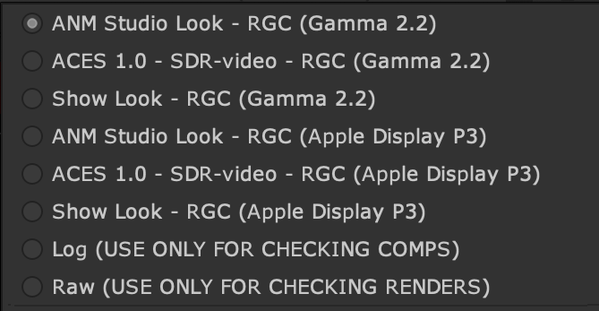

# ANM and VFX Configs

The ANM config ````ANM_config.ocio```` is designed for work on CG animation shorts and features. The VFX config ````VFX_config.ocio```` in contrast is designed for integrating CG and VFX with live action film. Consequently each has different Display Transforms geared for its particular pipeline needs.

## ANM Config



The above Display Transforms contain the following views:

**ACES 1.0 SDR - (RGC)** The standard ACES RRT with added [Referrence Gamut Compression (RGC)](docs/gamut.md)
**Neutral Look** is intended as a neutral starting point for lookdev work. 
**Filmic Look** is intended for lighting shot work and has a similar filmic look to the standard ACES 1.0 RRT, with slightly reduced contrast. 
**Show Look** is for the show specific look LUT decided on by the director for the ANM config. This Look is combined with the Filmic Look.
**Un-tone-mapped** the default Nuke transform without tone mapping.

You can read details about the *Neutral Look* and *Filmic Look* look transoforms on the [tone mapping](tonemap.md) page.  Additionally, both Look Transforms provide [highlight desaturation](docs/highlight.md) of blackbody color temperatures, and [reduced hue shifts](docs/chroma.md) compared to the default ACES 1.0 Output Transform. Finally, the new [Referrence Gamut Compression (RGC)](docs/gamut.md) is baked into all of the display tranforms (including the ACES 1.0 SDR) to address hue shifts in CG renders with ACES. Note that this is not the case for the VFX config below.

Each of these above views is paired with an output display:

**sRGB** For viewing on artist's computer monitors calibrated to sRGB Peicewise EOTF
**Gamma 2.0 - Rec.709** For viewing on artist's computer monitors calibrated to pure gamma 2.2
**Apple Display P3** For viewing on the MacBookPro M1 in the wider P3 gamut used for film. This also contains options for HDR display.

The remaining view transforms are the same as the default Maya 2022 config and are used for diagnostic purposes.

- **Raw** 
- **Log**


## VFX Config
   


As noted above, in a VFX pipeline [gamut compression](gamut.md) is applied as a node in VFX and thus not included in the Display Transform. 

The VFX config has the following views:

**ACES 1.0 SDR - (RGC)** The standard ACES RRT
**Shot Look** This view transform uses contextual variables to apply the shot-specific look LUT provided by the client to the view. The variables are defined in the config and can be set by the artist. See below.
**Un-tone-mapped** is the equivalent to Nuke's native sRGB which is a simple sRGB Gamma function without [tone mapping](tonemap.md). 

Each of these above views is paired with an output display:

**sRGB** For viewing on artist's computer monitors calibrated to sRGB Peicewise EOTF
**Gamma 2.0 - Rec.709** For viewing on artist's computer monitors calibrated to pure gamma 2.2
**Rec.1886 - Rec.709** For viewing in editorial on a Rec.709 (Gamma 2.4) reference monitor or on a HDTV display for dailies. 

There are again transoforms for diagnostic purposes.
- **Raw** 
- **Log**

And finally there is 
**DPX Shot Look** for displaying client LUTS from a display-referred non-color managed pipeline. See below.

#Shot Looks 

Both the **Shot Look** and **DPX Shot Look** view transforms use contextual variables to apply the shot-specific look LUT provided by the client to the view. The variables are defined in the config and can be set by the artist. **Shot Look** is intended for LUTs in an ACES pipline (the client is delivering EXR files in ACES2065-1 color space) and **DPX Shot Look** is for LUTs in a non-color managed display-referred pipeline (ther client is delivering DPX in the log space of the oroiginal camera raw).

The config has the following section at the top.

````
# ---------------- Per Shot Grade Variables ------------------------- #
environment:
#--------------
# example path: ../shots/SM_020_018/01_Client_Original_Footage/5_LUT/
#--------------
  LUT_PATH: path_to/shot_lut/
  LUT_NAME: clientShotLUTname_ACEScct.cube
#--------------
# Camera aliases are: ARRI, RED, CLog2, CLog3, 
# Sony, SonyCine, SonyVenice, SonyVeniceCine, ADX10
#--------------
  CAMERA: ARRI
  SHAPER: ACEScct
# ------------------------------------------------------------------- # 
````
Each artist would have a VFX config file in their local directory for the show they are working on, and set the above variables to correspond to the location (*LUT_PATH*) and name (*LUT_NAME*) of the LUT for the shot they are working on. Additionally if the client is delivering a LUT for display-referred DPX footage, the color space of the original camera should be entered into the **CAMERA** variable to set the log space for the **Shot Look DPX** display transform. 

In the StudioX VFX directory structure, the OCIO config directory is parallel to the shots directory:

- **Show/**
  - <b>Shots/</b>SM_020_018/01_Client_Original_Footage/5_LUT/clientShotLUTname_ACEScct.cube
  - <b>StdX_ACES/</b>OCIOv1_config_VFX.ocio

Therefore to go up a directory simply use ```../``` at the front of the file path. Like so:

````
  LUT_PATH: ../shots/SM_020_018/01_Client_Original_Footage/5_LUT/ 
````
The *SHAPER* variable refers to the working color space the LUT was created in (this is referred to as a "shaper" LUT). This will be either ACEScct or (less commonly) ACEScc, based on the Project Settings in DaVinci Resolve. VFX needs to know this in order to properly process the LUT in comp. It is good practice to have the client append the shaper space to the file name for clarity. See [ACES for Indie Filmmakers](VFXpulls.md#require) for details on requirements for VFX pulls. 

Below is the first part of a three part video series covering how to use the VFX config both for when the client is working in ACES and also when then are still using the display-referred workflow, and how to integrate that into a color managed ACES pipeline for VFX.

<iframe src="https://player.vimeo.com/video/670932546?h=ffdbf2d358" width="640" height="360" frameborder="0" allow="autoplay; fullscreen; picture-in-picture" allowfullscreen></iframe>
