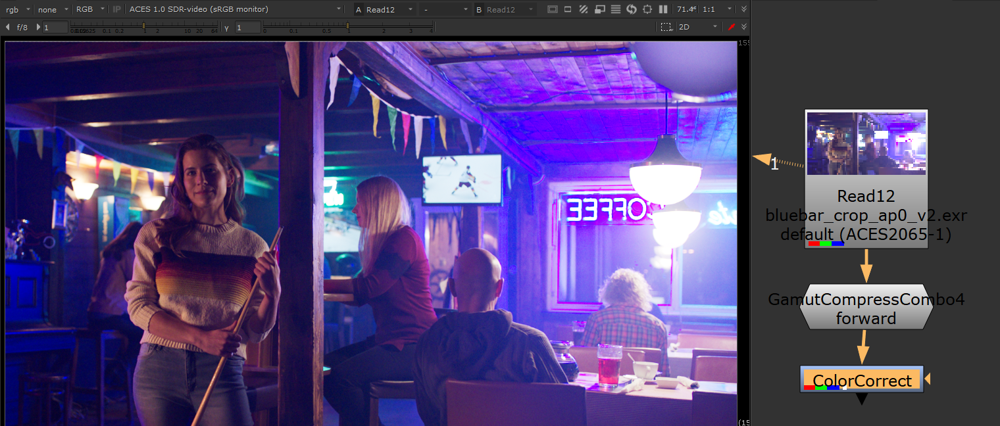
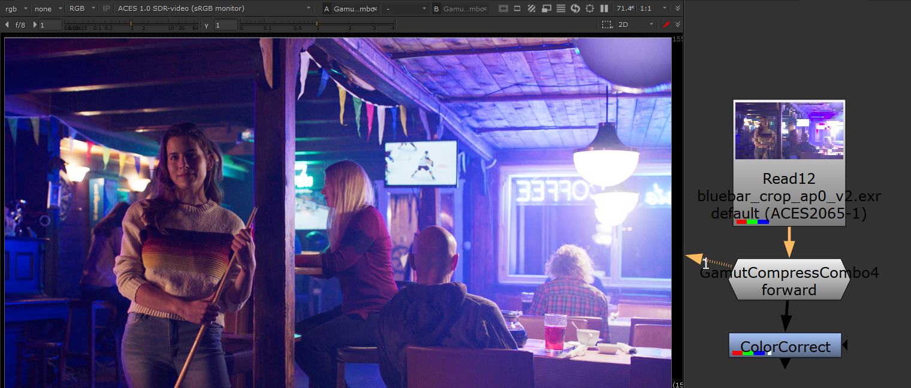
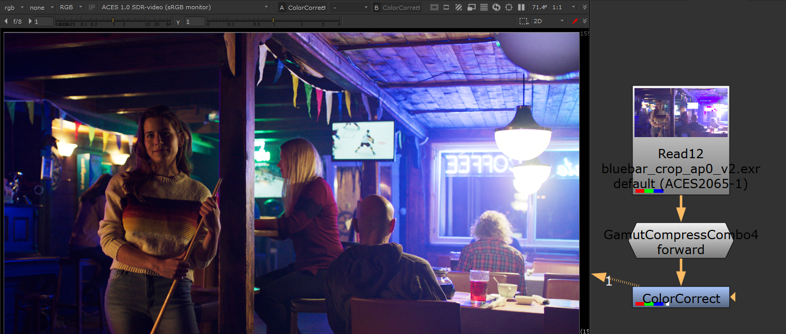
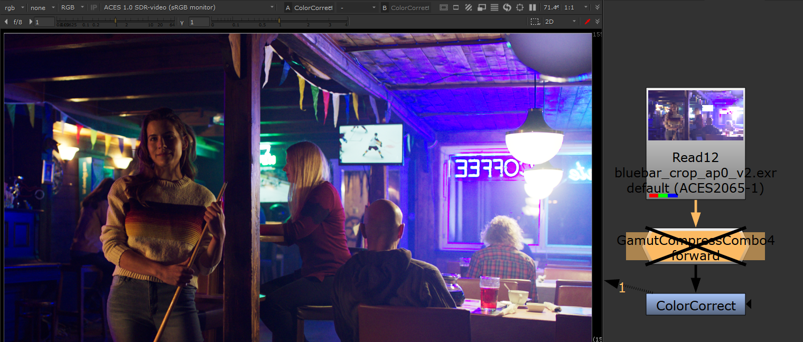

# Gamut Compression
 
The config's look transforms include an implementation of the [ACES gamut compression algorithm](https://github.com/ampas/aces-vwg-gamut-mapping-2020). Currently the proper way to do this is with a [Nuke](Nuke.md) node or with a DCTL for [Resolve Studio](Resolve.md). Implementation in OCIO is in the works for v2.1, but currently this has not been released. In the meantime gamut compression is provided in this config as a 3D LUT for viewing purposes. Because gamut compression works with negative numbers, the 3D LUT shaper needs to cover large range of negative values. This is done with a logarithmic function with a linear segment, similar to the ACEScct function, but that is also reflected by its intersection point with the Y-axis, essentially mirroring the ACEScct shaper. It's important to note however that this 3D LUT has limitations, for instance it is not invertable. We therefore only use it to view images in OCIO, and never to bake the gamut compression into the image. This again is done with the proper Nuke and DCTL nodes referenced above.
 
If you read through all of that you deserve to see some pretty pictures! Let's begin with several images with colors that are out of gamut, illustrating the problem. Note for instance the blobs of blue on the roof of the bar scene (bottom right), the loss of detail in the red areas in the top two images in their faces and clothing, and the crazy banding or posterizing happening on the spotlight behind the head of the woman (bottom left image).
  

    
Below are those images with the gamut compression algorithm applied (implemented using the [Nuke blink script tool](https://github.com/jedypod/gamut-compress)). Wow. 
    
  
     
Compare that to the LUT implementation used in this config, shown below. Looks visually identical.  

      
Now compare that to the older Blue Light Artifact Fix, pictured below, the results are clearly superior. Ironically the "blue fix" is making blue appear magenta. 

Gamut compression is meant to replace the Blue Light Artifact Fix and one of the key differences is that the gamut compression algorthm only affects the pixels that are out of gamut, leaving the rest of the image unchanged. So it's not so much color correction, and more "pixel healing."

## Pixel Healing

Let's have a look at the Gamut Compression node in action in Nuke. We begin with some footage with colors that are out of gamut. Look in particular at the neon sign in the window and the ceiling above it. The neon sign has purple artifacting around it as does the window frame, and the blue light on the ceiling is clipping. 

Next we apply the Gamut Compression node. Observe that all of the above issues are fixed.

Let's say we then wanted to use a Color Correct to do some despill of the blue light in the shot. Thanks to the pixel healing of the Gamut Compression this works great. This removes the blue-magenta cast across the whole image. Observe for example how the woman with the pool cue no longer has this blue-magenta cast in the image below.

Compare that to the same operation without the Gamut Compression. We're getting artifacting on the neon sign and posterization and clipping on the ceiling. Without gamut compression these can be a nighmare to deal with.

[Back to main](../StdX_ACES)
