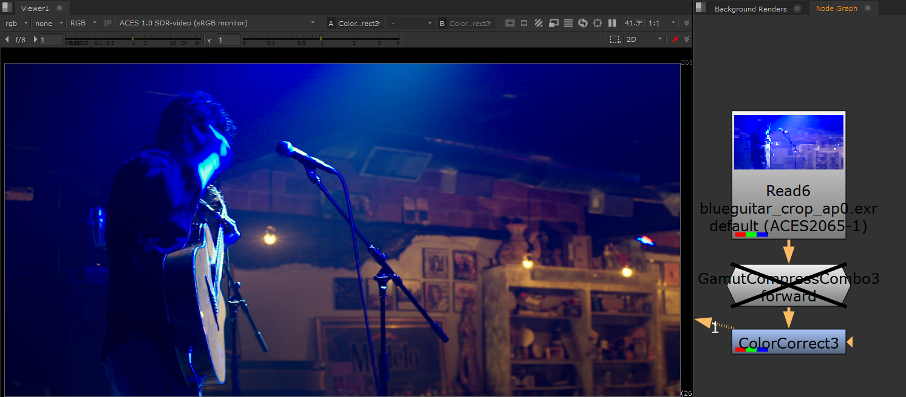

# Reference Gamut Compression
 
Problems with out-of-gamut colors are caused by an image going from a large color gamut space to a smaller one. The most common example is converting a 
film camera wide-gamut color space like a RED camera  to  the  smaller  gamut  of  the  display  device, for example Rec.709 for broadcast HDTV. 

Similarly in ACES one needs to go from the crazy big AP0 color gamut used for archive and exchange (which contains more colors than are visible to the human eye) into the smaller AP1 gamut color space used for CG/VFX work as well as DI. 

When transformed from the larger gamut into the smaller one, any highly saturated bright colors that were on the edge of the larger gamut space will fall outside of the  target  color  space, resulting in negative color values which produce artifacts and clipping (loss  of  texture detail, intensification  of  color  fringes, and so on).

To address this the ACES community established a [Gamut Mapping Virtual  Working  Group  (VWG)](https://github.com/ampas/aces-vwg-gamut-mapping-2020) who developed a Gamut Compression algorithmm. Implementations into DCC apps (Nuke, Resolve, etc) are in the works. In the meantime Gamut Compression is provided in this config as a [Nuke](Nuke.md) Gizmo and [Resolve Studio](Resolve.md) DCTL. Below is a roadmap its intended integration into a VFX pipeline.

While it is generally recommended to use analytic implementations of the ACES RGC transform some use cases may still require a 3D LUT based implementation instead, such as on-set monitoring. The two main considerations for a 3D LUT implementation of the ACES RGC are the LUT input color space and the transform precision. To achieve a reasonable approximation of the ACES RGC transform a 3D LUT implementation should use the highest practical resolution, ideally 65x65x65 or higher.

For on-set monitoring, where the input gamut is known and fixed, such an input color space could be the cameras specific log-encoding (e.g. LogCv3/AlexaWideGamut, Log3G10/REDWideGamutRGB). These encodings are optimized for the particular camera model and are expected to map all color samples into 0.0→1.0. (Please note that ACEScct does not fulfill this requirement even when it is available as a camera RAW development target.)

For visual effects, review or mastering applications that have to account for multiple input gamuts a different approach would be needed since these case are not be able to rely on a specific camera log-encoding and gamut. Instead a 1D shaper function can be used that transforms both negative and positive input value ranges into the 0.0→1.0 domain. To achieve this efficiently a piecewise log-encoding function that is reflected at the y-Axis would be recommended. This is done with a logarithmic function with a linear segment, similar to the ACEScct function, but that is also reflected by its intersection point with the Y-axis, essentially mirroring the ACEScct shaper. 
 
If you read through all of that you deserve to see some pretty pictures (Well, at least they are pretty after the gamut compression!) Let's begin with some film footage with out-of-gamut colors, illustrating the problem. Note for instance the crazy banding or posterizing happening on the spotlight behind the head of the woman (left image), and the blobs of blue on the ceiling of the bar scene resulting in loss  of  texture detail on the wood boards (right).
  

    
Below are those images with the gamut compression algorithm applied in Nuke. All of the above artifacting is gone. 
    
  
     
      
Now compare that to the older Blue Light Artifact Fix, pictured below, the results from the Gamut Compression are clearly superior. Ironically the "blue fix" is making blue appear magenta. Gamut compression is meant to replace the Blue Light Artifact Fix and one of the key differences is that the gamut compression algorithm only affects the pixels that are out of gamut, leaving the rest of the image unchanged. So it's not so much color correction, and more "pixel healing."

## Pixel Healing

Let's have a look at the Gamut Compression node in action in Nuke. We begin with some footage with colors that are out of gamut. 

Let's say we wanted to use a Color Correct to do some despill of all that blue light in the shot. We can see in the image below that this is looking good on the background room, but we are now seeing the out-of-gamut pixels more clearly on the performer. There is artifacting and posterization all over him.

Now let's look at how that same Color Correct looks when we first apply Gamut Compression, pictured below. The artifacting is gone. That's the pixel healing effect of Gamut Compression, and the reason it is applied as the first operation immediately after the input transform (i.e. right after the Read node). You want to begin working with healed pixels. Otherwise it's like cooking with spoiled food.

[Back to main](../StdX_ACES)
