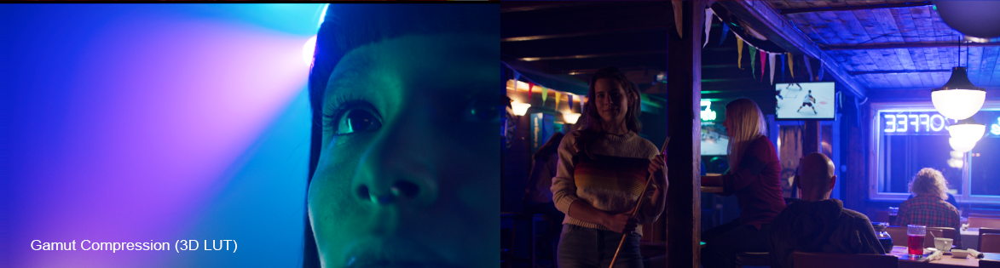
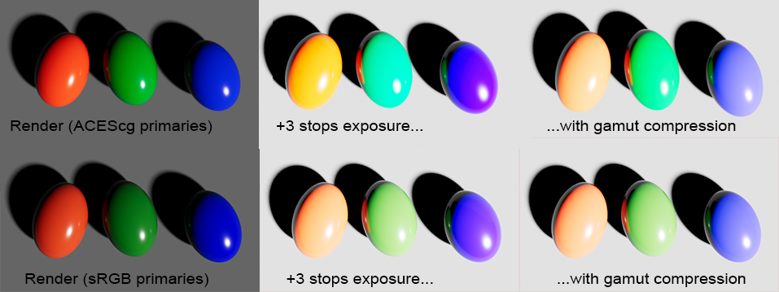

# Gamut Compression
 
Problems with out-of-gamut colors are caused by an image going from a large color gamut space to a smaller one. The most common example is converting a 
film camera wide-gamut color space like a RED camera  to  the  smaller  gamut  of  the  display  device, for example Rec.709 for broadcast HDTV. 

Similarly in ACES one needs to go from the crazy big AP0 color gamut used for archive and exchange (which contains more colors than are visible to the human eye) into the smaller AP1 gamut color space used for CG/VFX work as well as DI. 

When transformed from the larger gamut into the smaller one, any highly saturated bright colors that were on the edge of the larger gamut space will fall outside of the  target  color  space, resulting in negative color values which produce artifacts and clipping (loss  of  texture detail, intensification  of  color  fringes, and so on).

To address this the ACES community established a [Gamut Mapping Virtual  Working  Group  (VWG)](https://github.com/ampas/aces-vwg-gamut-mapping-2020) who developed a Gamut Compression algorithm, published as a [Nuke](Nuke.md) node and DCTL for [Resolve Studio](Resolve.md). Implementation in OCIO is in the works for v2.1, but currently this has not been released. In the meantime Gamut Compression is provided in this config as a 3D LUT for viewing purposes. Because Gamut Compression works with negative numbers, the 3D LUT shaper needs to cover a large range of negative values. This is done with a logarithmic function with a linear segment, similar to the ACEScct function, but that is also reflected by its intersection point with the Y-axis, essentially mirroring the ACEScct shaper. It's important to note however that this 3D LUT has limitations, for instance it is not invertible. We therefore only use it to view images in OCIO, and never to bake the gamut compression into the image. This again is done with the proper Nuke and DCTL nodes referenced above.
 
If you read through all of that you deserve to see some pretty pictures (Well, at least they are pretty after the gamut compression!) Let's begin with some film footage with out-of-gamut colors, illustrating the problem. Note for instance the crazy banding or posterizing happening on the spotlight behind the head of the woman (left image), and the blobs of blue on the ceiling of the bar scene resulting in loss  of  texture detail on the wood boards (right).
  

    
Below are those images with the gamut compression algorithm applied (implemented using the [Nuke blink script tool](https://github.com/jedypod/gamut-compress)). All of the above artifacting is gone. 
    
  
     
Compare that to the 3D LUT implementation used in this config, shown below. It looks visually identical. So as far as a tool to temporaily visualize the result this works quite well.

      
Now compare that to the older Blue Light Artifact Fix, pictured below, the results from the Gamut Compression are clearly superior. Ironically the "blue fix" is making blue appear magenta. Gamut compression is meant to replace the Blue Light Artifact Fix and one of the key differences is that the gamut compression algorithm only affects the pixels that are out of gamut, leaving the rest of the image unchanged. So it's not so much color correction, and more "pixel healing."

## CG Renders

Out-of-gamut colors also affect CG renders. With highly saturated colors in ACEScg space, hues shift from primaries to secondaries with increased luminance. Red turns yellow, green turns cyan, and blue turns magenta. This is greatly helped by instead picking colors in scene-linear sRGB/Rec.709 primaries. However, even then we still have the blue jellybean's color shifting towards magenta as the lights get brighter. With gamut mapping this is greatly improved.

## Pixel Healing

Let's have a look at the Gamut Compression node in action in Nuke. We begin with some footage with colors that are out of gamut. 

Let's say we wanted to use a Color Correct to do some despill of all that blue light in the shot. We can see in the image below that this is looking good on the background room, but we are now seeing the out-of-gamut pixels more clearly on the performer. There is artifacting and posterization all over him.

Now let's look at how that same Color Correct looks when we first apply Gamut Compression, pictured below. The artifacting is gone. That's the pixel healing effect of Gamut Compression, and the reason it is applied as the first operation immediately after the input transform (i.e. right after the Read node). You want to begin working with healed pixels. Otherwise it's like cooking with spoiled food.

[Back to main](../StdX_ACES)
