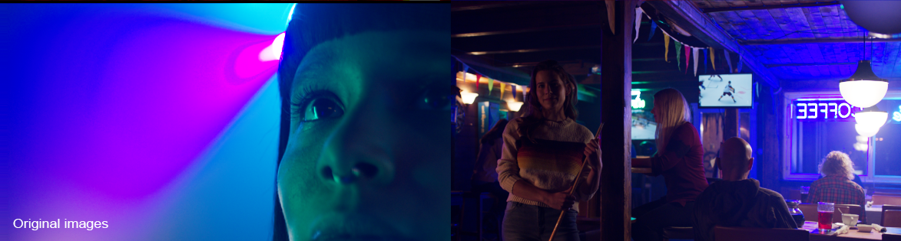

# Reference Gamut Compression
 
Problems with out-of-gamut colors are caused by an image going from a large color gamut space to a smaller one. The most common example is converting a 
film camera wide-gamut color space like a RED camera  to  the  smaller  gamut  of  the  display  device, for example Rec.709 for broadcast HDTV. 

Similarly in ACES one needs to go from the crazy big AP0 color gamut used for archive and exchange (which contains more colors than are visible to the human eye) into the smaller AP1 gamut color space used for CG/VFX work as well as DI. 

When transformed from the larger gamut into the smaller one, any highly saturated bright colors that were on the edge of the larger gamut space will fall outside of the  target  color  space, resulting in negative color values which produce artifacts and clipping (loss  of  texture detail, intensification  of  color  fringes, and so on).

To address this the ACES community established a [Gamut Mapping Virtual  Working  Group  (VWG)](https://github.com/ampas/aces-vwg-gamut-mapping-2020) who developed a Reference Gamut Compression algorithm. Implementations into DCC apps (Nuke, Resolve, etc) are in the works. In the meantime Gamut Compression is provided in this config as a [Nuke Gizmo](Nuke.md#gamut-compression-and-nuke).

Below is a roadmap how RGC integrates into a VFX pipeline.

[The ANM config](configs.md)  uses Reference Gamut Compression (RGC) to address [hue shifts in CG colors](chroma.md). Here the RGC is automatically applied in the view transforms of the ANM OCIO config, and also baked into the output when writing out to sRGB using 3D LUTS. This is accomplished with a 1D shaper function that transforms both negative and positive input value ranges into the 0.0→1.0 domain, essentially the ACEScct function mirrorred at the Y-axis. 

[The VFX config](configs.md) in contrast does not have RGC as a view transform or output and instead uses the [Nuke Gizmo](Nuke.md#gamut-compression-and-nuke).
 
If you read through all of that you deserve to see some pretty pictures (Well, at least they are pretty after the gamut compression!) Let's begin with some film footage with out-of-gamut colors, illustrating the problem. Note for instance the crazy banding or posterizing happening on the spotlight behind the head of the woman (left image), and the blobs of blue on the ceiling of the bar scene resulting in loss  of  texture detail on the wood boards (right).
  

    
Below are those images with the gamut compression algorithm applied in Nuke. All of the above artifacting is gone. 
    
  
     
      
Now compare that to the older Blue Light Artifact Fix, pictured below, the results from the Gamut Compression are clearly superior. Ironically the "blue fix" is making blue appear magenta. Gamut compression is meant to replace the Blue Light Artifact Fix and one of the key differences is that the gamut compression algorithm only affects the pixels that are out of gamut, leaving the rest of the image unchanged. So it's not so much color correction, and more "pixel healing."

[Back to main](../StdX_ACES)
