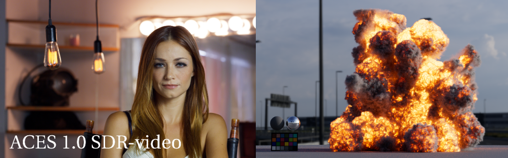
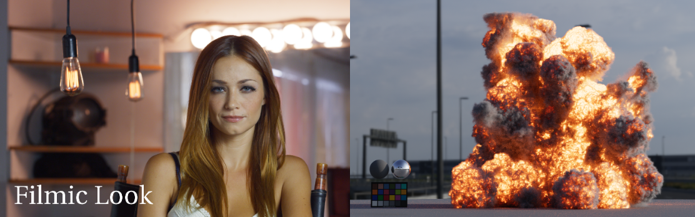
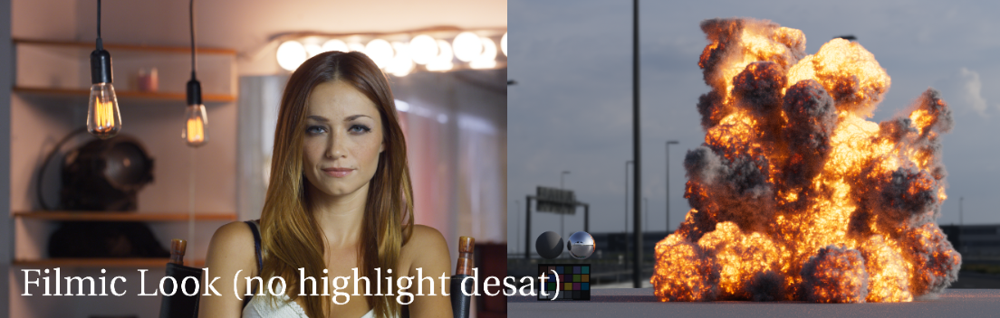
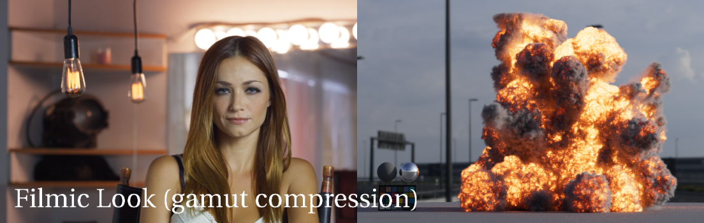
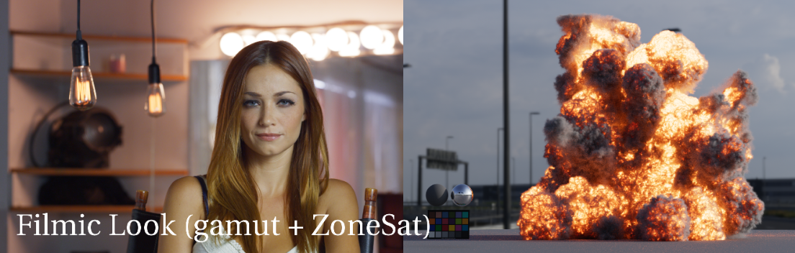

# Highlight Desaturation

Both the Filmic and Neutral looks handle warm light temperatures such as sunshine, fire, and tungsten light bulbs differently than the ACES RRT which renders these in an unnatural over-saturated way. Both the Filmic and Neutral Look Transforms therefore slightly lower the saturation in the image highlights, using the [ZoneSatLog Nuke tool](https://community.acescentral.com/t/look-transforms/3885/39). This gives luminous things like the fire and light bulbs, seen in the images below, a more natural appearance compared to the ACES Output Transform: 
   
   
   
   
A good deal of this is already done by the [gamut compression](gamut.md). The zoneSat just gives it a little nudge on its path to white as the luminance approaches display max. Here's a look at the effect of each part:

   
   
   
   
Note for CG assets these saturated colors in fire and lights can be caused by the render doing the spectra calculations in Rec.709/sRGB scene-linear, rather than in the wider gamut ACEScg scene-linear color space. This affects things like pyro FX, light color temperature, physical sun and sky, and so on. Many renders are updating this, but not have not completely. Arnold for example does use ACEScg primaries for its blackbody node used for OpenVDB, as does Houdini. However Arnold does not currently use this for light temperature. Hopefully this will be updated soon. In the meantime you can [use a 3x3 matrix to convert from sRGB to ACEScg in Maya](https://community.acescentral.com/t/acescg-vs-linear-srgb-709-cg-rendering/1512/7) for physical sky, and use this [nifty tool by Liam Collod](https://share.streamlit.io/mrlixm/streamlit_temperature2rgb/main/src/app.py) to get the color value for kelvin temperatures in ACEScg.
   
[Back to main](../StdX_ACES)
