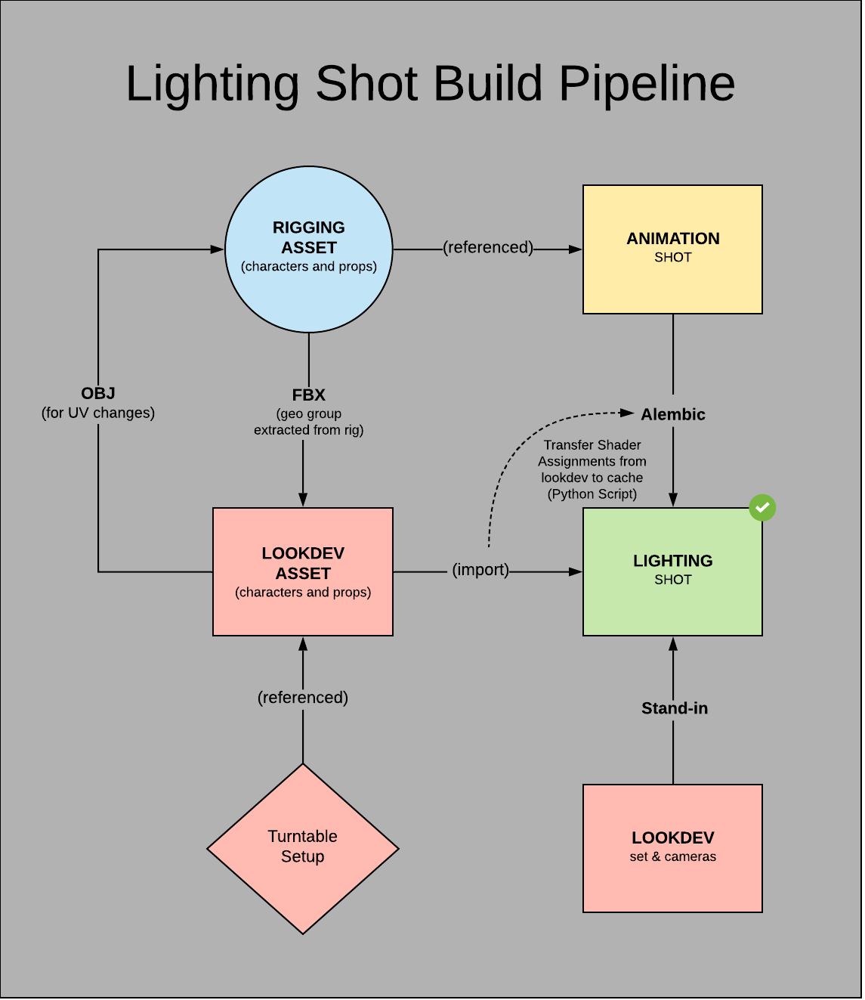

# Project Directory Structure and Naming Conventions

Project directory structure for CG in a VFX pipeline. Assets folder for the modeling, rigging, and lookdev departments. Shots folder for the animation, FX, and lighting departments. Published per shot assets so in the shots/published folder. Expand each section below for details and naming convensions.

## assets/
  
<details>
  <summary><b>mod/</b></summary>
  
- *modeling department: Maya files*
  
  ```[AssetName] / [AssetName]_mod_[artist]_[ver].ma```
  
  example:
  ```
  mod/
    spaceShip/
      spaceShip_mod_bsmith_v01.ma
  ```
</details>

<details>
  <summary><b>rig/</b></summary>
  
- *rigging department: Maya files*

  ```[AssetName] / [AssetName]_rig_[artist]_[ver].ma```
  
  example: 
  ```
  rig/
    spaceShip/
      spaceShip_rig_jdoe_v01.ma
  ```
</details>

<details>
  <summary><b>tex/</b></summary>
  
- *lookdev department: Maya turntable files*
  
  ```[AssetName] / [AssetName]_tex_[artist]_TT_[ver].ma```
  
  example: 
  ```
  tex/
    maya/
      spaceShip/
        spaceShip_tex_kjones_TT_v01.ma
  ```
  
- *lookdev department: Maya published assets*
  
  ```[AssetName] / [AssetName]_tex_[artist]_[ver].ma```
  
  example: 
  ```
  tex/
    maya/
      spaceShip/
        spaceShip_tex_kjones_v01.ma
  ```

  
- *lookdev department: Substance Painter files*
  
  ```[AssetName] / [AssetName]_[artist]_[ver].spp```
  
  example: 
  ```
  tex/
    painter/
      spaceShip/
        spaceShip_kjones_v01.spp
  ```
  
</details>


<br><br>
## shots/

<details>
  <summary><b>anim/</b></summary>

- *animation department: Maya files*
  
  ```[ShotName] / [ShotName]_anim_[artist]_[ver].ma```
  
  example:
  ```
  anim/
    GG_Sc20_50/
      GG_Sc20_50_anim_jdoe_v01.ma*
  ```
  
</details>

<details>
  <summary><b>fx/</b></summary>
  
- *effects department: Maya files*
  
  ```[ShotName] / [ShotName]_fx_[artist]_[ver].ma```
  
  example:
  ```
  fx/
    maya/
      GG_Sc20_50/
        GG_Sc20_50_fx_bsmith_v01.ma
  ```

- *effects department: Houdini files*
  
  ```[ShotName] / [ShotName]_fx_[artist]_[ver].hip```
  
  example:
  ```
  fx/
    houdini/
      GG_Sc20_50/
        GG_Sc20_50_fx_bsmith_v01.hip
  ```
</details>

<details>
  <summary><b>light/</b></summary>
  
- *lighting department: Houdini files*
  
  ```maya/[ShotName]/[ShotName]_light_[artist]_[ver].ma```
  
  example:
  ```
  light/
    maya/
      GG_Sc20_50/
        GG_Sc20_50_light_bsmith_v01.ma
  ```
  
 - *lighting department: Nuke files*
  
  ```nuke/[ShotName]/[ShotName]_light_[artist]_[ver].ma```
  
  example:
  ```
  light/
    nuke/
      GG_Sc20_50/
        GG_Sc20_50_light_bsmith_v01.nk
  ```

  
</details>

<details>
  <summary><b>publish/</b></summary>
  
- *published files: Alembic caches*
  
  ```Alembic/[ShotName]/[AssetName]_[artist]_[ver].abc```
  
  example:
  ```
  publish/
    Alembic/
      GG_Sc20_50/
        spaceShip_bsmith_v01.abc
  ```
- *published files: OpenVDB*
  
  ```vdb/[ShotName]/[EffectName]_[artist]_[ver].vdb```
  
  example:
  ```
  publish/
    vdb/
      GG_Sc20_50/
        smoke_bsmith_v01.vdb
  ```

- *published files: neutralized plates (ACEScg)*
  
  ```neut_footage/[ShotName]/[ShotName]_neutCG_[artist]_[ver].####.exr```
  
  example:
  ```
  neut_footage/
    GG_Sc20_50/
      GG_Sc20_50_neutCG_bsmith_v01.0001.exr
  ```
  
- *published files: degrained plates (ACEScg)*
  
  ```degrained_footage/[ShotName]/[ShotName]_neutCG_[artist]_[ver].####.exr```
  
  example:
  ```
  degrained_footage/
    GG_Sc20_50/
      GG_Sc20_50_degrain_bsmith_v01.0001.exr
  ```


</details>


<br><br>
## textures/

<details>
  <summary><b>textures/</b></summary>
  
- *texture maps (map naming: dif, spc, bmp, nor, dsp, met, msk, lyr)*

```[AssetName]/[ShaderName]_[map]_[AssetName}_[artist]_[ver].[ext]```
  
example:
```
 textures/
   spaceShip/
     leather_dif_spaceShip_kjones_v01.jpg
```
 </details>


<br><br>
## farm/

<details>
 <summary><b>renders/</b></summary>

- *renders*

```[ShotName]/[ShotName]_light_[artist]_[ver].####.exr```
  
example:
```
 renders/
   GG_Sc20_50/
     GG_Sc20_50_light_jdoe_v01.0001.exr/
```
</details>
  
<details>
 <summary><b>comps/</b></summary>

- *comps*
  
```[ShotName]/[ShotName]_light_[artist]_[ver].####.jpg```
  
example:
```
 renders/
   GG_Sc20_50/
     GG_Sc20_50_light_jdoe_v01.0001.jpg/
```
</details>

# Lighting Shot Build Flow Chart



