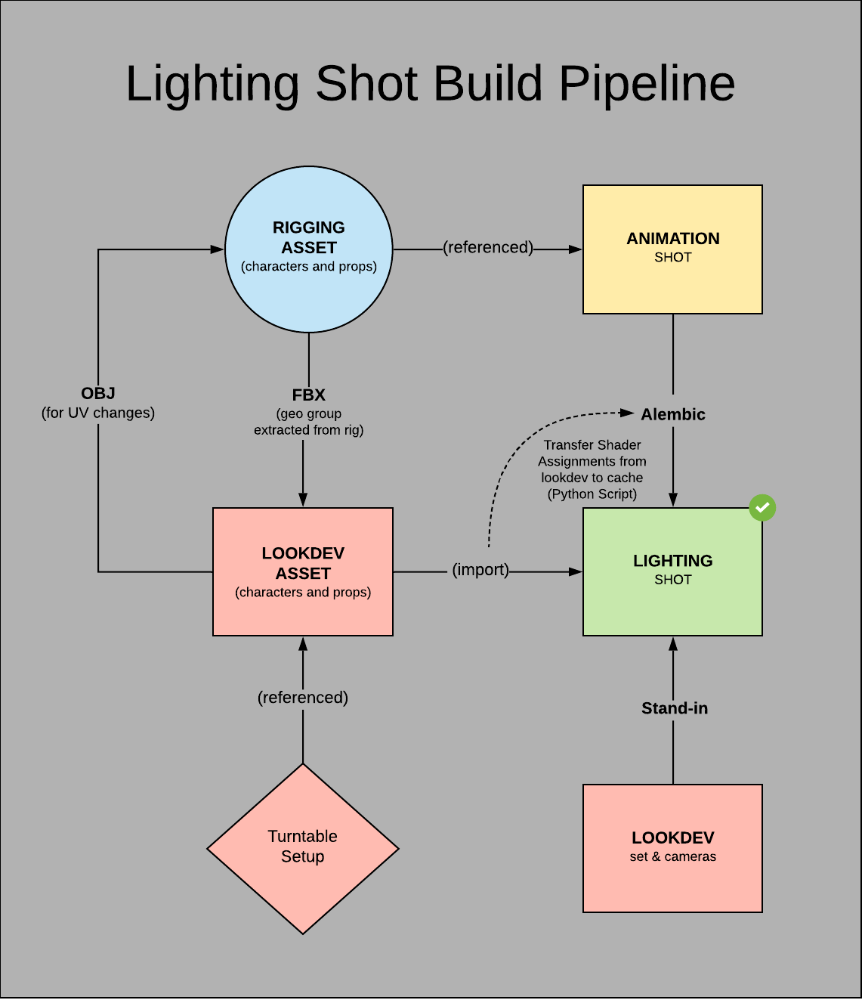

# CG Animation Project Directory Structure and Naming Conventions

## CG Directory Structure

Below is a breakdown of the project directory structure. This includes USD files, which we are gradually transitioning to. Currently, USD is used primarily for set building.
- [assets](#assets)/
  - char/
    - mod/
    - rig
    - tex/
  - prop/
    - mod/
    - rig
    - tex/
  - [set](#set)/
    - SetName/
      - mod/
        - maya/
        - usd/
      - tex/
        - maya/
        - usd/
- [shots](#shots)/
  - anim/
  - fx/
  - light/
- [textures](#textures)/
- [farm](#farm)/
  - renders/
  - comps/


# Naming Conventions

## assets/ 

(characters and props)

### MODELING
   
- *modeling department: Maya files*
  
  ```[AssetName] / [AssetName]_mod_[ver]_[artist].ma```
  
  example:
  ```
  mod/
    Monkey/
      Monkey_mod_v01_bsmith.ma
  ```
### RIGGING

- *rigging department: Maya files*

  ```[AssetName] / [AssetName]_rig_[ver]_[artist].ma```
  
  example: 
  ```
  rig/
    Monkey/
      Monkey_rig_v01_jdoe.ma
  ```


### LOOKDEV
  
- *lookdev department: Maya turntable files*
  
  ```maya / [AssetName] / [AssetName]_tex_TT_[ver]_[artist].ma```
  
  example: 
  ```
  tex/
    maya/
      Monkey/
        Monkey_tex_TT_v01_kjones.ma
  ```
  
- *lookdev department: Maya published assets* (note that the version of the published file should echo the corresponding turntable file)
  
  ```maya / [AssetName] / [AssetName]_tex_[ver]_[artist].ma```
  
  example: 
  ```
  tex/
    maya/
      Monkey/
        Monkey_tex_v01_kjones.ma
  ```

  
- *lookdev department: Substance Painter files*
  
  ```painter / [AssetName] / [AssetName]_[ver]_[artist].spp```
  
  example: 
  ```
  tex/
    painter/
      Monkey/
        Monkey_v01_kjones.spp
  ```
  

## set/

### MODELING

   
- *modeling department: Maya files*
  
  ```[setName] / mod / Maya / [SetName]_MODEL_[ver]_[artist].ma```
  
  example:
  ```
  shipCabin/
    mod/
      Maya/
        shipCabin_MODEL_v01_bsmith.ma
  ```

- *modeling department: USD set file*
  
  ```[setName] / mod / USD / [SetName]_MODEL_[ver].usda```
  
  example:
  ```
  shipCabin/
    mod/
      USD/
        shipCabin_MODEL_v01.usda
  ```

- *modeling department: USD set element files*
  
  ```[setName] / mod / USD / elements / [elementName]_mod.usda      (main asset file)```
  
Note too that the corresponding payload and geometry files are automatically generated with our USD Geo Export tool. See the example below as well as this video.
  
<iframe width="560" height="315" src="https://www.youtube.com/embed/0yPsnPXGQWc?si=59a-jbsOdIVaaReX" title="YouTube video player" frameborder="0" allow="accelerometer; autoplay; clipboard-write; encrypted-media; gyroscope; picture-in-picture; web-share" allowfullscreen></iframe>
  
  example:
  ```
  shipCabin/  
    mod/
      USD/
        v01/
           desk_mod.usda
           desk_mod.geom.usd
           desk_mod_payload.usda
  ```
Elements do not have a version in the name and instead have a version folder. This makes it easier to replace them in a set hierarchy. The above example only shows one element (consisting of an asset, geom, and payload file), but all of the elements that comprise the set would be under the v01/ folder and so on for each subsequent version of the elements.

### LOOKDEV

   
- *lookdev department: Maya files*
  
  ```[setName] / tex / Maya / [SetName]_LOOK_[ver]_[artist].ma```
  
  example:
  ```
  shipCabin/
    tex/
      Maya/
        shipCabin_LOOK_v01_bsmith.ma
  ```
- *lookdev department: Substance Painter set files*
  
  ```[setName] / tex / painter / [SetName]_[ver]_[artist].spp```
  
  example: 
  ```
  shipCabin/
    tex/
      painter/
        shipCabin_v01_kjones.spp
  
- *lookdev department: USD look set file*
  
  ```[setName] / tex / USD / [SetName]_LOOK_[ver].usda```
  
  example:
  ```
  shipCabin/
    tex/
      USD/
        shipCabin_LOOK_v01.usda
  ```

- *lookdev department: USD set element files*
  
  ```[setName] / tex / USD / elements / [elementName]_tex.usda```
  
  example:
  ```
  shipCabin/
    tex/
      USD/
         v01/
             desk_tex.usda

  ```
Elements do not have a version in the name and instead have a version folder. This makes it easier to replace them in a set hierarchy. The above example only shows one element, but all of the elements that comprise the set would be under the v01/ folder and so on for each subsequent version.

### GLOBAL ASSET: USD set files*
  
  ```[setName] / SET_[setName]_[ver].usda```
  
  example:
  ```
  shipCabin/
      SET_shipCabin_v01.usda

  ```
<br><br>
## shots/

### &nbsp;&nbsp;&nbsp;anim/

- *animation department: Maya files*
  
  ```[ShotName] / [ShotName]_anim_[ver]_[artist].ma```
  
  example:
  ```
  anim/
    maya/
      WB010/
        WB010_anim_v01_jdoe.ma
  ```
- *animation department: Alembic caches*
  
  ```Alembic / [ShotName] / [ShotName]_[AssetName]_[ver]_[artist].abc```
  
  example:
  ```
  anim/
    cache/
      WB010/
        WB010_Monkey_v01_bsmith.abc
  ```

### &nbsp;&nbsp;&nbsp;light/
  
- *lighting department: Maya files*
  
  ```maya / [ShotName] / [ShotName]_light_[ver]_[artist].ma```
  
  example:
  ```
  light/
    maya/
      WB010/
        WB010_light_v01_bsmith.ma
  ``` 


<br><br>
## textures/
  
- *texture maps (map naming: dif, spc, bmp, nor, dsp, met, msk, lyr)*

  ```[AssetName] / [ShaderName]_[map]_[AssetName}_[ver]_[artist].[ext]```
  
  example:
  ```
  textures/
    Monkey/
      teeth_dif_Monkey_v01_kjones.jpg
  ```

<br><br>
## farm/

### &nbsp;&nbsp;&nbsp;renders/

- *lighting department: rendered EXR sequence*
  
  ```[ShotName] / [ShotName]_light_[ver]_[artist].####.exr```
  
  example:
  ```
    WB010/
      WB010_light_v01_jdoe.0001.exr
  ```

### &nbsp;&nbsp;&nbsp;comp/

- *lighting department: comp JPG sequence*
  
  ```[ShotName] / [ShotName]_comp_[ver]_[artist].####.jpg```
  
  example:
  ```
    WB010/
      WB010_comp_v01_jdoe.0001.exr
  ```
 
<br><br><br>
# Lighting Shot Build Flow Chart

The following flow-chart shows the path that assets take in the construction of a lighting shot build.




