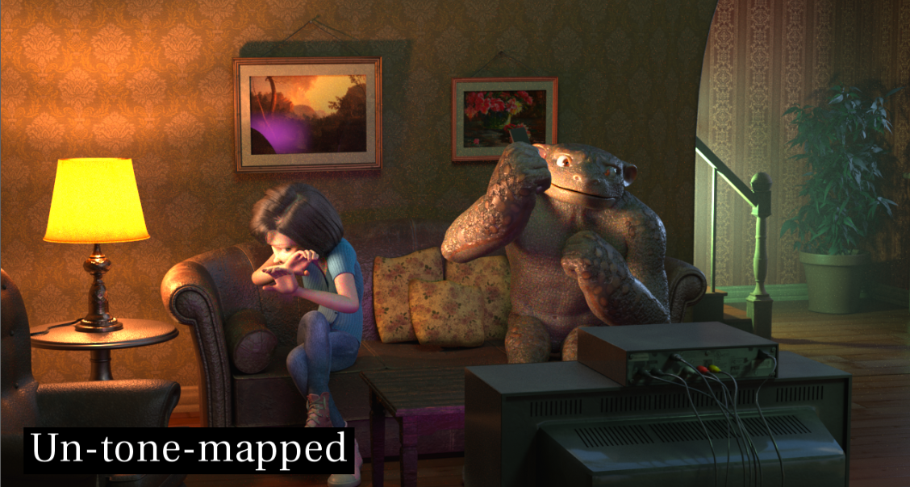
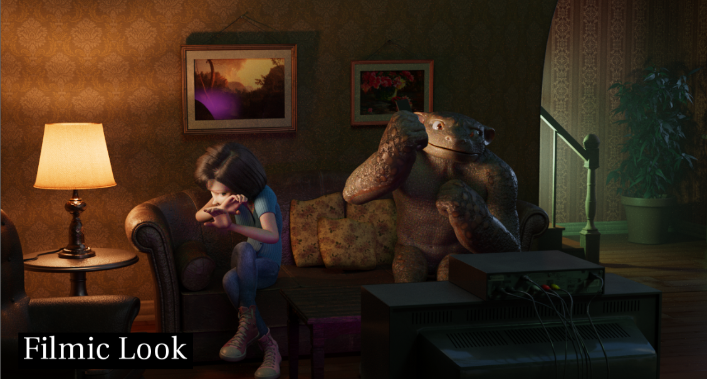
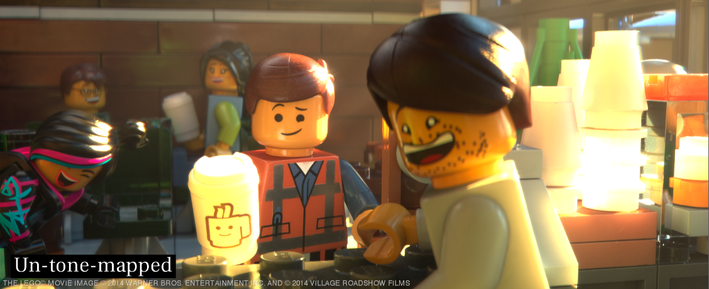
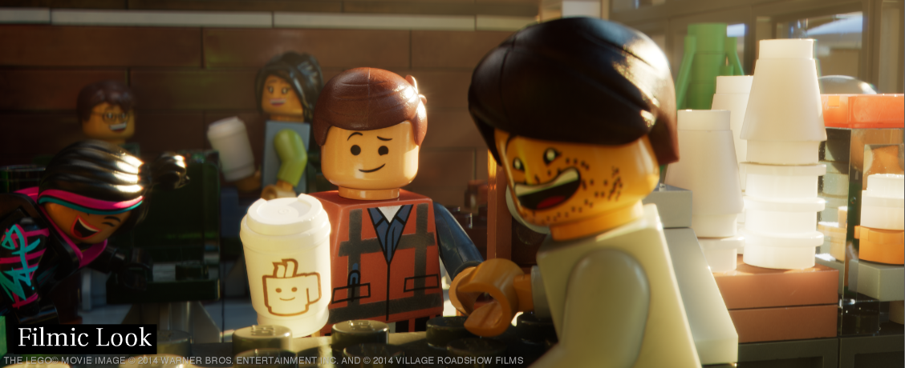
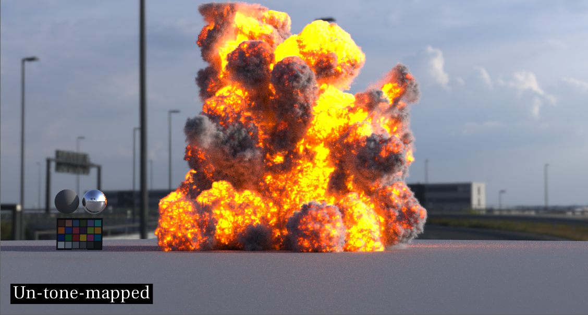
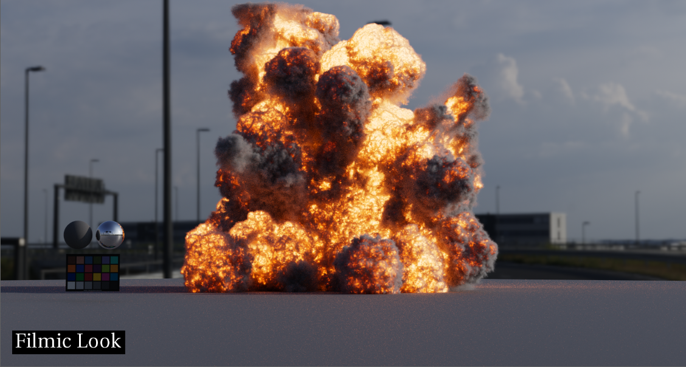

# Tone mapping

In the default linear workflow, used by Maya (prior to v2022) and Nuke, linear renders are viewed through an sRGB 2.2 gamma curve.  In 2012 Jeremy Selan issued a VES White Paper entitled *[Cinematic Color: From Your Monitor to the Big Screen](https://cinematiccolor.org/)* that proposed improvements to the traditional linear workflow that revolutionized the approach of the VFX industry. Perhaps the most significant of the improvements proposed in the white paper was the use of a “filmic” view transform. 

As the white paper explained, viewing an image through a 2.2 gamma can result in images with low apparent contrast and poor highlight rendition (i.e. highlight clipping). In contrast, using an S-shaped "film emulation" curve, typical of what we see in cameras, yields a pleasing appearance of contrast, with well balanced highlight and shadow details. Additionally, the filmic view transform does not simply clamp values above 1.0 as a gamma curve does, but preforms tone mapping. Compare below this RED camera footage without tone mapping (the default Nuke sRGB view) and the same image with filmic tone mapping. 

 

Specifically for ACES that means linear values from 1 to 16 (4 exposure stops) are re-mapped into the output range 0.8 to 1, and only values above 16 (16.3 to be more precise) are clipped. Observe the difference that makes in the sky in the images above. 

This is tremendously important not only for photos, but also for photorealistic renders. Compare these renders without tone mapping and with. Note the low-contrast look of the un-tone-mapped images, as well as how values over 1 (a lamp, sunlight, fire) will clip in a very unappealing way.

  
  
  
   
  
   
  

To do physically based rendering we need to see the render in the way a camera sees a scene, which is through an s-shaped tone curve. Otherwise, when values clip as soon as they go over 1 (as they do with an sRGB gamma curve like the one applied in the native viewer for Nuke, as well as in versions of Maya prior to v2022) this  leads artists to compensate by making the lights and shader colors unnaturally dim so they don't get unwanted clipping. Making the lights unnaturally dim causes many things in the render (GI bounce, etc.) to not work properly because the light values are not realistic, meaning the physically based render is not being given physically based light values. 

With tone mapping, rather than the artist needing to compensate and fight with the render, they can give their lights real-world values and the physically-based rendering gets the right amount of light to do its stuff like GI bounces. It also means that things in comp like optical effects (bokeh, motion blur, depth of field, bloom, atmospherics) also work properly because they are given the proper light values. In short, it makes the render behave more like a photo camera so artists can get photorealistic renders. 

Where ACES comes into the picture is where we wish to marry CG images to film. As explained above, it's essential that we view renders through a tone mapped transform to make them look photoreal, and we also want to view the film footage through that same filmic view transform so they can match. ACES provides that unified view transform, available in pretty much all software programs -- from film set, to edit, to VFX, to DI so there is consistency of artistic vision through every step of the film making process.

## Lower Contrast Tone Mapping Look Transforms

However there have been some complaints about the ACES view transform. Perhaps the top request of the ACES Output Transform (RRT) is that it be more neutral with less contrast. The [ACES Retrospective and Enhancements](https://community.acescentral.com/uploads/default/original/1X/38d7ee7ca7720701873914094d6f4a1d4ca031ef.pdf) paper states for example,

> “The defined ACES rendering intent has been questioned by a number of expert users... It is not uncommon to hear people saying they do not like the cumulative effects: crushing effect on shadows, and heavy highlight roll off, with too much look”

The two Look Transforms provided in this config are intended to address those complaints by lowering the contrast of the ACES tone curve. This pulls the shadows and highlights slightly out of the toe and shoulder curves, resulting in less crushing of shadows and more gentle highlight rolloff. The idea being to have the **Filmic Look** make the ACES Output Transform have "slightly less contrast" and the **Neutral Look** has even less in order to serve as a *neutral* starting point for DI and Lookdev. Note in the images below the details visible in the shadow areas compared to the ACES 1.0 Output Transform:

The **Neutral Look** contrast is implemented with an ASC CDL (American Society of Cinematographers Color Decision List), inspired by Geoff Boyle's approach described on [this ACEScentral thread](https://community.acescentral.com/t/luts-that-emulate-the-aces-workflow/1334) of setting the contrast to 0.85 and the offset to 0.06525 in log (ACEScct) which matches the default pivot in Resolve and Baselight. The **Filmic Look** is simply a linear offset of 0.008 to lift the toe a bit avoiding crushed shadows, but otherwise maintaining the ACES tone curve. 

The take away is that these Look Transforms allow you to work with tone mapping which doesn't impose a strong look, but instead provides a more neutral starting point from which you can do further grading work, and at the same time allows for the proper photographic integration of CG and film.

[Back to main](../StdX_ACES)

