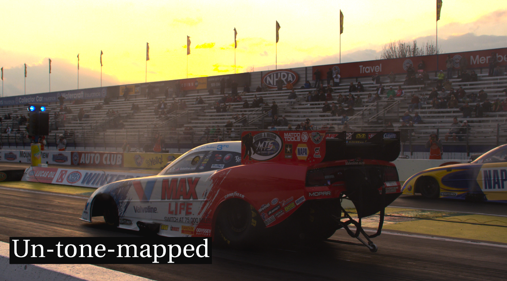
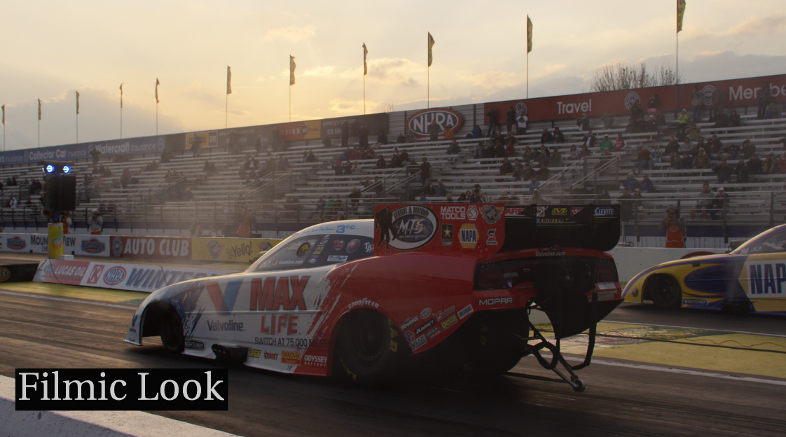
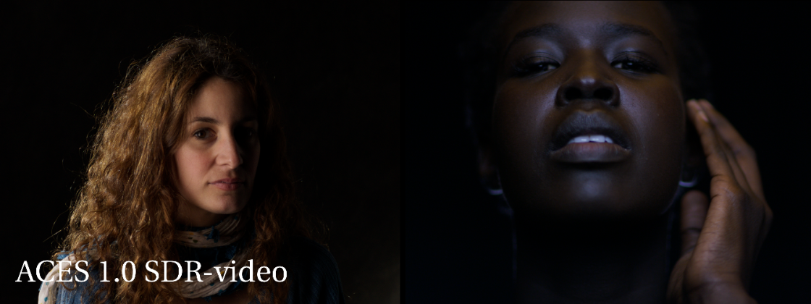
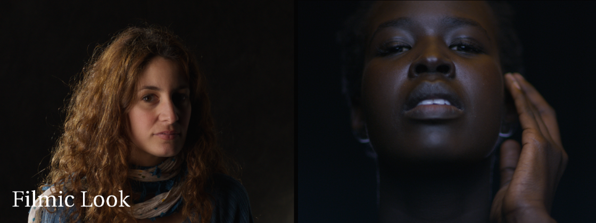
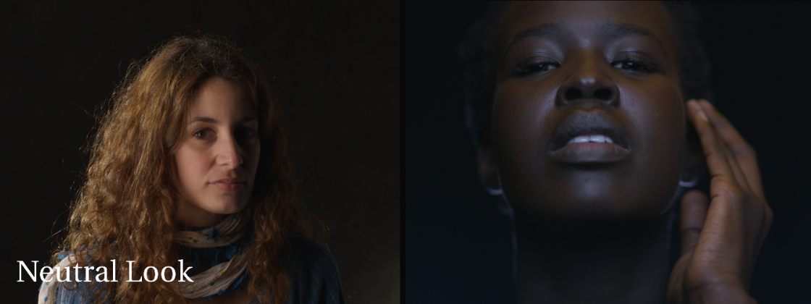

# Tone mapping

In the default linear workflow, used by Maya (prior to v2022) and Nuke, linear renders are viewed through an sRGB 2.2 gamma curve.  The "s" in sRGB stands for "standard" and is the intended way to view images on computer monitors, in contrast to Rec.709 which is the intended way to view images on HDTV monitors. In 2012 Jeremy Selan issued a VES White Paper entitled *[Cinematic Color: From Your Monitor to the Big Screen](https://cinematiccolor.org/)* that proposed improvements to the traditional linear workflow that revolutionized the approach of the VFX industry. Perhaps the most significant of the improvements proposed in the white paper was the use of a “filmic” view transform. 

As the white paper explained, viewing an image through a 2.2 gamma can result in images with low apparent contrast and poor highlight rendition (i.e. highlight clipping). In contrast, using an S-shaped "film emulation" curve, typical of what we see in cameras, yields a pleasing appearance of contrast, with well balanced highlight and shadow details. Additionally, the filmic view transform does not simply clamp values above 1.0 as a gamma curve does, but preforms tone mapping. Compare below this RED camera footage without tone mapping (the default Nuke sRGB view) and the same image with filmic tone mapping. Observe how the sky is clipping in values over 1 in the un-tone-mapped image. 

This is tremendously important not only for photos, but also for photorealistic renders. In short, we need to see the render in the way a camera sees a scene, which is through an s-shaped tone curve. Otherwise, when values clip as soon as they go over 1 (as they do with an sRGB gamma curve) this  leads artists to compensate by making the lights and shader colors unnaturally dim. This leads to light not working properly in the scene (GI bounce, etc.) because the light values are not realistic, making the physically based render not get physically based values. 

With tone mapping, rather than the artist needing to compensate and fight with the render, it just works the way a film camera would. That means that artists can thus give their lights real-world values and the physically-based rendering gets the right amount of light to do its stuff like GI bounces. It also means that things in comp like optical effects (bokeh, motion blur, depth of field, bloom, atmospherics) also work properly because they are given the proper light values. In short, it makes the render behave more like a photo camera so artists can get photorealistic renders. 

Where ACES comes into the picture is where we wish to marry CG images to film. We need to view renders through a filmic view transform to make them look photoreal, and we also want to view the film footage through that same filmic view transform so they can match. ACES provides that unified view transform that works in pretty much all software programs -- from film set to edit to VFX to DI.

## Lower Contrast Tone Mapping Look Transforms

However there have been some complaints about the ACES view transform. Perhaps the top request of the ACES Output Transform (RRT) is that it be more neutral with less contrast. The [ACES Retrospective and Enhancements](https://community.acescentral.com/uploads/default/original/1X/38d7ee7ca7720701873914094d6f4a1d4ca031ef.pdf) paper states for example,

> “The defined ACES rendering intent has been questioned by a number of expert users... It is not uncommon to hear people saying they do not like the cumulative effects: crushing effect on shadows, and heavy highlight roll off, with too much look”

The two Look Transforms provided in this config are intended to address those complaints by lowering the contrast of the ACES tone curve. The **Filmic** lowers contrast to 0.9 and **Neutral** to 0.8. This pulls the shadows and highlights slightly out of the toe and shoulder curves, resulting in less crushing of shadows and more gentle highlight rolloff. The idea being to have the **Filmic Look** make the ACES Output Transform have "slightly less contrast" and the **Neutral Look** has even less in order to serve as a *neutral* starting point for DI and Lookdev. Note in the images below the details visible in the shadow areas compared to the ACES 1.0 Output Transform:

The **Neutral Look** contrast is implemented with a ASL_CDL node, inspired by Geoff Boyle's approach described on [this ACEScentral thread](https://community.acescentral.com/t/luts-that-emulate-the-aces-workflow/1334). The **Filmic Look** contrast is done with a Nuke node provided by the amazing [Jed Smith](https://github.com/jedypod) which adjusts the contrast of the ACES tone curve in linear space, keeping the pivot at 0.18 for middle grey. Using a “gamma” function here doesn’t work well because it does different things to values above 1 and below 1, and of course EXR files have plenty of values above 1 as discussed above. If you're interested in the math, here's the contrast function as a [desmos plot](https://www.desmos.com/calculator/zuxtjn6wmu). 

The take away is that these Look Transforms also you to work with tone mapping that does not impose a strong look to the film, but instead provides a more neutral starting point from which you can do further grading work, and at the same time allows for the proper integration of CG and film.

[Back to main](../StdX_ACES)

